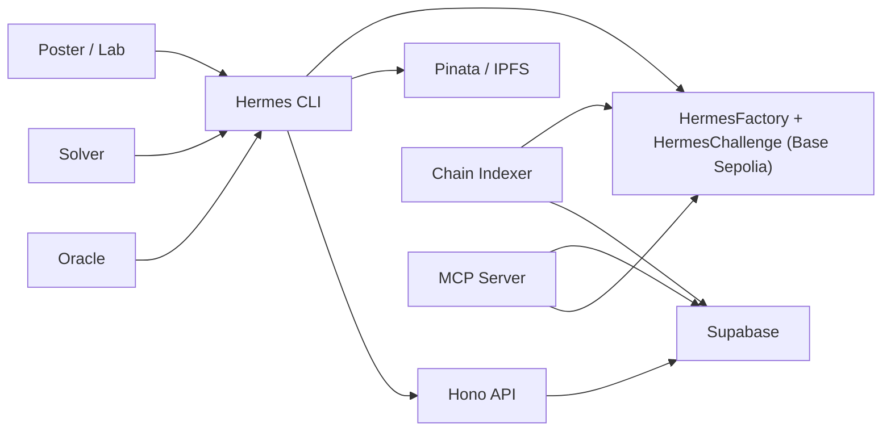

# Hermes

Hermes is an on-chain science bounty protocol on Base. Labs and researchers post reproducible computational challenges with USDC rewards; solvers submit results, oracle scoring is reproducible, and payouts settle on-chain.

## Quickstart (5 Commands)

```bash
pnpm install
pnpm turbo build
node apps/cli/dist/index.js doctor
node apps/cli/dist/index.js list --format json
node apps/cli/dist/index.js init --template reproducibility --force
```

## Architecture



## Monorepo Layout

- `/Users/changyuesin/Hermes/apps/cli` — Hermes CLI (`hm`)
- `/Users/changyuesin/Hermes/apps/api` — Hono API
- `/Users/changyuesin/Hermes/apps/mcp-server` — MCP SDK server
- `/Users/changyuesin/Hermes/packages/contracts` — Solidity contracts + Foundry tests
- `/Users/changyuesin/Hermes/packages/chain` — viem chain helpers + indexer
- `/Users/changyuesin/Hermes/packages/db` — Supabase queries
- `/Users/changyuesin/Hermes/packages/ipfs` — Pinata/IPFS helpers
- `/Users/changyuesin/Hermes/packages/scorer` — Docker scorer runtime/proof generation
- `/Users/changyuesin/Hermes/challenges/templates` — challenge specs and seed templates
- `/Users/changyuesin/Hermes/scripts` — deployment, seeding, e2e scripts

## Environment Setup

Copy and fill environment values:

```bash
cp .env.example .env
```

Required keys:
- `HERMES_RPC_URL`
- `HERMES_FACTORY_ADDRESS`
- `HERMES_USDC_ADDRESS`
- `HERMES_PRIVATE_KEY`
- `HERMES_ORACLE_KEY`
- `HERMES_PINATA_JWT`
- `HERMES_SUPABASE_URL`
- `HERMES_SUPABASE_ANON_KEY`
- `HERMES_SUPABASE_SERVICE_KEY`

## Local Development

```bash
pnpm install
pnpm turbo build
pnpm turbo test
```

Run services:

```bash
node apps/api/dist/index.js
node apps/mcp-server/dist/index.js
node packages/chain/dist/indexer.js
```

## Seeding Challenges (Phase 7)

```bash
./scripts/seed-challenges.sh
```

This validates and posts 5 ready-to-post challenge templates, then waits for indexer visibility via `hm list`.

## End-to-End Validation

```bash
./scripts/e2e-test.sh
```

The script exercises:
- `hm post`
- indexer pickup + `hm list`
- `hm get --download`
- `hm score-local`
- `hm submit`
- `hm score`
- `hm finalize`
- `hm claim` and payout delta check

Note: On Sepolia, finalization requires `deadline + dispute_window_hours` to elapse. For fast runs, use an Anvil RPC with time-travel enabled.

## Deployment

```bash
./scripts/deploy.sh
```

This script deploys contracts to Base Sepolia and provides optional hooks for API/indexer deployment targets.

## Web Mockup (Phase 8 prep)

- `/Users/changyuesin/Hermes/docs/ui-specs/hermes-ui-vibe.md`
- `/Users/changyuesin/Hermes/hermes-mockup`

Build mockup:

```bash
cd hermes-mockup
npm install
npm run build
```
