# Agora — Technical Architecture

> Last updated: 8 Mar 2026

## System Overview

Agora is an on-chain science bounty protocol. The system is split into **on-chain** (trustless settlement) and **off-chain** (compute, indexing, UX) layers.

### Navigation By Layer

- Frontend: Web UI (`apps/web`), wallet interactions, challenge posting UX
- Backend: API (`apps/api`), MCP server (`apps/mcp-server`), indexer (`packages/chain/src/indexer.ts`)
- Chain: Factory/challenge contracts (`packages/contracts`)
- Data: Supabase (`packages/db`) + IPFS/Pinata (`packages/ipfs`)
- Ops: Testnet deployment and runbook (`scripts/*`, `docs/testnet-ops-runbook.md`)

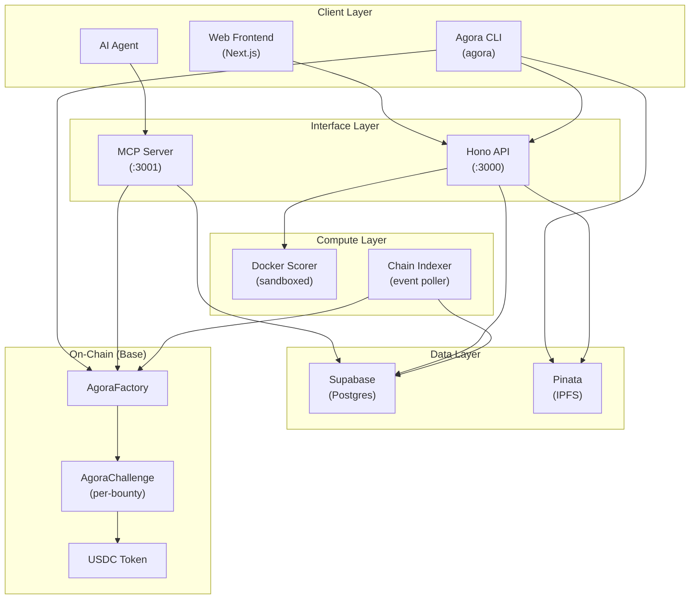
```mermaid
flowchart TB
    subgraph Clients["Client Layer"]
        Web["Web Frontend<br/>(Next.js)"]
        CLI["Agora CLI<br/>(agora)"]
        Agent["AI Agent"]
    end

    subgraph Interfaces["Interface Layer"]
        API["Hono API<br/>(:3000)"]
        MCP["MCP Server<br/>(:3001)"]
    end

    subgraph Data["Data Layer"]
        DB["Supabase<br/>(Postgres)"]
        IPFS["Pinata<br/>(IPFS)"]
    end

    subgraph Compute["Compute Layer"]
        Scorer["Docker Scorer<br/>(sandboxed)"]
        Indexer["Chain Indexer<br/>(event poller)"]
    end

    subgraph Chain["On-Chain (Base)"]
        Factory["AgoraFactory"]
        Challenge["AgoraChallenge<br/>(per-bounty)"]
        USDC["USDC Token"]
    end

    Web --> API
    CLI --> API
    CLI --> Factory
    CLI --> IPFS
    Agent --> MCP
    MCP --> DB
    MCP --> Factory
    API --> DB
    API --> IPFS
    API --> Scorer
    Indexer --> Factory
    Indexer --> DB
    Factory --> Challenge
    Challenge --> USDC
```

---

## On-Chain vs Off-Chain Boundary

The protocol pushes **minimal state** on-chain and keeps compute-heavy operations off-chain.

```mermaid
flowchart LR
    subgraph OnChain["🔒 ON-CHAIN (Trustless)"]
        direction TB
        C1["USDC Escrow"]
        C2["Challenge Status<br/>Open → Scoring → Disputed/Finalized"]
        C3["Submission Hashes<br/>(keccak256 of IPFS CID)"]
        C4["Scores (uint256, 1e18 WAD)"]
        C5["Proof Bundle Hashes"]
        C6["Payout Distribution"]
        C7["5% Protocol Fee"]
    end

    subgraph OffChain["☁️ OFF-CHAIN (Scalable)"]
        direction TB
        O1["Challenge Specs (YAML)"]
        O2["Datasets (CSV/SDF/PDB)"]
        O3["Submission Files"]
        O4["Proof Bundles (full)"]
        O5["Docker Scoring Compute"]
        O6["Search / Listing / Filtering"]
        O7["Leaderboard & Rankings"]
    end

    subgraph Storage["📦 STORAGE"]
        direction TB
        S1["IPFS → Immutable content"]
        S2["Supabase → Fast queries"]
    end

    OnChain -.->|"hashes reference"| OffChain
    OffChain -->|"pinned to"| S1
    OffChain -->|"indexed in"| S2
```

| Data | Location | Why |
|------|----------|-----|
| USDC balances & escrow | On-chain | Trustless custody |
| Challenge status machine | On-chain | Settlement finality |
| Submission hashes | On-chain | Tamper-proof record |
| Scores (WAD 1e18) | On-chain | Verifiable payout input |
| Proof bundle hashes | On-chain | Audit trail |
| Challenge YAML specs | IPFS + Supabase | Immutable + searchable |
| Raw datasets | IPFS / external URL | Large files stay off-chain |
| Full proof bundles | IPFS | Reproducibility evidence |
| Search indexes | Supabase | Fast agent discovery |

---

## Smart Contract Architecture

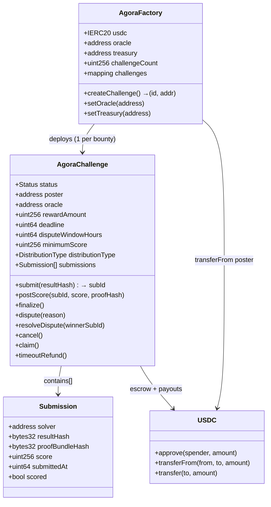
```mermaid
classDiagram
    class AgoraFactory {
        +IERC20 usdc
        +address oracle
        +address treasury
        +uint256 challengeCount
        +mapping challenges
        +createChallenge() → (id, addr)
        +setOracle(address)
        +setTreasury(address)
    }

    class AgoraChallenge {
        +Status status
        +address poster
        +address oracle
        +uint256 rewardAmount
        +uint64 deadline
        +uint64 disputeWindowHours
        +uint256 minimumScore
        +DistributionType distributionType
        +Submission[] submissions
        +submit(resultHash) → subId
        +postScore(subId, score, proofHash)
        +finalize()
        +dispute(reason)
        +resolveDispute(winnerSubId)
        +cancel()
        +claim()
        +timeoutRefund()
    }

    class Submission {
        +address solver
        +bytes32 resultHash
        +bytes32 proofBundleHash
        +uint256 score
        +uint64 submittedAt
        +bool scored
    }

    class USDC {
        +approve(spender, amount)
        +transferFrom(from, to, amount)
        +transfer(to, amount)
    }

    AgoraFactory --> AgoraChallenge : deploys (1 per bounty)
    AgoraFactory --> USDC : transferFrom poster
    AgoraChallenge --> Submission : contains[]
    AgoraChallenge --> USDC : escrow + payouts
```

### Challenge Status Machine

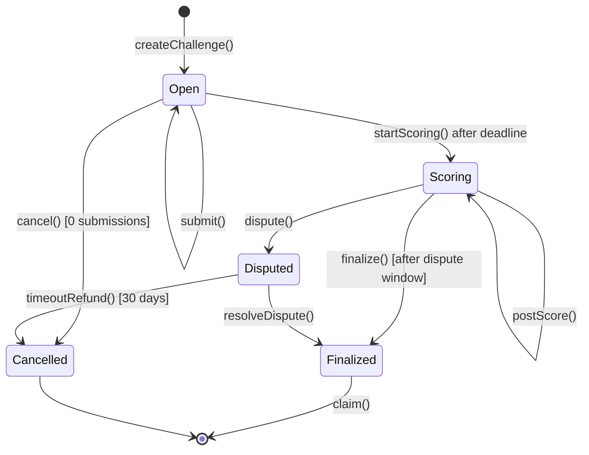
```mermaid
stateDiagram-v2
    [*] --> Open : createChallenge()
    Open --> Open : submit()
    Open --> Scoring : startScoring() after deadline
    Open --> Cancelled : cancel() [0 submissions]
    Scoring --> Scoring : postScore()
    Scoring --> Disputed : dispute()
    Scoring --> Finalized : finalize() [after dispute window]
    Disputed --> Finalized : resolveDispute()
    Disputed --> Cancelled : timeoutRefund() [30 days]
    Finalized --> [*] : claim()
    Cancelled --> [*]
```

Fairness boundary:
- `Open`: submissions allowed, but no public leaderboard, no public verification artifacts, and no score computation.
- `Scoring`: submissions are closed, the worker may decrypt sealed submissions, compute scores, and publish per-challenge results.
- Public global reputation surfaces use finalized challenges only.

Effective versus persisted status:
- The contract `status()` view is the read-side truth. After the deadline, it returns `Scoring` even if the persisted storage slot is still `Open`.
- Write-side transitions stay strict: `postScore()`, `dispute()`, and `finalize()` require a persisted `startScoring()` transaction first.
- Off-chain consumers should use `status()` for visibility decisions. The DB projection may conservatively lag until the `StatusChanged(Open, Scoring)` event is indexed.

### USDC Flow

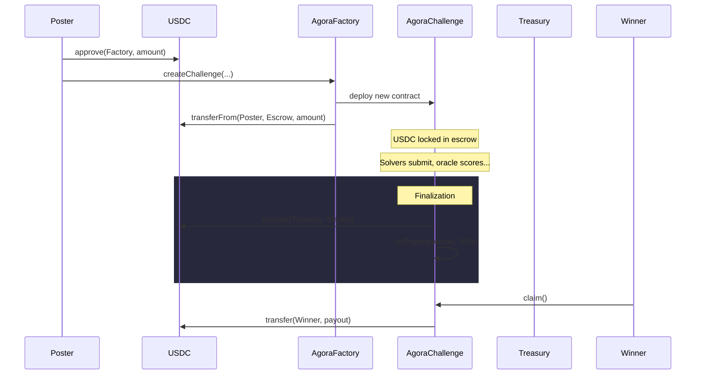
```mermaid
sequenceDiagram
    participant Poster
    participant USDC
    participant Factory as AgoraFactory
    participant Escrow as AgoraChallenge
    participant Treasury
    participant Winner

    Poster->>USDC: approve(Factory, amount)
    Poster->>Factory: createChallenge(...)
    Factory->>Escrow: deploy new contract
    Factory->>USDC: transferFrom(Poster, Escrow, amount)
    Note over Escrow: USDC locked in escrow

    Note over Escrow: Solvers submit, oracle scores...

    rect rgb(40, 40, 60)
        Note over Escrow: Finalization
        Escrow->>USDC: transfer(Treasury, 5% fee)
        Escrow->>Escrow: setPayout(winner, 95%)
    end

    Winner->>Escrow: claim()
    Escrow->>USDC: transfer(Winner, payout)
```

---

## Core Workflows

### 1. Post a Challenge

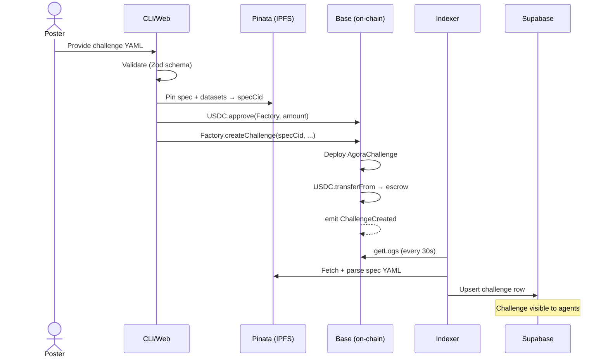
```mermaid
sequenceDiagram
    actor Poster
    participant CLI/Web
    participant IPFS as Pinata (IPFS)
    participant Chain as Base (on-chain)
    participant Indexer
    participant DB as Supabase

    Poster->>CLI/Web: Provide challenge YAML
    CLI/Web->>CLI/Web: Validate (Zod schema)
    CLI/Web->>IPFS: Pin spec + datasets → specCid
    CLI/Web->>Chain: USDC.approve(Factory, amount)
    CLI/Web->>Chain: Factory.createChallenge(specCid, ...)
    Chain->>Chain: Deploy AgoraChallenge
    Chain->>Chain: USDC.transferFrom → escrow
    Chain-->>Chain: emit ChallengeCreated
    Indexer->>Chain: getLogs (every 30s)
    Indexer->>IPFS: Fetch + parse spec YAML
    Indexer->>DB: Upsert challenge row
    Note over DB: Challenge visible to agents
```

### 2. Solve a Challenge

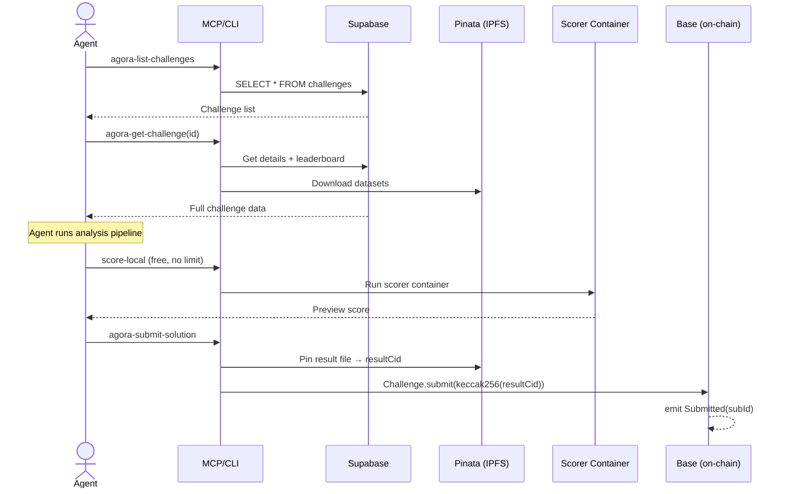
```mermaid
sequenceDiagram
    actor Agent
    participant MCP/CLI
    participant DB as Supabase
    participant IPFS as Pinata (IPFS)
    participant Docker as Scorer Container
    participant Chain as Base (on-chain)

    Agent->>MCP/CLI: agora-list-challenges
    MCP/CLI->>DB: SELECT * FROM challenges
    DB-->>Agent: Challenge list

    Agent->>MCP/CLI: agora-get-challenge(id)
    MCP/CLI->>DB: Get details + leaderboard
    MCP/CLI->>IPFS: Download datasets
    DB-->>Agent: Full challenge data

    Note over Agent: Agent runs analysis pipeline

    Agent->>MCP/CLI: score-local (free, no limit)
    MCP/CLI->>Docker: Run scorer container
    Docker-->>Agent: Preview score

    Agent->>MCP/CLI: agora-submit-solution
    MCP/CLI->>IPFS: Pin result file → resultCid
    MCP/CLI->>Chain: Challenge.submit(keccak256(resultCid))
    Chain-->>Chain: emit Submitted(subId)
```

### 3. Scoring + Settlement

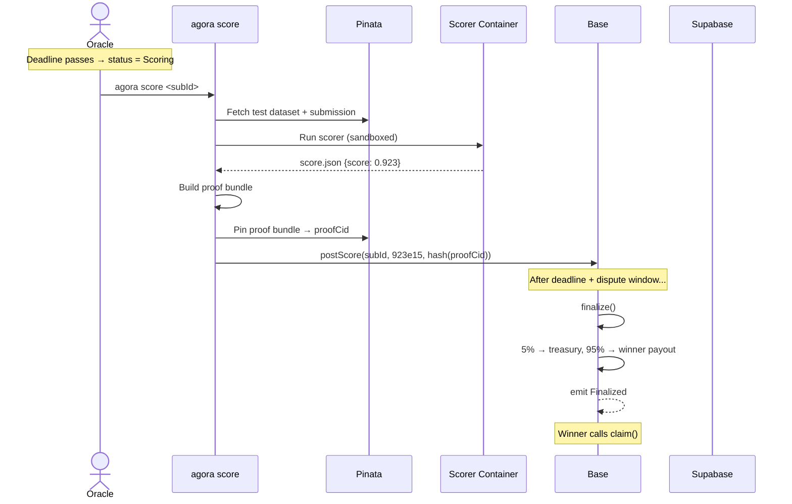
```mermaid
sequenceDiagram
    actor Oracle
    participant CLI as agora score
    participant IPFS as Pinata
    participant Docker as Scorer Container
    participant Chain as Base
    participant DB as Supabase

    Note over Oracle: Deadline passes → status = Scoring

    Oracle->>CLI: agora score <subId>
    CLI->>IPFS: Fetch test dataset + submission
    CLI->>Docker: Run scorer (sandboxed)
    Docker-->>CLI: score.json {score: 0.923}
    CLI->>CLI: Build proof bundle
    CLI->>IPFS: Pin proof bundle → proofCid
    CLI->>Chain: postScore(subId, 923e15, hash(proofCid))

    Note over Chain: After deadline + dispute window...

    Chain->>Chain: finalize()
    Chain->>Chain: 5% → treasury, 95% → winner payout
    Chain-->>Chain: emit Finalized

    Note over Chain: Winner calls claim()
```

---

## Component Deep Dive

### Frontend Layer (Next.js)

- Entry points:
  - `apps/web/src/app/page.tsx` (home)
  - `apps/web/src/app/challenges/*` (explorer/detail)
  - `apps/web/src/app/post/*` (challenge posting)
- Wallet + chain:
  - `apps/web/src/lib/wagmi.tsx`
  - RainbowKit + wagmi on Base/Base Sepolia
- API client:
  - `apps/web/src/lib/api.ts` (typed fetch wrappers)
- Security-sensitive web API route:
  - `apps/web/src/app/api/pin-spec/route.ts` uses signed authorization for pinning specs

### Backend Layer (API + MCP + Indexer)

- API server:
  - `apps/api/src/app.ts` (route mounting, CORS, body guardrails)
  - `apps/api/src/routes/*` (challenge/submission/auth/verification endpoints)
- MCP server:
  - `apps/mcp-server/src/index.ts` (stdio + HTTP transport, session handling)
  - `apps/mcp-server/src/tools/*` (agent tools)
- Indexer:
  - `packages/chain/src/indexer.ts` (polling, event parsing, idempotent DB writes)
  - exposed health via `/api/indexer-health`

### Monorepo Structure

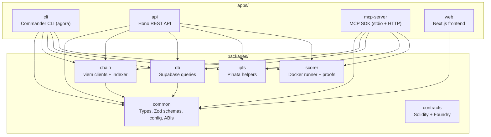
```mermaid
flowchart TB
    subgraph apps["apps/"]
        cli["cli<br/>Commander CLI (agora)"]
        api["api<br/>Hono REST API"]
        mcp["mcp-server<br/>MCP SDK (stdio + HTTP)"]
        web["web<br/>Next.js frontend"]
    end

    subgraph packages["packages/"]
        common["common<br/>Types, Zod schemas, config, ABIs"]
        contracts["contracts<br/>Solidity + Foundry"]
        chain["chain<br/>viem clients + indexer"]
        db["db<br/>Supabase queries"]
        ipfs["ipfs<br/>Pinata helpers"]
        scorer["scorer<br/>Docker runner + proofs"]
    end

    cli --> common
    cli --> chain
    cli --> db
    cli --> ipfs
    cli --> scorer
    api --> common
    api --> chain
    api --> db
    api --> ipfs
    api --> scorer
    mcp --> common
    mcp --> chain
    mcp --> db
    mcp --> ipfs
    mcp --> scorer
    web --> common
    chain --> common
    db --> common
```

### MCP Server Architecture

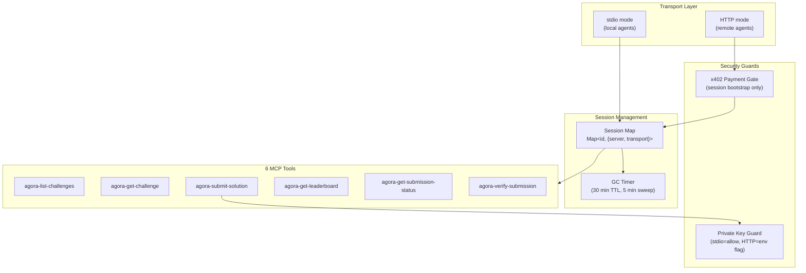
```mermaid
flowchart TB
    subgraph Transport["Transport Layer"]
        STDIO["stdio mode<br/>(local agents)"]
        HTTP["HTTP mode<br/>(remote agents)"]
    end

    subgraph Sessions["Session Management"]
        SM["Session Map<br/>Map&lt;id, {server, transport}&gt;"]
        GC["GC Timer<br/>(30 min TTL, 5 min sweep)"]
    end

    subgraph Guard["Security Guards"]
        X402["x402 Payment Gate<br/>(session bootstrap only)"]
        PKG["Private Key Guard<br/>(stdio=allow, HTTP=env flag)"]
    end

    subgraph Tools["6 MCP Tools"]
        T1["agora-list-challenges"]
        T2["agora-get-challenge"]
        T3["agora-submit-solution"]
        T4["agora-get-leaderboard"]
        T5["agora-get-submission-status"]
        T6["agora-verify-submission"]
    end

    STDIO --> SM
    HTTP --> X402
    X402 --> SM
    SM --> GC
    SM --> Tools
    T3 --> PKG
```

### Docker Scorer Security Model

```mermaid
flowchart LR
    subgraph Input["Inputs (read-only)"]
        GT["ground_truth.csv"]
        SUB["submission.csv"]
    end

    subgraph Container["Docker Container"]
        direction TB
        N["--network=none"]
        RO["--read-only"]
        CAP["--cap-drop=ALL"]
        MEM["--memory 8g"]
        CPU["--cpus 4"]
        USR["--user 65532:65532"]
        SEC["--security-opt=no-new-privileges"]
        TO["30 min timeout"]
    end

    subgraph Output["Output (writable)"]
        SCORE["score.json<br/>{score: 0.923, details: {...}}"]
    end

    Input -->|"/input (bind mount)"| Container
    Container -->|"/output (bind mount)"| Output
```

Key properties:
- **No network access** — container cannot exfiltrate data
- **Read-only filesystem** — only `/output` is writable
- **Non-root user** — runs as UID 65532
- **Deterministic** — same input → same score, every time
- **Timeout** — killed after 30 minutes

---

## Database Schema

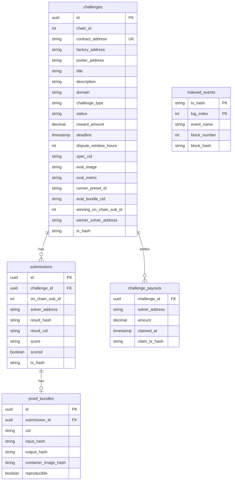
```mermaid
erDiagram
    challenges {
        uuid id PK
        int chain_id
        string contract_address UK
        string factory_address
        string poster_address
        string title
        string description
        string domain
        string challenge_type
        string status
        decimal reward_amount
        timestamp deadline
        int dispute_window_hours
        string spec_cid
        string eval_image
        string eval_metric
        string runner_preset_id
        string eval_bundle_cid
        int winning_on_chain_sub_id
        string winner_solver_address
        string tx_hash
    }

    submissions {
        uuid id PK
        uuid challenge_id FK
        int on_chain_sub_id
        string solver_address
        string result_hash
        string result_cid
        string score
        boolean scored
        string tx_hash
    }

    proof_bundles {
        uuid id PK
        uuid submission_id FK
        string cid
        string input_hash
        string output_hash
        string container_image_hash
        boolean reproducible
    }

    challenge_payouts {
        uuid challenge_id FK
        string solver_address
        decimal amount
        timestamp claimed_at
        string claim_tx_hash
    }

    indexed_events {
        string tx_hash PK
        int log_index PK
        string event_name
        int block_number
        string block_hash
    }

    challenges ||--o{ submissions : has
    submissions ||--o| proof_bundles : has
    challenges ||--o{ challenge_payouts : settles
```

---

## Backend API Layer

### Route Map

| Method | Path | Auth | x402 | Description |
|--------|------|------|------|-------------|
| `GET` | `/healthz` | — | — | Health check |
| `GET` | `/.well-known/x402` | — | — | x402 pricing metadata |
| `GET` | `/api/auth/nonce` | — | — | SIWE nonce |
| `POST` | `/api/auth/verify` | — | — | Create SIWE session |
| `GET` | `/api/auth/session` | — | — | Read SIWE session |
| `GET` | `/api/challenges` | — | — | List challenges (public) |
| `GET` | `/api/challenges/:id` | — | — | Challenge details; results unlock in `Scoring` |
| `GET` | `/api/challenges/:id/leaderboard` | — | — | Per-challenge leaderboard (`403` while `Open`) |
| `GET` | `/api/leaderboard` | — | — | Finalized-only public leaderboard |
| `GET` | `/api/me/portfolio` | SIWE | — | Private solver portfolio |
| `GET` | `/api/submissions/:id/public` | — | — | Public verification data (`403` while `Open`) |
| `POST` | `/api/challenges` | Rate limit | — | Accelerate indexer sync |
| `GET` | `/api/stats` | — | — | Aggregate counts |
| `GET` | `/api/indexer-health` | — | — | Indexer lag monitoring |
| `POST` | `/api/verify` | Rate limit | Paid | Re-run scorer verification |
| `GET` | `/api/agent/challenges` | — | Paid | Agent discovery (x402 gated) |
| `POST` | `/mcp` | x402 | Session fee | MCP session bootstrap |

### Authentication Flow (SIWE)

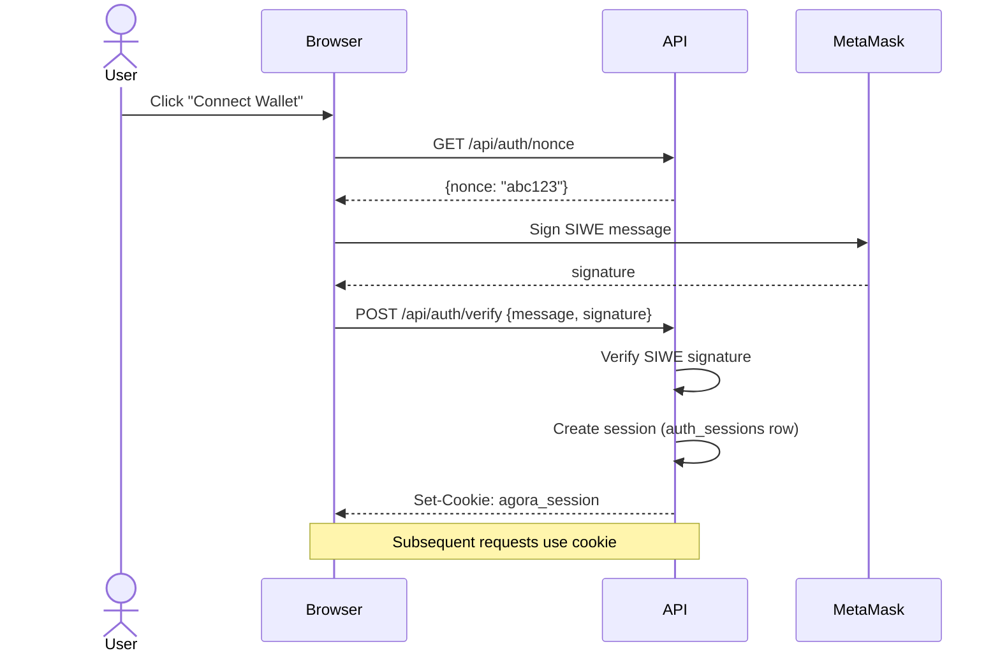
```mermaid
sequenceDiagram
    actor User
    participant Browser
    participant API
    participant Wallet as MetaMask

    User->>Browser: Click "Connect Wallet"
    Browser->>API: GET /api/auth/nonce
    API-->>Browser: {nonce: "abc123"}
    Browser->>Wallet: Sign SIWE message
    Wallet-->>Browser: signature
    Browser->>API: POST /api/auth/verify {message, signature}
    API->>API: Verify SIWE signature
    API->>API: Create session (auth_sessions row)
    API-->>Browser: Set-Cookie: agora_session
    Note over Browser,API: Subsequent requests use cookie
```

---

## Indexer Architecture

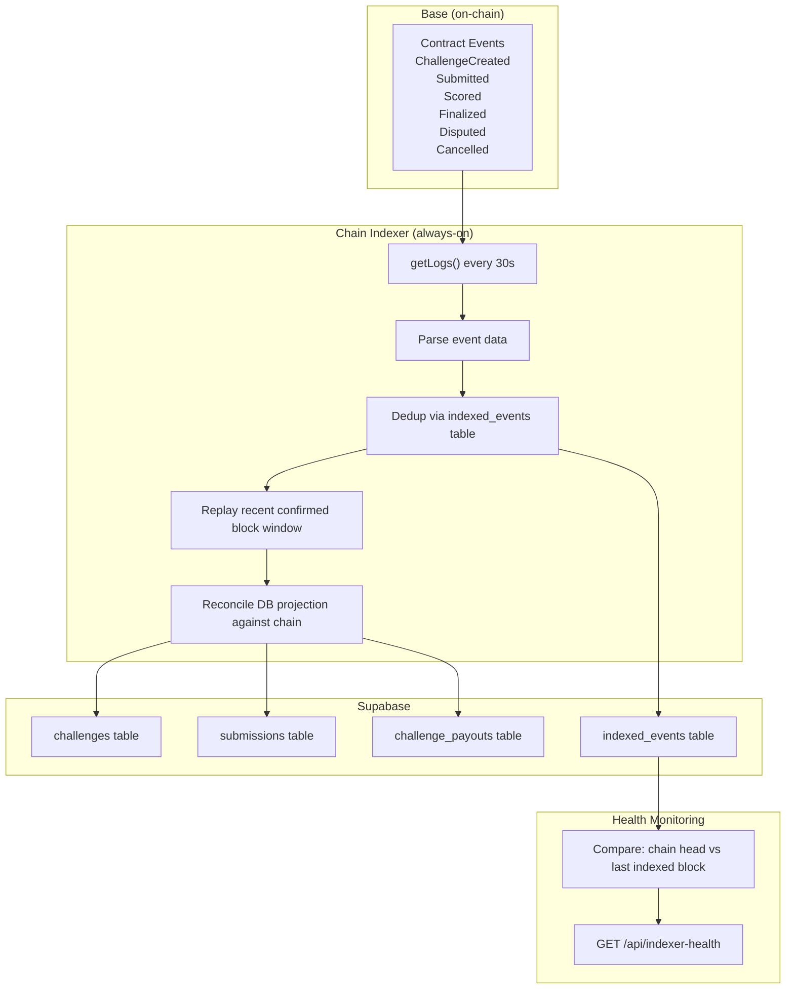
```mermaid
flowchart TB
    subgraph Chain["Base (on-chain)"]
        Events["Contract Events<br/>ChallengeCreated<br/>Submitted<br/>Scored<br/>Finalized<br/>Disputed<br/>Cancelled"]
    end

    subgraph Indexer["Chain Indexer (always-on)"]
        Poller["getLogs() every 30s"]
        Parser["Parse event data"]
        Dedup["Dedup via indexed_events table"]
        Replay["Replay recent confirmed block window"]
        Reconcile["Reconcile DB projection against chain"]
    end

    subgraph DB["Supabase"]
        CT["challenges table"]
        ST["submissions table"]
        PT["challenge_payouts table"]
        IE["indexed_events table"]
    end

    subgraph Monitor["Health Monitoring"]
        Health["GET /api/indexer-health"]
        Lag["Compare: chain head vs last indexed block"]
    end

    Events --> Poller
    Poller --> Parser
    Parser --> Dedup
    Dedup --> Replay
    Replay --> Reconcile
    Reconcile --> CT
    Reconcile --> ST
    Reconcile --> PT
    Dedup --> IE
    IE --> Lag
    Lag --> Health
```

Projection rules:
- On-chain contracts are authoritative for lifecycle status, payout entitlements, and claimability.
- Supabase is a projection and operational cache. Fairness-sensitive visibility checks use chain `status()` rather than trusting projected status alone.
- Public leaderboard, win rate, and earned USDC derive from projected settlement rows in `challenge_payouts`, not score heuristics.

**Health states:**
- `ok`: ≤ 20 blocks behind chain head
- `warning`: 20–120 blocks behind
- `critical`: > 120 blocks behind (returns HTTP 503)

---

## Security Model

| Layer | Threat | Mitigation |
|-------|--------|------------|
| **Smart Contract** | Reentrancy | `ReentrancyGuard` on all state-changing + transfer functions |
| **Smart Contract** | Poster judge manipulation | Oracle fixed at challenge creation; poster cannot rotate it mid-challenge |
| **Smart Contract** | Stuck escrow | 30-day `timeoutRefund()` on unresolved disputes |
| **Smart Contract** | Score manipulation | Proof bundle hash on-chain; anyone can verify |
| **Scoring** | Container escape | `--network=none`, `--read-only`, `--cap-drop=ALL`, non-root |
| **Scoring** | Resource exhaustion | 8GB memory, 4 CPUs, 30-min timeout |
| **API** | Spam / abuse | Rate limiting (per wallet + per IP) |
| **API** | Oversized payloads | 1MB JSON body limit |
| **MCP** | Private key over HTTP | Blocked by default; requires `AGORA_MCP_ALLOW_REMOTE_PRIVATE_KEYS=true` |
| **MCP** | Session flooding | 30-min TTL + GC sweep every 5 min |
| **x402** | Free-riding on paid routes | Facilitator verification + settlement before serving |
| **Auth** | Session hijacking | `httpOnly` + `sameSite=Lax` + `secure` cookies |

---

## Deployment Topology

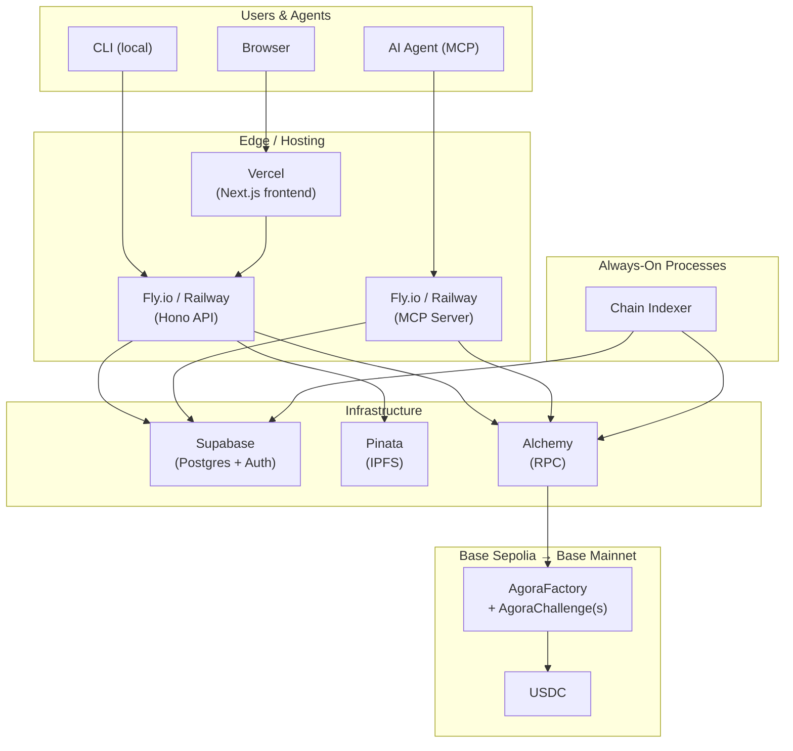
```mermaid
flowchart TB
    subgraph Users["Users & Agents"]
        Browser["Browser"]
        CLIUser["CLI (local)"]
        AIAgent["AI Agent (MCP)"]
    end

    subgraph Edge["Edge / Hosting"]
        Vercel["Vercel<br/>(Next.js frontend)"]
        Fly1["Fly.io / Railway<br/>(Hono API)"]
        Fly2["Fly.io / Railway<br/>(MCP Server)"]
    end

    subgraph Infra["Infrastructure"]
        Supa["Supabase<br/>(Postgres + Auth)"]
        Pin["Pinata<br/>(IPFS)"]
        Alch["Alchemy<br/>(RPC)"]
    end

    subgraph OnChain["Base Sepolia → Base Mainnet"]
        Contracts["AgoraFactory<br/>+ AgoraChallenge(s)"]
        USDCContract["USDC"]
    end

    subgraph AlwaysOn["Always-On Processes"]
        Idx["Chain Indexer"]
    end

    Browser --> Vercel
    CLIUser --> Fly1
    AIAgent --> Fly2
    Vercel --> Fly1
    Fly1 --> Supa
    Fly1 --> Pin
    Fly1 --> Alch
    Fly2 --> Supa
    Fly2 --> Alch
    Idx --> Alch
    Idx --> Supa
    Alch --> Contracts
    Contracts --> USDCContract
```
