# Hermes — Technical Architecture

> Last updated: 27 Feb 2026

## System Overview

Hermes is an on-chain science bounty protocol. The system is split into **on-chain** (trustless settlement) and **off-chain** (compute, indexing, UX) layers.

### Navigation By Layer

- Frontend: Web UI (`apps/web`), wallet interactions, challenge posting UX
- Backend: API (`apps/api`), MCP server (`apps/mcp-server`), indexer (`packages/chain/src/indexer.ts`)
- Chain: Factory/challenge contracts (`packages/contracts`)
- Data: Supabase (`packages/db`) + IPFS/Pinata (`packages/ipfs`)
- Ops: Testnet deployment and runbook (`scripts/*`, `docs/testnet-ops-runbook.md`)

---

## On-Chain vs Off-Chain Boundary

The protocol pushes **minimal state** on-chain and keeps compute-heavy operations off-chain.

```mermaid
flowchart LR
    subgraph OnChain["🔒 ON-CHAIN (Trustless)"]
        direction TB
        C1["USDC Escrow"]
        C2["Challenge Status<br/>Active → Scoring → Finalized"]
        C3["Submission Hashes<br/>(keccak256 of IPFS CID)"]
        C4["Scores (uint256, 1e18 WAD)"]
        C5["Proof Bundle Hashes"]
        C6["Payout Distribution"]
        C7["5% Protocol Fee"]
    end

    subgraph OffChain["☁️ OFF-CHAIN (Scalable)"]
        direction TB
        O1["Challenge Specs (YAML)"]
        O2["Datasets (CSV/SDF/PDB)"]
        O3["Submission Files"]
        O4["Proof Bundles (full)"]
        O5["Docker Scoring Compute"]
        O6["Search / Listing / Filtering"]
        O7["Leaderboard & Rankings"]
    end

    subgraph Storage["📦 STORAGE"]
        direction TB
        S1["IPFS → Immutable content"]
        S2["Supabase → Fast queries"]
    end

    OnChain -.->|"hashes reference"| OffChain
    OffChain -->|"pinned to"| S1
    OffChain -->|"indexed in"| S2
```

| Data | Location | Why |
|------|----------|-----|
| USDC balances & escrow | On-chain | Trustless custody |
| Challenge status machine | On-chain | Settlement finality |
| Submission hashes | On-chain | Tamper-proof record |
| Scores (WAD 1e18) | On-chain | Verifiable payout input |
| Proof bundle hashes | On-chain | Audit trail |
| Challenge YAML specs | IPFS + Supabase | Immutable + searchable |
| Raw datasets | IPFS / external URL | Large files stay off-chain |
| Full proof bundles | IPFS | Reproducibility evidence |
| Search indexes | Supabase | Fast agent discovery |

---

## Smart Contract Architecture

```mermaid
classDiagram
    class HermesFactory {
        +IERC20 usdc
        +address oracle
        +address treasury
        +uint256 challengeCount
        +mapping challenges
        +createChallenge() → (id, addr)
        +setOracle(address)
        +setTreasury(address)
    }

    class HermesChallenge {
        +Status status
        +address poster
        +address oracle
        +uint256 rewardAmount
        +uint64 deadline
        +uint64 disputeWindowHours
        +uint256 minimumScore
        +DistributionType distributionType
        +Submission[] submissions
        +submit(resultHash) → subId
        +postScore(subId, score, proofHash)
        +finalize()
        +dispute(reason)
        +resolveDispute(winnerSubId)
        +cancel()
        +claim()
        +timeoutRefund()
        +proposeOracleRotation(addr)
        +executeOracleRotation()
    }

    class Submission {
        +address solver
        +bytes32 resultHash
        +bytes32 proofBundleHash
        +uint256 score
        +uint64 submittedAt
        +bool scored
    }

    class USDC {
        +approve(spender, amount)
        +transferFrom(from, to, amount)
        +transfer(to, amount)
    }

    HermesFactory --> HermesChallenge : deploys (1 per bounty)
    HermesFactory --> USDC : transferFrom poster
    HermesChallenge --> Submission : contains[]
    HermesChallenge --> USDC : escrow + payouts
```

### Challenge Status Machine

### USDC Flow

---

## Core Workflows

### 1. Post a Challenge

### 2. Solve a Challenge

```mermaid
sequenceDiagram
    actor Agent
    participant MCP/CLI
    participant DB as Supabase
    participant IPFS as Pinata (IPFS)
    participant Docker as Scorer Container
    participant Chain as Base (on-chain)

    Agent->>MCP/CLI: hermes-list-challenges
    MCP/CLI->>DB: SELECT * FROM challenges
    DB-->>Agent: Challenge list

    Agent->>MCP/CLI: hermes-get-challenge(id)
    MCP/CLI->>DB: Get details + leaderboard
    MCP/CLI->>IPFS: Download datasets
    DB-->>Agent: Full challenge data

    Note over Agent: Agent runs analysis pipeline

    Agent->>MCP/CLI: score-local (free, no limit)
    MCP/CLI->>Docker: Run scorer container
    Docker-->>Agent: Preview score

    Agent->>MCP/CLI: hermes-submit-solution
    MCP/CLI->>IPFS: Pin result file → resultCid
    MCP/CLI->>Chain: Challenge.submit(keccak256(resultCid))
    Chain-->>Chain: emit Submitted(subId)
```

### 3. Scoring + Settlement

```mermaid
sequenceDiagram
    actor Oracle
    participant CLI as hm score
    participant IPFS as Pinata
    participant Docker as Scorer Container
    participant Chain as Base
    participant DB as Supabase

    Note over Oracle: Deadline passes → status = Scoring

    Oracle->>CLI: hm score <subId>
    CLI->>IPFS: Fetch test dataset + submission
    CLI->>Docker: Run scorer (sandboxed)
    Docker-->>CLI: score.json {score: 0.923}
    CLI->>CLI: Build proof bundle
    CLI->>IPFS: Pin proof bundle → proofCid
    CLI->>Chain: postScore(subId, 923e15, hash(proofCid))

    Note over Chain: After deadline + dispute window...

    Chain->>Chain: finalize()
    Chain->>Chain: 5% → treasury, 95% → winner payout
    Chain-->>Chain: emit Finalized

    Note over Chain: Winner calls claim()
```

---

## Component Deep Dive

### Frontend Layer (Next.js)

- Entry points:
  - `apps/web/src/app/page.tsx` (home)
  - `apps/web/src/app/challenges/*` (explorer/detail)
  - `apps/web/src/app/post/*` (challenge posting)
- Wallet + chain:
  - `apps/web/src/lib/wagmi.tsx`
  - RainbowKit + wagmi on Base/Base Sepolia
- API client:
  - `apps/web/src/lib/api.ts` (typed fetch wrappers)
- Security-sensitive web API route:
  - `apps/web/src/app/api/pin-spec/route.ts` uses signed authorization for pinning specs

### Backend Layer (API + MCP + Indexer)

- API server:
  - `apps/api/src/app.ts` (route mounting, CORS, body guardrails)
  - `apps/api/src/routes/*` (challenge/submission/auth/verification endpoints)
- MCP server:
  - `apps/mcp-server/src/index.ts` (stdio + HTTP transport, session handling)
  - `apps/mcp-server/src/tools/*` (agent tools)
- Indexer:
  - `packages/chain/src/indexer.ts` (polling, event parsing, idempotent DB writes)
  - exposed health via `/api/indexer-health`

### Monorepo Structure

### MCP Server Architecture

### Docker Scorer Security Model

Key properties:
- **No network access** — container cannot exfiltrate data
- **Read-only filesystem** — only `/output` is writable
- **Non-root user** — runs as UID 65532
- **Deterministic** — same input → same score, every time
- **Timeout** — killed after 30 minutes

---

## Database Schema

---

## Backend API Layer

### Route Map

| Method | Path | Auth | x402 | Description |
|--------|------|------|------|-------------|
| `GET` | `/healthz` | — | — | Health check |
| `GET` | `/.well-known/x402` | — | — | x402 pricing metadata |
| `GET` | `/api/challenges` | — | — | List challenges (public) |
| `GET` | `/api/challenges/:id` | — | — | Challenge details + leaderboard |
| `POST` | `/api/challenges` | Rate limit | — | Accelerate indexer sync |
| `GET` | `/api/stats` | — | — | Aggregate counts |
| `GET` | `/api/indexer-health` | — | — | Indexer lag monitoring |
| `POST` | `/api/verify` | Rate limit | Paid | Re-run scorer verification |
| `POST` | `/api/score-preview` | Rate limit | Paid | Dry-run scoring (Docker) |
| `GET` | `/api/agent/challenges` | — | Paid | Agent discovery (x402 gated) |
| `POST` | `/mcp` | x402 | Session fee | MCP session bootstrap |

### Authentication Flow (SIWE)

---

## Indexer Architecture

**Health states:**
- `ok`: ≤ 20 blocks behind chain head
- `warning`: 20–120 blocks behind
- `critical`: > 120 blocks behind (returns HTTP 503)

---

## Security Model

| Layer | Threat | Mitigation |
|-------|--------|------------|
| **Smart Contract** | Reentrancy | `ReentrancyGuard` on all state-changing + transfer functions |
| **Smart Contract** | Oracle compromise | `proposeOracleRotation` + 2-day timelock |
| **Smart Contract** | Stuck escrow | 30-day `timeoutRefund()` on unresolved disputes |
| **Smart Contract** | Score manipulation | Proof bundle hash on-chain; anyone can verify |
| **Scoring** | Container escape | `--network=none`, `--read-only`, `--cap-drop=ALL`, non-root |
| **Scoring** | Resource exhaustion | 8GB memory, 4 CPUs, 30-min timeout |
| **API** | Spam / abuse | Rate limiting (per wallet + per IP) |
| **API** | Oversized payloads | 1MB JSON body limit |
| **MCP** | Private key over HTTP | Blocked by default; requires `HERMES_MCP_ALLOW_REMOTE_PRIVATE_KEYS=true` |
| **MCP** | Session flooding | 30-min TTL + GC sweep every 5 min |
| **x402** | Free-riding on paid routes | Facilitator verification + settlement before serving |
| **Auth** | Session hijacking | `httpOnly` + `sameSite=Lax` + `secure` cookies |

---

## Deployment Topology

