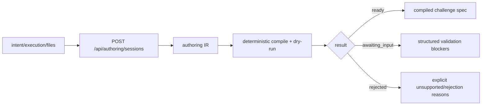

# Challenge Authoring IR

## Purpose

Define the typed intermediate representation that sits between structured
authoring state and a compiled challenge spec.

This is the durable interpretation layer used by:

- direct OpenClaw agent calls
- any future caller that starts an authoring session through
  `/api/authoring/sessions`

It is not the public API contract. The public contract is the authoring session
API in [specs/authoring-session-api.md](specs/authoring-session-api.md).

The IR may help drive compile and persistence, but it is not the canonical
source of public field-level validation. Public session `validation` should come
from the persisted assessment snapshot, not be reconstructed later from IR
compile hints.

## Design Rule

Agora should never jump directly from natural language to an on-chain publish.

The safe path is:

```text
structured session state + files
  -> typed authoring IR
  -> deterministic compile + dry-run
  -> challenge spec candidate
  -> explicit publish confirmation
```

Deterministic compile remains authoritative. Any future assist/inference path is
separate from this default session contract.

## Current Session Flow



Machine-first path:

```text
create session -> patch structured fields -> ready -> publish
```

There is no separate public `compile` endpoint and no legacy helper response
surface anymore.

## What The IR Must Capture

The IR is the durable typed working state of the session so far. It must
answer:

- what problem the owning agent is trying to solve
- what solvers are expected to submit
- how winning is measured
- which artifacts are public vs hidden
- which execution template and metric fit
- what information is still missing
- why Agora rejected the task if it cannot be compiled into a valid challenge

The IR is internal. The public machine contract should not depend on callers
or read helpers reverse-engineering validation from internal IR fields.

## Conceptual Shape

The persisted schema may evolve, but the stable structure is:

```ts
type ChallengeAuthoringIr = {
  version: 3;
  origin: {
    provider: "direct" | "beach_science";
    external_id?: string | null;
    external_url?: string | null;
    ingested_at: string;
    raw_context?: Record<string, unknown> | null;
  };
  source: {
    title?: string | null;
    poster_messages: Array<{
      id: string;
      role: "poster" | "participant" | "system";
      content: string;
      created_at: string;
    }>;
    uploaded_artifact_ids: string[];
  };
  intent: {
    current: PartialChallengeIntent;
    missing_fields: string[];
  };
  assessment: {
    input_hash: string | null;
    outcome: "ready" | "awaiting_input" | "rejected" | null;
    reason_codes: string[];
    warnings: string[];
    missing_fields: string[];
  };
  validation_snapshot: {
    missing_fields: ValidationIssue[];
    invalid_fields: ValidationIssue[];
    dry_run_failure: ValidationIssue | null;
    unsupported_reason: ValidationIssue | null;
  } | null;
  execution: {
    template: string | null;
    metric: string | null;
    comparator: "maximize" | "minimize" | "closest_match" | "pass_fail" | "custom" | null;
    evaluation_artifact_id: string | null;
    visible_artifact_ids: string[];
    evaluation_columns: {
      id: string | null;
      value: string | null;
    };
    submission_columns: {
      id: string | null;
      value: string | null;
    };
    rejection_reasons: string[];
    compile_diagnostics: {
      codes: string[];
      message: string | null;
    };
  };
};
```

`validation_snapshot` is the persisted source for public session validation.
`compile_diagnostics` remains internal compiler detail and must not be the only
durable representation of caller-correctable issues.

## Outcome Model

The IR and compile pipeline collapse to three meaningful authoring outcomes:

- `ready`
- `awaiting_input`
- `rejected`

Public session state then adds the lifecycle terminals:

- `published`
- `expired`

Internal transient `created` exists only briefly at insert time and is not part
of the public contract.

## What Deterministic Compile Does

Deterministic compile decides whether Agora can produce a valid challenge spec.

It validates:

- required intent fields
- execution template support
- metric validity
- artifact-role completeness
- submission contract shape
- scorer transparency inputs
- dry-run viability

Compile output is the authoritative source for:

- whether the session is `ready`
- which internal compile blockers remain
- what the final compilation object contains
- whether the task must be `rejected`

The shared assessment result is the authoritative source for public validation
returned by create, patch, and get.

## Bottom Line

The right abstraction is:

```text
create/patch = assess + validate + compile dry-run + persist exact snapshot
publish = explicit irreversible creation path
```

Everything else is transport.
