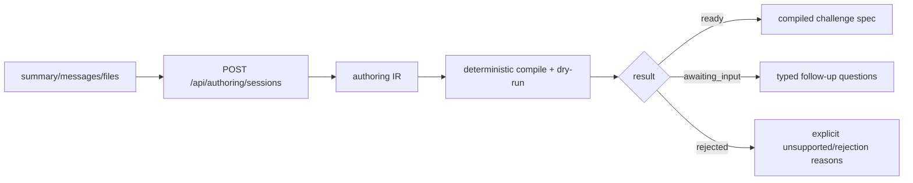

# Challenge Authoring IR

## Purpose

Define the typed intermediate representation that sits between rough authoring
context and a compiled challenge spec.

This is the durable interpretation layer used by:

- the web `/post` flow
- direct OpenClaw agent calls
- any future caller that starts an authoring session through
  `/api/authoring/sessions`

It is not the public API contract. The public contract is the authoring session
API in [specs/authoring-session-api.md](specs/authoring-session-api.md).

## Design Rule

Agora should never jump directly from natural language to an on-chain publish.

The safe path is:

```text
rough context + files
  -> typed authoring IR
  -> deterministic compile + dry-run
  -> challenge spec candidate
  -> explicit publish confirmation
```

The LLM helps interpret intent and identify gaps. Deterministic compile remains
authoritative.

## Current Session Flow



Conversational path:

```text
create session -> answer questions -> respond -> ready -> publish
```

There is no separate public `compile` endpoint and no legacy helper response
surface anymore.

## What The IR Must Capture

The IR is the durable typed interpretation of the session so far. It must
answer:

- what problem the creator is trying to solve
- what solvers are expected to submit
- how winning is measured
- which artifacts are public vs hidden
- which execution template and metric fit
- what information is still missing
- why Agora rejected the task if it cannot be compiled into a valid challenge

## Conceptual Shape

The persisted schema may evolve, but the stable structure is:

```ts
type ChallengeAuthoringIr = {
  version: 3;
  origin: {
    provider: "direct" | "beach_science";
    external_id?: string | null;
    external_url?: string | null;
    ingested_at: string;
    raw_context?: Record<string, unknown> | null;
  };
  source: {
    title?: string | null;
    poster_messages: Array<{
      id: string;
      role: "poster" | "participant" | "system";
      content: string;
      created_at: string;
    }>;
    uploaded_artifact_ids: string[];
  };
  intent: {
    current: PartialChallengeIntent;
    missing_fields: string[];
  };
  assessment: {
    input_hash: string | null;
    outcome: "ready" | "awaiting_input" | "rejected" | null;
    reason_codes: string[];
    warnings: string[];
    missing_fields: string[];
  };
  evaluation: {
    template: string | null;
    metric: string | null;
    artifact_assignments: Array<{
      artifact_id: string;
      artifact_index: number;
      role: string;
      visibility: "public" | "private";
    }>;
    rejection_reasons: string[];
    compile_error_codes: string[];
    compile_error_message: string | null;
  };
  questions: {
    pending: AuthoringQuestion[];
  };
};
```

## Outcome Model

The IR and compile pipeline collapse to three meaningful authoring outcomes:

- `ready`
- `awaiting_input`
- `rejected`

Public session state then adds the lifecycle terminals:

- `published`
- `expired`

Internal transient `created` exists only briefly at insert time and is not part
of the public contract.

## What The LLM Does

The LLM may:

- read rough context and artifact metadata
- propose the most likely execution template
- propose the most likely metric
- identify missing required fields
- suggest artifact roles

The LLM may not:

- invent unsupported execution templates
- invent unsupported metrics
- skip deterministic compile
- publish directly from prose

## What Deterministic Compile Does

Deterministic compile decides whether Agora can produce a valid challenge spec.

It validates:

- required intent fields
- execution template support
- metric validity
- artifact-role completeness
- submission contract shape
- scorer transparency inputs
- dry-run viability

Compile output is the authoritative source for:

- whether the session is `ready`
- which questions remain blocking
- what the final compilation object contains
- whether the task must be `rejected`

## Runtime-Family Selection

Managed authoring only targets supported Agora runtime families:

- `reproducibility`
- `tabular_regression`
- `tabular_classification`
- `ranking`
- `docking`

If a task needs a different evaluator model, Agora should reject it clearly and
point the creator toward the explicit custom scorer workflow rather than
pretending it can compile it.

## Bottom Line

The right abstraction is:

```text
create/respond = interpret + validate + compile dry-run
publish = explicit irreversible creation path
```

Everything else is transport.
