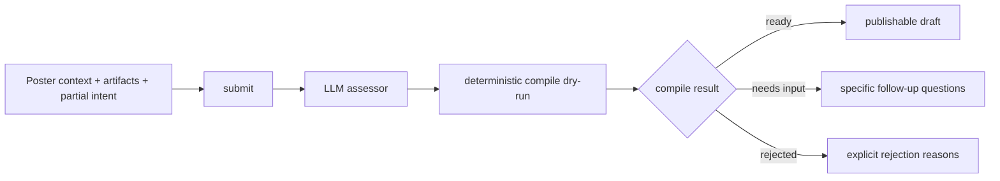

# Challenge Authoring IR

## Purpose

Define the poster-side intake contract between vague scientific intent and a publishable deterministic challenge.

This is the authoring layer for:

- Beach/OpenClaw submits
- the guided `/post` flow
- any future assisted CLI or agent intake path

It is **not** the final publish boundary. The final boundary is still the compiled challenge spec.

## Design rule

Agora should never go directly from natural language to scorer code.

The safe path is:

```text
raw context + partial intent
  -> typed intake state
  -> deterministic compile dry-run
  -> publishable challenge spec
```

The LLM is used for interpretation and gap-finding. Deterministic compile remains authoritative.

## Target flow



Happy path:

```text
submit -> publish
```

Conversational path:

```text
submit -> answer returned questions -> submit -> publish
```

There is no separate `clarify` endpoint and no separate `compile` endpoint in the target model.

## Universal submit gate

The public assisted-authoring surface should converge on:

- `POST /api/authoring/drafts/submit`
- `POST /api/authoring/drafts/:id/publish`

Partner wrappers such as Beach may still exist for auth and normalization, but they should call the same intake workflow internally.

## What the IR must capture

The authoring IR is the durable state of the conversation, not a bag of heuristics.

It must answer:

- what problem the poster is trying to solve
- what solvers are expected to submit
- how winning is measured
- which artifacts are public vs hidden
- which supported Gems runtime family fits
- what information is still missing

## Minimal IR shape

The live schema may evolve, but the stable conceptual shape is:

```ts
type AuthoringIntakeState = {
  version: 1;
  source: {
    provider: "direct" | "beach_science";
    external_id?: string | null;
    external_url?: string | null;
    raw_context?: Record<string, unknown> | null;
  };
  intent: {
    current: PartialChallengeIntent;
    missing_fields: string[];
  };
  artifacts: {
    uploaded_ids: string[];
    assignments: Array<{
      artifact_id: string;
      role: string;
      visibility: "public" | "private";
    }>;
  };
  evaluation: {
    runtime_family: string | null;
    metric: string | null;
    rejection_reasons: string[];
    compile_error_codes: string[];
    compile_error_message: string | null;
  };
  questions: {
    pending: Array<{
      id: string;
      field: string;
      kind: string;
      prompt: string;
      why: string | null;
      reason_codes: string[];
    }>;
  };
};
```

## What the LLM does

The LLM should:

- read poster context and artifact metadata
- propose the most likely Gems runtime family
- propose the most likely metric
- assign artifact roles when possible
- surface exactly what is missing

The LLM should **not**:

- publish directly from prose
- invent unsupported runtime families
- invent metrics outside the runtime catalog
- write scorer code

## What compile does

Deterministic compile dry-run decides the real outcome.

It validates:

- required intent fields
- runtime family support
- metric validity
- artifact-role completeness
- submission contract shape
- scoreability under the current managed Gems families

Compile output should collapse to three operational states:

- `ready`
- `needs_input`
- `failed`

That is the truth surface the rest of the system should read.

## Runtime-family selection

The scorer catalog in [runtime-families.ts](../packages/common/src/runtime-families.ts) is the source of truth for what the assisted authoring flow can target.

The assisted flow currently targets supported Gems families only:

- `reproducibility`
- `tabular_regression`
- `tabular_classification`
- `ranking`
- `docking`

If a challenge needs a different evaluator model, it should fail clearly and point the poster toward the explicit custom scorer workflow rather than pretending the assisted flow can compile it.

## Question model

Question generation should be compiler-driven.

That means:

- the LLM proposes candidate structure
- compile says what is still missing or invalid
- the system turns those errors into the next specific questions

Examples:

- "Which column is the target variable?"
- "Should solvers predict a numeric value or a class label?"
- "Is this file the hidden evaluation set or the public training data?"

## State model

Managed drafts should stay simple:

- `draft`
- `compiling`
- `ready`
- `needs_input`
- `published`
- `failed`

There is no review queue state in the assisted intake model anymore.

## Current implementation direction

The repo is converging on this shape:

- external Beach/OpenClaw flow already uses `submit + publish`
- direct managed authoring is being collapsed onto the same `submit + publish` model
- deterministic compile remains in [managed-authoring.ts](../apps/api/src/lib/managed-authoring.ts)
- stale split-path and review-era paths are being removed

The next architectural step is not "more heuristics." It is one universal intake workflow backed by a structured LLM assessor and a deterministic compiler.

## Non-goals

- arbitrary scorer-code generation
- keeping separate Beach-only intake semantics
- reintroducing review queue states for normal assisted posting
- mixing assisted Gems intake with the explicit custom scorer workflow

## Bottom line

The correct abstraction is:

```text
submit = interpret + validate + compile dry-run
publish = irreversible on-chain creation
```

Everything else is transport detail.
