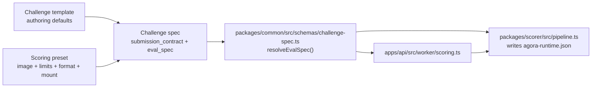

# Scoring Extension Guide

## Purpose

How to add a new scoring method or a new challenge family without spreading logic across the worker, API, and web app.

## The extension boundary

Agora treats scoring extensibility as three small, separate concepts:

1. **Challenge templates** in `packages/common/src/challenges/templates.ts`
2. **Scoring presets** in `packages/common/src/presets.ts`
3. **Generic scorer execution** in `packages/scorer/src/pipeline.ts`

Challenge type and domain catalogs remain centralized in:
- `packages/common/src/types/challenge.ts`

The worker, API routes, score jobs, proofs, and indexer should not need product-specific edits for a normal new scoring method.

ELI5:

- `templates.ts` decides what the posting flow should default to
- `presets.ts` decides how official scoring runs
- `pipeline.ts` stages files, writes the scorer runtime config, and runs Docker
- the worker just asks common for the resolved plan and executes it

## File map

### `packages/common/src/challenges/templates.ts`

Use this when you need:

- a new user-facing challenge family
- different posting defaults
- a new default preset for a challenge family
- shared draft construction used by the web posting flow

This file owns:

- default label and description
- default domain
- default metric
- default container
- default preset id
- shared submission-contract builders for current challenge families

### `packages/common/src/presets.ts`

Use this when you need a new scoring method that Agora will ship and support.

Each preset owns:

- container image
- runner limits
- default minimum score
- `expectedSubmissionKind`
- `mount`

This is the only runtime scoring config layer.

The worker hot path reads the resolved submission contract and scoring env from
the `challenges` table first. IPFS spec reads during scoring are now legacy
fallback only.

Official presets may also declare scorer-facing runtime defaults that the
pipeline serializes into `/input/agora-runtime.json` for the container.

### `packages/common/src/schemas/challenge-spec.ts`

This is where the shared contract is validated and turned into a resolved runtime plan.

It owns:

- preset-to-submission-contract validation
- scoreability validation
- `resolveEvalSpec()` for worker/scorer/oracle use

### `packages/scorer/src/pipeline.ts`

This is the generic runtime path.

It owns:

- staging evaluation bundle + submission files into the workspace
- writing `/input/agora-runtime.json` from preset defaults + submission contract
- pre-scoring contract validation
- running the Docker scorer
- DB-first runtime config resolution with legacy IPFS fallback

## Add a new official scoring method

1. Add a preset entry in `packages/common/src/presets.ts`.
2. Publish the scorer Docker image.
3. If the new method also needs a new authoring experience, add a challenge template entry in `packages/common/src/challenges/templates.ts`.
4. Add tests in:
   - `packages/common/src/tests/*`
   - `packages/scorer/src/tests/*`

That is the normal path. You should not need:

- a new worker branch
- a new scorer adapter directory
- a new runtime registry file

## Add a new challenge family

Use this path only when the user-facing posting flow genuinely differs.

1. Add the new challenge type/domain value in `packages/common/src/types/challenge.ts`.
2. Add its template entry in `packages/common/src/challenges/templates.ts`.
3. Optionally add a preset in `packages/common/src/presets.ts` if Agora also ships an official scorer for it.
4. Update docs/tests.

## ELI5 file map

- `packages/common/src/challenges/templates.ts`
  - "If a new company posts challenge type X, what should the draft look like?"

- `packages/common/src/presets.ts`
  - "What container, resource limits, file layout, and submission kind does official scorer Y use?"

- `packages/common/src/schemas/challenge-spec.ts`
  - "Given a challenge spec, what is the final scoring plan?"

- `packages/scorer/src/pipeline.ts`
  - "Take that plan, stage the files, and run Docker."

- `apps/api/src/worker/scoring.ts`
  - "Score one queued submission and build a proof."

- `apps/web/src/app/post/PostClient.tsx`
  - "Render the form and call the shared draft builder."

## What should stay unchanged

Adding a normal scoring method should not require changing:

- worker job state transitions
- score-job queue handling
- API challenge routes
- proof bundle storage
- indexer event handling
- deployment scripts

If a new scoring method needs edits in those layers, the design is probably too coupled.
