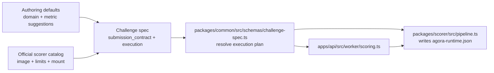

# Scoring Extension Guide

## Purpose

How to extend the official scoring runtime without spreading logic across the
worker, API, and web app.

## The extension boundary

Agora treats scoring extensibility as three small concepts, but only one of
them is allowed to define official runtime capability:

1. **Authoring defaults** in `packages/common/src/challenges/templates.ts`
2. **Official scorer catalog** in `packages/common/src/official-scorer-catalog.ts`
3. **Generic scorer execution** in `packages/scorer/src/pipeline.ts`

Challenge type and domain catalogs remain centralized in:
- `packages/common/src/types/challenge.ts`

The worker, API routes, score jobs, proofs, and indexer should not need product-specific edits for a normal new scoring method.

ELI5:

- `templates.ts` decides what the posting flow should default to
- `official-scorer-catalog.ts` decides how official scoring runs
- `pipeline.ts` stages files, writes the scorer runtime config, and runs Docker
- the worker just asks common for the resolved plan and executes it

## File map

### `packages/common/src/challenges/templates.ts`

Use this when you need:

- a new user-facing challenge family
- different posting defaults
- shared challenge spec candidate construction used by the web posting flow

This file owns:

- default label and description
- default domain
- default metric
- shared submission-contract builders for current challenge families

This file does **not** own:

- official scorer image selection
- runtime limits
- mount layout
- worker execution behavior

### `packages/common/src/official-scorer-catalog.ts`

Use this when you need a new official scoring method that Agora will ship and support.

Each catalog entry owns:

- template id
- container image
- runner limits
- supported metrics
- allowed policies
- `mount`
- official release-platform contract (`linux/amd64` and `linux/arm64`)

This is the only official scoring config layer.

The worker hot path reads the resolved submission contract and scoring env from
the `challenges` table first. Pinned-spec reads are only for local/public
verification paths outside the worker hot path.

Official scorer catalog entries may also declare scorer-facing runtime defaults that
the pipeline serializes into `/input/agora-runtime.json` for the container.

### `packages/common/src/schemas/challenge-spec.ts`

This is where the shared contract is validated and turned into a resolved runtime plan.

It owns:

- execution-to-catalog validation
- scoreability validation
- challenge-spec-to-execution-plan derivation for worker/scorer/oracle use

### `packages/scorer/src/pipeline.ts`

This is the generic runtime path.

It owns:

- staging evaluation bundle + submission files into the workspace
- writing `/input/agora-runtime.json` from execution-plan defaults + submission contract
- pre-scoring contract validation
- running the Docker scorer
- DB-first runtime config resolution, with pinned-spec reads only where local or public verification still needs them

## Add a new official scoring method

1. Add or update the catalog entry in `packages/common/src/official-scorer-catalog.ts`.
2. Publish the scorer Docker image.
   - official scorer tags must publish as a multi-arch manifest list for
     `linux/amd64` and `linux/arm64`
3. If the new method also needs a new authoring experience, add or update authoring defaults in `packages/common/src/challenges/templates.ts`.
4. Add tests in:
   - `packages/common/src/tests/*`
   - `packages/scorer/src/tests/*`
   - worker/runtime plan tests

That is the normal path. You should not need:

- a new worker branch
- a new scorer adapter directory
- a new runtime registry file
- a separate official image whitelist

## Add a new challenge family

Use this path only when the user-facing posting flow genuinely differs.

1. Add the new challenge type/domain value in `packages/common/src/types/challenge.ts`.
2. Add its template entry in `packages/common/src/challenges/templates.ts`.
3. Only add a scorer catalog entry if Agora is actually shipping a new official runtime, not just a new UX label.
4. Update docs/tests.

## ELI5 file map

- `packages/common/src/challenges/templates.ts`
  - "If a new company posts challenge type X, what should the challenge spec candidate look like?"

- `packages/common/src/official-scorer-catalog.ts`
  - "What container, resource limits, file layout, and metrics does official scorer Y use?"

- `packages/common/src/schemas/challenge-spec.ts`
  - "Given a challenge spec, what is the final scoring plan?"

- `packages/scorer/src/pipeline.ts`
  - "Take that plan, stage the files, and run Docker."

- `apps/api/src/worker/scoring.ts`
  - "Score one queued submission and build a proof."

- `apps/web/src/app/post/PostClient.tsx`
  - "Render the form and call the shared challenge-spec builder."

## What should stay unchanged

Adding a normal scoring method should not require changing:

- worker job state transitions
- score-job queue handling
- API challenge routes
- proof bundle storage
- indexer event handling
- deployment scripts beyond reading the official scorer catalog

If a new scoring method needs edits in those layers, the design is probably too coupled.

## Guardrails

- Official runtime support must come from exactly one catalog. Do not add a
  second image whitelist or metric-routing table.
- Official scorer release tags must stay multi-arch for `linux/amd64` and
  `linux/arm64`.
- `challenge_type` is an authoring/product concept. It must not route worker
  execution.
- The canonical worker cache is `execution_plan_json`, not a hand-built mirror
  of the challenge spec.
