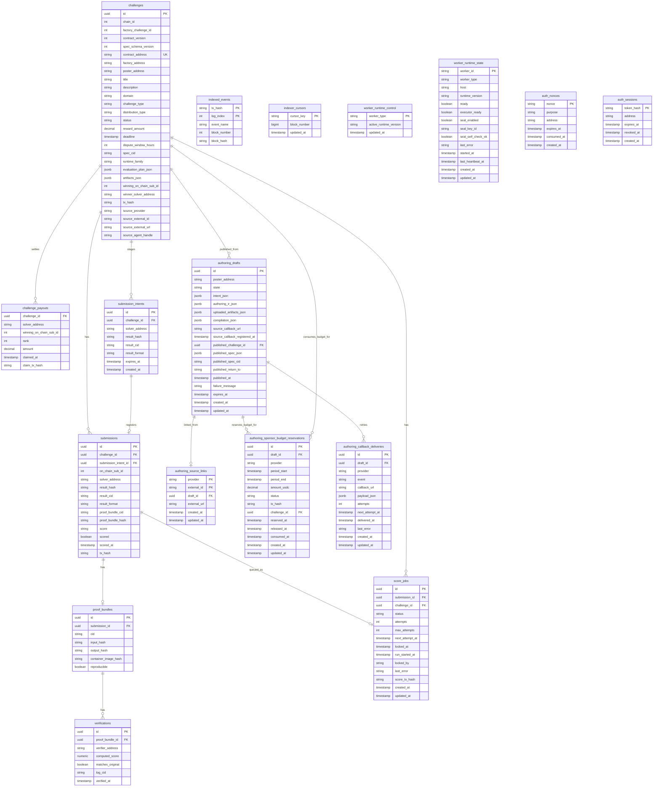
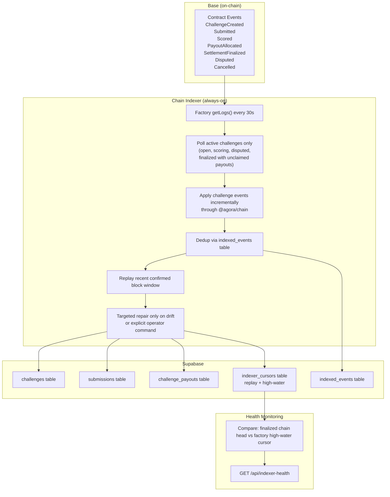

# Data and Indexing

## Purpose

How data flows through Agora: from on-chain events through the indexer into the database, and how each layer relates to truth.

## Audience

Engineers working on the indexer, database, API, or any component that reads/writes data. Operators debugging data inconsistencies.

## Read this after

- [Architecture](architecture.md) — system overview
- [Protocol](protocol.md) — on-chain rules and events

## Source of truth

This doc is authoritative for: database schema, projection model, indexer behavior, and read/write truth boundaries. It is NOT authoritative for: sealed submission format details, smart contract logic, API route definitions, or frontend behavior. For the privacy model around `result_cid`, replay artifacts, and sealed envelopes, see [Submission Privacy](submission-privacy.md).

## Summary

- On-chain contracts are authoritative for lifecycle status, payout entitlements, and claimability
- Supabase is a projection and operational cache, not the source of truth
- The indexer polls chain events every 30s and writes idempotent projections to Supabase
- Scoreable submissions require a pre-registered `submission_intent` and a linked `submissions.submission_intent_id`
- Fairness-sensitive visibility checks use chain `status()` rather than projected status
- Public leaderboard, win rate, and earned USDC derive from finalized `challenge_payouts` rows
- Worker scoring reads canonical `evaluation_plan_json` from the DB; it is the single cached execution contract for scorer image, mount, env, submission contract, evaluation contract, and runtime policies
- Authoring state now uses one canonical `authoring_drafts` aggregate, with `authoring_source_links` for stable external source identity, `authoring_callback_deliveries` for callback retry, and `authoring_sponsor_budget_reservations` for sponsor-capacity accounting
- Published challenges can now carry external-source attribution (`source_provider`, `source_external_id`, `source_external_url`, `source_agent_handle`) for Beach/OpenClaw lineage and sponsor-budget accounting

---

## On-Chain vs Off-Chain Boundary

| Data | Location | Why |
|------|----------|-----|
| USDC balances & escrow | On-chain | Trustless custody |
| Challenge status machine | On-chain | Settlement finality |
| Submission hashes | On-chain | Tamper-proof record |
| Scores (WAD 1e18) | On-chain | Verifiable payout input |
| Proof bundle hashes | On-chain | Audit trail |
| Challenge YAML specs | IPFS + Supabase | Immutable + searchable |
| Raw artifacts | IPFS / external URL | Large files stay off-chain |
| Full proof bundles | IPFS | Reproducibility evidence |
| Search indexes | Supabase | Fast agent discovery |

---

## Source-of-Truth Matrix

| Concept | Authoritative Source | Notes |
|---------|---------------------|-------|
| Lifecycle status | Contract `status()` | DB projection may conservatively lag |
| Payout entitlements | Contract (`PayoutAllocated` events) | `challenge_payouts` table is projection |
| Claimability | Contract (`claim()`) | — |
| Leaderboard display | DB (`challenge_payouts` from finalized) | Not score heuristics |
| UI status labels | API domain types derived from chain | — |
| Verification gate | Chain truth | Fairness-sensitive routes re-check |
| Challenge metadata | IPFS (immutable) + DB (searchable cache) | DB also caches resolved scoring config for worker hot-path reads |
| Submission fetch metadata (`result_cid`, `result_format`) | DB registration (`submission_intents` + `submissions.submission_intent_id`) | Chain stores only `result_hash`; unmatched on-chain submissions are not scoreable |
| Submission content | IPFS | Hash anchored on-chain |

---

## Database Schema



### Table Descriptions

- **challenges** — Projected from `ChallengeCreated` events + IPFS spec parsing. Key fields: `contract_address` (unique on-chain identity), `factory_challenge_id` (factory-level on-chain numeric id), `status` (projected lifecycle state), `reward_amount` (USDC, 6 decimals), `deadline` (UTC timestamp), `spec_cid` (IPFS pointer to challenge YAML), `runtime_family` (managed runtime selection), `evaluation_plan_json` (canonical cached scoring plan: scorer image, bundle, mount, env, contracts, and policy metadata), and `artifacts_json` (public/private artifact cache). `challenge_type` remains a compatibility and display field, but execution behavior should key off `evaluation_plan_json` and the resolved evaluation plan helpers.

- **submissions** — Projected from `Submitted` + `Scored` events. Key fields: `on_chain_sub_id` (contract-level submission index), `result_hash` (keccak256 of result CID, anchored on-chain), `submission_intent_id` (required link to the pre-registered submission intent), `result_cid` (IPFS pointer to the registered submission file), `score` (WAD-scaled score string), and `scored` (boolean, set true when `Scored` event is indexed). Additional columns: `result_format` (enum: `plain_v0` for direct/public payloads or `sealed_submission_v2` for sealed envelopes), `proof_bundle_cid` (IPFS CID of the proof bundle), `proof_bundle_hash` (on-chain hash of the proof bundle), and `scored_at` (timestamp when the score was posted). For `sealed_submission_v2`, `result_cid` points to the sealed envelope, not the plaintext replay artifact.

- **submission_intents** — Required off-chain submission registration records. Each scoreable submission must start here before the wallet transaction is sent. Rows store `(challenge_id, solver_address, result_hash)` plus the canonical `result_cid` and `result_format`. The only canonical link from a registered on-chain submission back to its intent is `submissions.submission_intent_id`; there is no reverse match pointer on the intent row anymore.

- **proof_bundles** — Created during scoring. Links a submission to its proof CID and reproducibility check. Fields include `input_hash`, `output_hash`, and `container_image_hash` for full audit trail. `reproducible` indicates whether independent re-runs match. `replaySubmissionCid` may point to a plaintext replay artifact once scoring begins, which is why public verification stays locked while the challenge is open.

- **challenge_payouts** — Projected from `PayoutAllocated` events. Primary key is `(challenge_id, solver_address, rank)`. Canonical source for leaderboard rankings and solver earnings. `claimed_at` and `claim_tx_hash` are updated when the `Claimed` event is indexed.

- **indexed_events** — Deduplication table keyed on `(tx_hash, log_index)`. Prevents reprocessing of already-handled events. Also used for health monitoring by comparing `block_number` against chain head.

- **score_jobs** — Worker coordination table. States: `queued` → `running` → `scored` | `failed` | `skipped`. Includes lease management via `locked_at`, `locked_by`, and stale-lease recovery. `max_attempts` defaults to 5. `next_attempt_at` gates delayed retries. Jobs are only created or revived after a `submissions` row has both the on-chain fields and the linked registered metadata (`result_cid`, `result_format`, `submission_intent_id`). `skipped` means the submission exceeded per-challenge or per-solver scoring limits.

- **worker_runtime_state** — Worker heartbeat and readiness table. Each scoring worker publishes `worker_id`, `host`, `runtime_version`, scorer-backend readiness, sealing readiness, and `last_error`. The `executor_ready` column means “the configured scorer execution backend is ready,” regardless of whether that backend is local Docker in dev or the remote executor in production. The API reads this table for `/api/worker-health` and runtime-mismatch detection.
- **worker_runtime_control** — Active scoring-runtime control row. The API upserts the active runtime version on startup, and score-job claims are fenced against it so older workers cannot keep claiming jobs after a deploy.
- **authoring_drafts** — Canonical draft aggregate for guided posting and external source imports. Stores poster identity, raw `intent_json`, interpreted `authoring_ir_json` (including source provider/origin), normalized artifact metadata, current compilation state, callback registration metadata, publish outcome metadata, failure state, and expiry timestamps.
- **authoring_source_links** — Legacy source-identity index for the generic external draft API. The current Beach/OpenClaw session flow does not reuse this table for per-thread draft refresh; each new bounty attempt starts a fresh session.
- **authoring_sponsor_budget_reservations** — Reservation ledger for sponsor-budget enforcement during authoring publishes. Rows move from `reserved` to `consumed` once the publish is projected, or to `released` when the publish never submitted a challenge transaction. This keeps budget enforcement atomic without requiring the chain to know about off-chain draft ids.
- **authoring_callback_deliveries** — Durable callback outbox for external authoring hosts. Stores signed payloads, retry timing, attempt counts, terminal delivery timestamp, and last error for sweep-based retries.
- **challenges.source_* columns** — Optional attribution copied from the published challenge spec. These fields preserve the originating external host/provider identity and agent handle for reporting, callback correlation, and sponsor-budget enforcement.

- **verifications** — Records independent re-runs of the scorer. Links a proof_bundle to a verifier address, the computed score, whether it matches the original, and an optional log CID. Created by `agora verify`. `agora verify-public` is read-only and does not insert verification rows.

- **indexer_cursors** — Operational table tracking the last processed block number per cursor key. Used by the indexer to resume from the correct position after restart.

- **auth_nonces** — SIWE and pin-spec authentication nonces. Purpose is either `siwe` or `pin_spec`. Nonces expire and are consumed on use.

- **auth_sessions** — Authenticated session tokens for SIWE sessions. Keyed by `token_hash`. Includes revocation support.

---

## Indexer Architecture



### How the indexer works

- **Polls every 30 seconds** using `getLogs` against the active factory and the active challenge set only: `open`, `scoring`, `disputed`, and `finalized` challenges with unclaimed payouts.
- **Confirmation depth:** Controlled by `AGORA_INDEXER_CONFIRMATION_DEPTH` (default 3). Events are only committed to the DB once they have this many confirmations, reducing reorg risk.
- **Deduplication** via the `indexed_events` table. Each event is keyed on `(tx_hash, log_index)`. `block_hash` is also stored for replay diagnostics and shallow reorg analysis. If the key already exists, the event handler is skipped.
- **Idempotent writes** — The indexer is safe to replay. Re-running the same block range produces the same DB state. UPSERTs and conditional writes ensure no duplicate or conflicting rows.
- **Implementation is split by concern** — `indexer.ts` owns polling and cursor coordination; `factory-events.ts` projects `ChallengeCreated`; `challenge-events.ts` owns challenge-log idempotency and retry dispatch; `submissions.ts` owns submission projection and intent-backed recovery; `settlement.ts` owns status, payouts, claims, and targeted reconcile; `cursors.ts` owns challenge cursor bootstrap/persist.
- **Hot path is event-driven** — submissions, scores, payout allocations, settlement winner fields, and claim state are updated directly from challenge events. Full `reconcileChallengeProjection()` is reserved for targeted drift repair or explicit operator repair.
- **Replay scope is split** — the factory cursor retains a replay window for reorg safety, while quiet challenge cursors advance to the exact next block by default and only rewind when that challenge actually fails.
- **`AGORA_INDEXER_START_BLOCK`** must be set for new factory deployments. This tells the indexer where to begin scanning. Without it, the indexer will not know which blocks to poll for the new factory's events.

---

## Event to Projection Mapping

| Event | Target Table | Action |
|-------|-------------|--------|
| `ChallengeCreated` | `challenges` | INSERT with IPFS spec fetch |
| `Submitted` | `submissions` | INSERT |
| `StatusChanged` | `challenges` | UPDATE status |
| `Scored` | `submissions` | UPDATE score, scored=true |
| `PayoutAllocated` | `challenge_payouts` | INSERT/UPSERT by `(challenge_id, solver_address, rank)` |
| `SettlementFinalized` | `challenges` | UPDATE status=finalized + winner fields |
| `Disputed` | `challenges` | Handled via `StatusChanged` event (status transitions to `disputed`) |
| `DisputeResolved` | `challenges` | UPDATE status + winner |
| `Cancelled` | `challenges` | Handled via `StatusChanged` event (status transitions to `cancelled`) |
| `Claimed` | `challenge_payouts` | UPDATE claimed_at, claim_tx_hash |

---

## Health Monitoring

- **Endpoint:** `GET /api/indexer-health`
- Compares the finalized chain head against the factory **high-water cursor**, not the replay cursor. This prevents the replay window from showing up as false lag.
- **States:**
  - `ok` — 20 blocks or fewer behind chain head
  - `warning` — 20-120 blocks behind
  - `critical` — more than 120 blocks behind (returns HTTP 503)
- Indexer health also reports the intended factory address, useful for confirming the correct contract generation is being indexed.

---

## Projection Rules

- **DB is a cache, not truth.** If DB and chain disagree, chain wins.
- **Fairness-sensitive visibility checks** (e.g., leaderboard during `Open` status) use chain `status()`, not projected status. This prevents premature leaderboard exposure due to indexer lag.
- **Public global reputation** surfaces use finalized challenges only. Win rate and earned USDC derive from `challenge_payouts` rows where the parent challenge is finalized.
- **Effective vs persisted status:** The contract `status()` view returns `Scoring` after the deadline even if the persisted storage slot is still `Open`. Off-chain consumers should use `status()` for visibility decisions. The DB projection may conservatively lag until the `StatusChanged(Open, Scoring)` event is indexed.
- **Strict submission registration:** clients must pre-register `submission_intents` before they submit on-chain. That durable reservation remains the prerequisite for a scoreable submission, but explicit API submit-confirmation is no longer the only reconciliation path: the indexer can now recover the projected `submissions` row directly from the reserved intent when the on-chain `solver` + `result_hash` match. Truly unmatched on-chain submissions still remain operationally invalid and must be investigated.

- **Worker coordination:** The worker only claims `score_jobs` after the challenge enters `Scoring` at deadline and only when its `runtime_version` matches the active row in `worker_runtime_control`. Jobs move: `queued` → `running` → `scored` | `failed` | `skipped`. `skipped` indicates the submission exceeded per-challenge or per-solver scoring limits. The worker and API coordinate through Supabase: `score_jobs` drives scoring work, `worker_runtime_state` carries heartbeat/readiness/runtime-version state, `worker_runtime_control` fences mixed-runtime workers during deploys, the executor runs scorer containers, and `submission_intents` act as the required registration record for every scoreable submission.

---

## Reindex / Replay

When the indexer falls behind, processes stale data, or a new factory is deployed, you may need to replay events.

- **Preview (dry-run):**
  ```bash
  agora reindex --from-block <block_number> --dry-run
  ```

- **Apply:**
  ```bash
  agora reindex --from-block <block_number>
  ```

- **Deep replay with purge:**
  ```bash
  agora reindex --from-block <block_number> --purge-indexed-events
  ```

- **Repair one projected challenge without replaying the full indexer:**
  ```bash
  agora repair-challenge --id <challenge_id>
  ```

### What each option does

- `--from-block` rewinds factory + challenge cursors for the active chain to the specified block number. The indexer will re-scan from that point on its next poll cycle.
- `--dry-run` shows what would be replayed without writing to the database.
- `--purge-indexed-events` deletes rows from `indexed_events` for the replayed range, forcing event handlers to run again even for previously processed events. Use this when you suspect corrupted projections.
- `repair-challenge` rebuilds one challenge projection from chain state at the current confirmed tip. Use this for challenge-local drift without replaying the whole factory.

### When to reindex

- After deploying a new factory (set `AGORA_INDEXER_START_BLOCK` to the deploy block first).
- After the factory address changes (align API/indexer/worker/web env first, restart all services, then reindex).
- When `GET /api/indexer-health` reports `critical` and a restart alone does not recover.
- When DB projections are visibly inconsistent with on-chain state.
