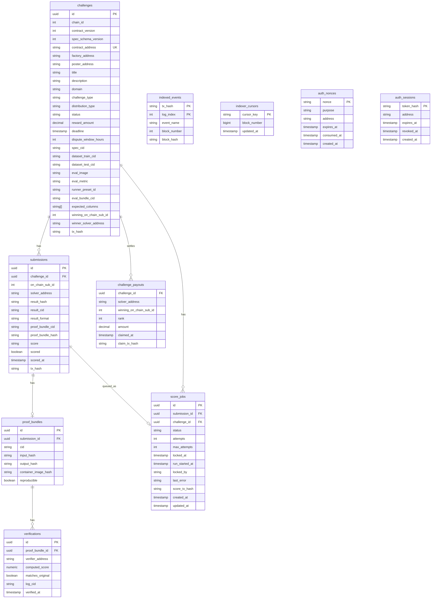
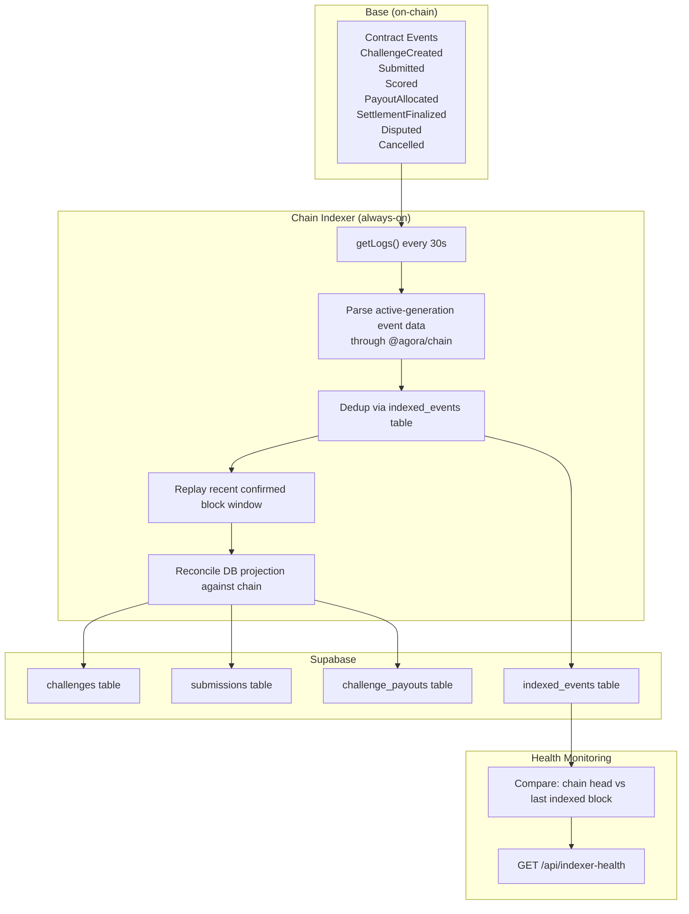

# Data and Indexing

## Purpose

How data flows through Agora: from on-chain events through the indexer into the database, and how each layer relates to truth.

## Audience

Engineers working on the indexer, database, API, or any component that reads/writes data. Operators debugging data inconsistencies.

## Read this after

- [Architecture](architecture.md) — system overview
- [Protocol](protocol.md) — on-chain rules and events

## Source of truth

This doc is authoritative for: database schema, projection model, indexer behavior, and read/write truth boundaries. It is NOT authoritative for: smart contract logic, API route definitions, or frontend behavior.

## Summary

- On-chain contracts are authoritative for lifecycle status, payout entitlements, and claimability
- Supabase is a projection and operational cache, not the source of truth
- The indexer polls chain events every 30s and writes idempotent projections to Supabase
- Fairness-sensitive visibility checks use chain `status()` rather than projected status
- Public leaderboard, win rate, and earned USDC derive from finalized `challenge_payouts` rows

---

## On-Chain vs Off-Chain Boundary

| Data | Location | Why |
|------|----------|-----|
| USDC balances & escrow | On-chain | Trustless custody |
| Challenge status machine | On-chain | Settlement finality |
| Submission hashes | On-chain | Tamper-proof record |
| Scores (WAD 1e18) | On-chain | Verifiable payout input |
| Proof bundle hashes | On-chain | Audit trail |
| Challenge YAML specs | IPFS + Supabase | Immutable + searchable |
| Raw datasets | IPFS / external URL | Large files stay off-chain |
| Full proof bundles | IPFS | Reproducibility evidence |
| Search indexes | Supabase | Fast agent discovery |

---

## Source-of-Truth Matrix

| Concept | Authoritative Source | Notes |
|---------|---------------------|-------|
| Lifecycle status | Contract `status()` | DB projection may conservatively lag |
| Payout entitlements | Contract (`PayoutAllocated` events) | `challenge_payouts` table is projection |
| Claimability | Contract (`claim()`) | — |
| Leaderboard display | DB (`challenge_payouts` from finalized) | Not score heuristics |
| UI status labels | API domain types derived from chain | — |
| Verification gate | Chain truth | Fairness-sensitive routes re-check |
| Challenge metadata | IPFS (immutable) + DB (searchable cache) | — |
| Submission content | IPFS | Hash anchored on-chain |

---

## Database Schema



### Table Descriptions

- **challenges** — Projected from `ChallengeCreated` events + IPFS spec parsing. Key fields: `contract_address` (unique on-chain identity), `status` (projected lifecycle state), `reward_amount` (USDC, 6 decimals), `deadline` (UTC timestamp), `spec_cid` (IPFS pointer to challenge YAML), `eval_image` (Docker scorer image reference). Additional columns: `contract_version` (on-chain contract version for generation tracking), `spec_schema_version` (YAML schema version), `dataset_train_cid` and `dataset_test_cid` (IPFS CIDs for training/test data), `expected_columns` (expected output column names), `distribution_type` (payout distribution: `winner_take_all`, `top_3`, or `proportional`), `runner_preset_id` (scorer runner preset), `eval_bundle_cid` (IPFS CID for evaluation bundle).

- **submissions** — Projected from `Submitted` + `Scored` events. Key fields: `on_chain_sub_id` (contract-level submission index), `result_hash` (keccak256 of result CID, anchored on-chain), `result_cid` (IPFS pointer to submission file), `score` (WAD-scaled score string), `scored` (boolean, set true when `Scored` event is indexed). Additional columns: `result_format` (enum: `plain_v0` for unencrypted or `sealed_v1` for sealed submissions), `proof_bundle_cid` (IPFS CID of the proof bundle), `proof_bundle_hash` (on-chain hash of the proof bundle), `scored_at` (timestamp when the score was posted).

- **proof_bundles** — Created during scoring. Links a submission to its proof CID and reproducibility check. Fields include `input_hash`, `output_hash`, and `container_image_hash` for full audit trail. `reproducible` indicates whether independent re-runs match.

- **challenge_payouts** — Projected from `PayoutAllocated` events. Primary key is `(challenge_id, solver_address, rank)`. Canonical source for leaderboard rankings and solver earnings. `claimed_at` and `claim_tx_hash` are updated when the `Claimed` event is indexed.

- **indexed_events** — Deduplication table keyed on `(tx_hash, log_index)`. Prevents reprocessing of already-handled events. Also used for health monitoring by comparing `block_number` against chain head.

- **score_jobs** — Worker coordination table. States: `queued` → `running` → `scored` | `failed` | `skipped`. Includes lease management via `locked_at`, `locked_by`, and stale-lease recovery. `max_attempts` defaults to 5. `skipped` means the submission exceeded per-challenge or per-solver scoring limits.

- **verifications** — Records independent re-runs of the scorer. Links a proof_bundle to a verifier address, the computed score, whether it matches the original, and an optional log CID. Created by `agora verify`. `agora verify-public` is read-only and does not insert verification rows.

- **indexer_cursors** — Operational table tracking the last processed block number per cursor key. Used by the indexer to resume from the correct position after restart.

- **auth_nonces** — SIWE and pin-spec authentication nonces. Purpose is either `siwe` or `pin_spec`. Nonces expire and are consumed on use.

- **auth_sessions** — Authenticated session tokens for SIWE sessions. Keyed by `token_hash`. Includes revocation support.

---

## Indexer Architecture



### How the indexer works

- **Polls every 30 seconds** using `getLogs` against the active factory and all known challenge contracts.
- **Confirmation depth:** Controlled by `AGORA_INDEXER_CONFIRMATION_DEPTH` (default 3). Events are only committed to the DB once they have this many confirmations, reducing reorg risk.
- **Deduplication** via the `indexed_events` table. Each event is keyed on `(tx_hash, log_index)`. `block_hash` is also stored for replay diagnostics and shallow reorg analysis. If the key already exists, the event handler is skipped.
- **Idempotent writes** — The indexer is safe to replay. Re-running the same block range produces the same DB state. UPSERTs and conditional writes ensure no duplicate or conflicting rows.
- **`AGORA_INDEXER_START_BLOCK`** must be set for new factory deployments. This tells the indexer where to begin scanning. Without it, the indexer will not know which blocks to poll for the new factory's events.

---

## Event to Projection Mapping

| Event | Target Table | Action |
|-------|-------------|--------|
| `ChallengeCreated` | `challenges` | INSERT with IPFS spec fetch |
| `Submitted` | `submissions` | INSERT |
| `StatusChanged` | `challenges` | UPDATE status |
| `Scored` | `submissions` | UPDATE score, scored=true |
| `PayoutAllocated` | `challenge_payouts` | INSERT/UPSERT by `(challenge_id, solver_address, rank)` |
| `SettlementFinalized` | `challenges` | UPDATE status=finalized + winner fields |
| `Disputed` | `challenges` | Handled via `StatusChanged` event (status transitions to `disputed`) |
| `DisputeResolved` | `challenges` | UPDATE status + winner |
| `Cancelled` | `challenges` | Handled via `StatusChanged` event (status transitions to `cancelled`) |
| `Claimed` | `challenge_payouts` | UPDATE claimed_at, claim_tx_hash |

---

## Health Monitoring

- **Endpoint:** `GET /api/indexer-health`
- Compares chain head block number vs last indexed block in `indexed_events`.
- **States:**
  - `ok` — 20 blocks or fewer behind chain head
  - `warning` — 20-120 blocks behind
  - `critical` — more than 120 blocks behind (returns HTTP 503)
- Indexer health also reports the intended factory address, useful for confirming the correct contract generation is being indexed.

---

## Projection Rules

- **DB is a cache, not truth.** If DB and chain disagree, chain wins.
- **Fairness-sensitive visibility checks** (e.g., leaderboard during `Open` status) use chain `status()`, not projected status. This prevents premature leaderboard exposure due to indexer lag.
- **Public global reputation** surfaces use finalized challenges only. Win rate and earned USDC derive from `challenge_payouts` rows where the parent challenge is finalized.
- **Effective vs persisted status:** The contract `status()` view returns `Scoring` after the deadline even if the persisted storage slot is still `Open`. Off-chain consumers should use `status()` for visibility decisions. The DB projection may conservatively lag until the `StatusChanged(Open, Scoring)` event is indexed.
- **Worker coordination:** The worker only claims `score_jobs` after the challenge enters `Scoring` at deadline. Jobs move: `queued` → `running` → `scored` | `failed` | `skipped`. `skipped` indicates the submission exceeded per-challenge or per-solver scoring limits. The worker and API share no runtime state — the only coordination point is the `score_jobs` table.

---

## Reindex / Replay

When the indexer falls behind, processes stale data, or a new factory is deployed, you may need to replay events.

- **Preview (dry-run):**
  ```bash
  agora reindex --from-block <block_number> --dry-run
  ```

- **Apply:**
  ```bash
  agora reindex --from-block <block_number>
  ```

- **Deep replay with purge:**
  ```bash
  agora reindex --from-block <block_number> --purge-indexed-events
  ```

### What each option does

- `--from-block` rewinds factory + challenge cursors for the active chain to the specified block number. The indexer will re-scan from that point on its next poll cycle.
- `--dry-run` shows what would be replayed without writing to the database.
- `--purge-indexed-events` deletes rows from `indexed_events` for the replayed range, forcing event handlers to run again even for previously processed events. Use this when you suspect corrupted projections.

### When to reindex

- After deploying a new factory (set `AGORA_INDEXER_START_BLOCK` to the deploy block first).
- After the factory address changes (align API/indexer/worker/web env first, restart all services, then reindex).
- When `GET /api/indexer-health` reports `critical` and a restart alone does not recover.
- When DB projections are visibly inconsistent with on-chain state.
