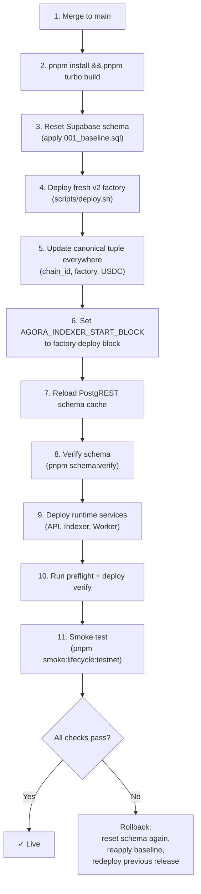

# Deployment

## Purpose

How to deploy, cut over, and roll back Agora services across environments.

## Audience

Operators and engineers responsible for deploying Agora to testnet or production.

## Read this after

- [Architecture](architecture.md) — system overview
- [Protocol](protocol.md) — contract lifecycle and settlement rules
- [Operations](operations.md) — day-to-day operations, monitoring, and incident response
- [specs/authoring-session-api.md](specs/authoring-session-api.md) — locked session-first authoring contract

## Source of truth

This doc is authoritative for: pre-launch checklists, deployment procedures, rollback criteria, contract deployment, external cutover checklists, and worker recovery scripts. It is NOT authoritative for: day-to-day operations, health monitoring, incident playbooks, or service startup (see [Operations](operations.md)).

## Summary

- Pre-launch requires aligned (chain id, factory address, USDC address) tuple across all services
- Cutover requires coordinated env updates, DB reset, factory deploy, and reindex
- Rollback if API health, indexer lag, DB consistency, or scoring verification fails
- External cutover covers GitHub, Vercel, API/runtime services, executor runtime, chain addresses, image registry, DNS, and operator machines

---

## Pre-Launch Checklist

1. Merge latest `main` and deploy from `main` only.
2. Set all required environment variables in your host platform.
3. For a clean contract generation: reset the testnet Supabase schema and apply [001_baseline.sql](/Users/changyuesin/Agora/packages/db/supabase/migrations/001_baseline.sql).
4. Deploy a fresh `v2` factory. `scripts/deploy.sh` requires explicit `AGORA_ORACLE_ADDRESS` and `AGORA_TREASURY_ADDRESS`.
5. Set `AGORA_INDEXER_START_BLOCK` to the factory deployment block before restarting the indexer.
6. Confirm the canonical `(chain id, factory address, USDC address)` tuple is identical in API, indexer, worker orchestrator, CLI, and web env.
7. If sealed submissions are enabled, set the submission sealing env vars in API and worker orchestrator.
8. Set `AGORA_CORS_ORIGINS` (comma-separated exact origins).
9. Ensure each deployed service reports the commit SHA it is actually running. API and worker orchestrator should match for scoring; web may differ temporarily during rollout. Prefer automatic SHA detection from platform git metadata; set `AGORA_RUNTIME_VERSION` manually only when your host does not expose a commit SHA.
10. Keep `AGORA_REQUIRE_PINNED_PRESET_DIGESTS=true`. Official GHCR scorer packages should be public; if they are not public yet, set `AGORA_GHCR_TOKEN` anywhere digest resolution runs and make sure the executor host can still `docker pull` them.
11. Build and run preflight:

```bash
pnpm install
pnpm turbo build
./scripts/preflight-testnet.sh
```

Recommended explicit release checks:

```bash
pnpm schema:verify
pnpm scorers:verify
```

Recommended runtime release trigger:

```bash
pnpm release:testnet
pnpm release:testnet:clean
```

This repo now ships two explicit runtime release lanes:

- `pnpm release:testnet`: non-destructive runtime deploy. Keeps the current
  Supabase schema, requires `pnpm schema:verify` to pass, deploys Railway
  runtime services, verifies deploy alignment, and runs the external lifecycle
  smoke.
- `pnpm release:testnet:clean`: destructive rebuild lane. Resets the Supabase
  schema, reapplies the single baseline, reloads the PostgREST cache, then
  continues with the same deploy/verify/smoke gate.

Pushes to `main` now trigger the same GitHub workflow automatically in
non-destructive `runtime` mode. The matching manual GitHub Actions trigger is
[`.github/workflows/release-runtime.yml`](/Users/changyuesin/Agora/.github/workflows/release-runtime.yml),
which accepts the same `runtime` vs `clean` choice when operators need to run
it manually.

Both the local script and the GitHub workflow require explicit Railway
targeting:

- `AGORA_RAILWAY_PROJECT_ID`
- `AGORA_RAILWAY_ENVIRONMENT`
- `AGORA_RAILWAY_API_SERVICE`
- `AGORA_RAILWAY_INDEXER_SERVICE`
- `AGORA_RAILWAY_WORKER_SERVICE`

The release gate now validates `RAILWAY_TOKEN` plus Railway project/service
access before it starts build/test/schema work.

Notes:

- `pnpm scorers:verify` requires a running Docker daemon.
- It verifies the production invariant, not just digest resolution: official scorer images must be anonymously resolvable from GHCR and anonymously pullable with Docker.
- The shipped official execution-template catalog is intentionally narrow. Today the primary template is `official_table_metric_v1`; do not add placeholder templates unless a real published scorer artifact exists for them.
- This repo now ships a single rebased Supabase baseline. Reset the schema and apply [001_baseline.sql](/Users/changyuesin/Agora/packages/db/supabase/migrations/001_baseline.sql) instead of attempting an incremental migration chain.

Railway deployment checks before production cutover:

- Railway API, indexer, and worker orchestrator are dashboard-managed, not config-as-code.
- Keep each service connected to repo `andymolecule/Agora`, branch `main`.
- Disable native Railway auto-deploy for API, indexer, and worker orchestrator. GitHub Actions is now the automatic runtime deploy path.
- Do not use repo-local `railway.toml` files for these services.
- Do not use dashboard watch-path filtering unless you have a measured need for it. Runtime services now deploy through the gated release path, not through raw `main` pushes.
- Keep the dashboard build/start commands stable:
  - API build: `pnpm turbo build --filter=@agora/api`
  - API start: `pnpm --filter @agora/api start`
  - Indexer build: `pnpm turbo build --filter=@agora/chain`
  - Indexer start: `pnpm --filter @agora/chain indexer`
  - Worker build: `pnpm turbo build --filter=@agora/api`
  - Worker start: `pnpm --filter @agora/api worker`
- The only supported runtime rollout is gated and explicit:
  1. reset the target schema
  2. apply [001_baseline.sql](/Users/changyuesin/Agora/packages/db/supabase/migrations/001_baseline.sql)
  3. reload the PostgREST schema cache
  4. run `pnpm schema:verify`
  5. deploy API, indexer, and worker
  6. run `pnpm deploy:verify`
  7. run smoke
  8. Normal `main` pushes now deploy through the GitHub Actions `Release Runtime` workflow in `runtime` mode. Use `pnpm release:testnet`, `pnpm release:testnet:clean`, or the manual workflow only when you need an explicit operator-triggered deploy.

---

## Rollback Criteria

Rollback if any of these occur:

- API health fails for more than 5 minutes.
- Indexer lag exceeds 200 blocks for more than 10 minutes.
- Incorrect challenge/submission writes observed in Supabase.
- Scoring or verification mismatches between on-chain and local outputs.

---

## Deployment and Cutover



### Contract Deployment

```bash
./scripts/deploy.sh             # Contracts to Base Sepolia
./scripts/preflight-testnet.sh  # Pre-launch validation
```

Clean v2 cutover:

1. Run one active factory generation at a time.
2. Reset Supabase, apply [001_baseline.sql](/Users/changyuesin/Agora/packages/db/supabase/migrations/001_baseline.sql).
3. Deploy fresh `v2` factory.
4. Update canonical `(chain id, factory address, USDC address)` tuple everywhere.
5. Set `AGORA_INDEXER_START_BLOCK` and reindex from zero.

---

## External Cutover Checklist

This section covers non-code work for deployment across hosted systems.

### GitHub

- Confirm repo slug, settings, secrets use `AGORA_*` naming.
- Review branch protection rules, required status checks, environments, and deployment rules.
- Review GHCR visibility, package ownership, and README metadata.
- Review release names, milestones, and any pinned issue/PR templates.

### Vercel

- Set production and preview env vars (`NEXT_PUBLIC_AGORA_*` and server-side `AGORA_*`).
- On Vercel, `AGORA_API_URL` must point to the backend API origin, not the web origin. The web app's `/api/*` proxy uses this server-side value and will return `500` if it loops back to the web host.
- Update the production domain and any preview aliases.
- Validate that Open Graph metadata, title, and favicon render as Agora.
- Verify explorer links in the UI point to current deployments.

### API Runtime

- Set the API environment to `AGORA_*` names only.
- `AGORA_CORS_ORIGINS` matches frontend origins.
- `AGORA_RUNTIME_VERSION` is optional. API, worker orchestrator, and indexer processes launched through `scripts/run-node-with-root-env.mjs` use platform commit metadata when available and otherwise fall back to the local git SHA.
- While the runtime schema is healthy, the API keeps the active scoring runtime version in sync inside `worker_runtime_control`. Scoring workers only claim jobs when their runtime version matches that active row, which keeps claim fencing explicit even though API and worker orchestrator now roll forward together.
- SIWE origin and domain checks pass against production API and web domains.
- `agora_session` cookie is issued with correct `secure` behavior in production.
- Reverse proxy forwards `x-forwarded-host` and `x-forwarded-proto` correctly.
- Browser auth/session requests stay same-origin under the web origin's `/api/*` proxy instead of calling the backend API origin directly.

### Chain Cutover

- Reset testnet DB, apply [001_baseline.sql](/Users/changyuesin/Agora/packages/db/supabase/migrations/001_baseline.sql).
- Deploy fresh `v2` factory.
- Update all runtime addresses together:
  - `AGORA_FACTORY_ADDRESS`, `AGORA_USDC_ADDRESS`, `AGORA_CHAIN_ID`, `AGORA_RPC_URL`
  - `AGORA_ORACLE_ADDRESS`, `AGORA_TREASURY_ADDRESS`
  - `NEXT_PUBLIC_AGORA_FACTORY_ADDRESS`, `NEXT_PUBLIC_AGORA_USDC_ADDRESS`, `NEXT_PUBLIC_AGORA_CHAIN_ID`, `NEXT_PUBLIC_AGORA_RPC_URL`
- Set indexer start block for the new deployment generation.
- Reindex from the fresh `v2` factory only.
- Never mix prior-generation factory addresses into active runtime envs.

### Image Registry

- Publish scorer images under the Agora namespace (`ghcr.io/andymolecule/*`).
- The current official package set is:
  - `gems-match-scorer`
  - `gems-tabular-scorer`
  - `gems-ranking-scorer`
  - `gems-generated-scorer`
- Use the `Publish Scorers` GitHub Actions workflow to build and publish official scorer images from `containers/`.
- The scorer publish workflow must publish a multi-arch manifest list for `linux/amd64` and `linux/arm64`.
- The scorer publish workflow now verifies digest resolution plus unauthenticated `docker pull` for both `linux/amd64` and `linux/arm64` after publishing. A release is not healthy until all pass.
- If the repo owner and GHCR namespace differ, provide `GHCR_PAT` (with `write:packages`) and, if needed, `GHCR_USERNAME` to the workflow so it can push into the org package namespace.
- Make official scorer packages public in GHCR so solvers and verifiers can inspect and pull them without credentials.
- If you cannot make the package public yet, provide `AGORA_GHCR_TOKEN` for any API or worker environment that resolves official image digests, and configure Docker auth on the worker host separately. Public packages are still the preferred steady state.
- Publish stable release tags (for example `:v1`) and resolve them to pinned `@sha256:` digests before challenge persistence. Do not use `:latest`.
- Verify tags/digests referenced by official execution templates are available.
- Do not treat amd64-only official images as healthy for release. Local Apple Silicon operator/developer hosts are part of the supported verification surface.
- Do not bake hidden labels, hidden test sets, or other evaluation-only data into the image. Put that material in the evaluation bundle or mounted dataset CIDs instead.
- After the first publish, confirm package visibility in the GitHub Packages UI. The workflow pushes images, but package visibility is still an org-level/package-level setting.

### Executor Runtime

- Deploy the executor from `apps/executor` onto a Docker-capable host or service.
- Set `AGORA_EXECUTOR_AUTH_TOKEN` on the executor and the matching `AGORA_SCORER_EXECUTOR_TOKEN` on the worker orchestrator.
- In production, the executor now fails to start without `AGORA_EXECUTOR_AUTH_TOKEN`.
- Set the worker orchestrator to `AGORA_SCORER_EXECUTOR_BACKEND=remote_http` and `AGORA_SCORER_EXECUTOR_URL=<executor base url>`.
- The executor is infrastructure, not an every-commit app deploy target. Update it when the executor service changes or when scorer execution semantics require it.

### Worker Recovery Scripts

- `pnpm recover:score-jobs -- --challenge-id=<challenge-id>` requeues stale `running` jobs and retries failed jobs after an infra outage.
- `pnpm recover:authoring-publishes -- --stale-minutes=30` reconciles stale sponsor-budget reservations for authoring publishes after API or indexer interruptions.
- `agora clean-failed-jobs` skips terminal failed jobs such as invalid submissions, missing off-chain submission metadata, and invalid challenge scoring configs. It is dry-run by default.
- `pnpm schema:verify` checks that the live Supabase/PostgREST schema exposes all runtime-critical columns.
- `pnpm scorers:verify` checks that all official scorer images are anonymously resolvable from GHCR and anonymously pullable with Docker.
- `pnpm smoke:lifecycle:local` runs the deterministic Anvil-backed lifecycle smoke.
- `pnpm smoke:lifecycle:testnet` runs the external CLI smoke against the configured deployment.
- `pnpm deploy:verify -- --api-url=<api-origin> --web-url=<web-origin>` checks that API and web match the expected deployed revision and that the worker is healthy on the active API runtime. Use `--expected-api` and `--expected-web` only when you intentionally want to verify different revisions.
- `Monitor Scoring Runtime` GitHub Actions runs on a schedule and fails visibly when `/api/worker-health` reports zero healthy workers on the active runtime or sealing readiness is unavailable.

### DNS and Domains

- Point the production web domain to the frontend deployment.
- Point the production API domain to the API deployment.
- Update CORS allowlists, reverse-proxy configs, and TLS cert coverage for final domains.

### Operator Machines

- Replace local `.env` files with current `AGORA_*` naming.
- Update agent client configs to Agora API origin and tool ids.
- Confirm CLI config directories and aliases use `agora`.
- Confirm cron jobs, shell aliases, launch agents, or systemd units do not reference retired names.

### Final Verification

- `git remote -v` shows the Agora repo URL.
- Hosted web app title and metadata display Agora.
- `pnpm deploy:verify -- --api-url=<api-origin> --web-url=<web-origin>` passes before cutover, proving API and web each serve the intended revision and that the worker is aligned with the API runtime.
- API auth flow sets `agora_session`.
- CLI help text shows `agora`.
- Runtime envs contain only `AGORA_*` and `NEXT_PUBLIC_AGORA_*` keys for first-party settings.
- All externally referenced scorer images resolve under the Agora registry namespace.
