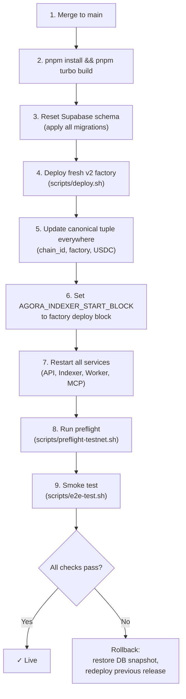

# Deployment

## Purpose

How to deploy, cut over, and roll back Agora services across environments.

## Audience

Operators and engineers responsible for deploying Agora to testnet or production.

## Read this after

- [Architecture](architecture.md) — system overview
- [Protocol](protocol.md) — contract lifecycle and settlement rules
- [Operations](operations.md) — day-to-day operations, monitoring, and incident response

## Source of truth

This doc is authoritative for: pre-launch checklists, deployment procedures, rollback criteria, contract deployment, external cutover checklists, and worker recovery scripts. It is NOT authoritative for: day-to-day operations, health monitoring, incident playbooks, or service startup (see [Operations](operations.md)).

## Summary

- Pre-launch requires aligned (chain id, factory address, USDC address) tuple across all services
- Cutover requires coordinated env updates, DB reset, factory deploy, and reindex
- Rollback if API health, indexer lag, DB consistency, or scoring verification fails
- External cutover covers GitHub, Vercel, API runtime, chain addresses, image registry, DNS, and operator machines

---

## Pre-Launch Checklist

1. Merge latest `main` and deploy from `main` only.
2. Set all required environment variables in your host platform.
3. For a clean contract generation: reset the testnet Supabase schema and apply all current Supabase migrations.
4. Deploy a fresh `v2` factory. `scripts/deploy.sh` requires explicit `AGORA_ORACLE_ADDRESS` and `AGORA_TREASURY_ADDRESS`.
5. Set `AGORA_INDEXER_START_BLOCK` to the factory deployment block before restarting the indexer.
6. Confirm the canonical `(chain id, factory address, USDC address)` tuple is identical in API, indexer, worker, CLI, and web env.
7. If sealed submissions are enabled, set the submission sealing env vars in API and worker.
8. Set `AGORA_CORS_ORIGINS` (comma-separated exact origins).
9. Ensure each deploy surface resolves to the latest relevant runtime revision. API and worker must match exactly; web may legitimately differ on pushes that only touch web-only or ops-only files. Prefer automatic SHA detection from platform git metadata; set `AGORA_RUNTIME_VERSION` manually only when your host does not expose a commit SHA.
10. Keep `AGORA_REQUIRE_PINNED_PRESET_DIGESTS=true`. Official GHCR scorer packages should be public; if they are not public yet, set `AGORA_GHCR_TOKEN` anywhere digest resolution runs and make sure the worker host can still `docker pull` them.
11. Build and run preflight:

```bash
pnpm install
pnpm turbo build
./scripts/preflight-testnet.sh
```

Recommended explicit release checks:

```bash
pnpm schema:verify
pnpm scorers:verify
```

Notes:

- `pnpm scorers:verify` requires a running Docker daemon.
- It verifies the production invariant, not just digest resolution: official scorer images must be anonymously resolvable from GHCR and anonymously pullable with Docker.
- The shipped official preset catalog is intentionally narrow: `csv_comparison_v1`, `regression_v1`, and `docking_v1`. Placeholder presets should not be reintroduced unless a real published scorer artifact exists for them.

Railway deployment checks before production cutover:

- Railway API and indexer are dashboard-managed, not config-as-code.
- Keep each service connected to repo `andymolecule/Agora`, branch `main`.
- Keep native Railway auto-deploy enabled for both services.
- Do not use repo-local `railway.toml` files for these services.
- Do not use dashboard watch-path filtering unless you have a measured need for it. For Agora's current size, rebuilding on every `main` push is simpler and more reliable than selective deploy filtering.
- Keep the dashboard build/start commands stable:
  - API build: `pnpm turbo build --filter=@agora/api`
  - API start: `pnpm --filter @agora/api start`
  - Indexer build: `pnpm turbo build --filter=@agora/chain`
  - Indexer start: `pnpm --filter @agora/chain indexer`
- If Railway stops auto-deploying after a config change, the first recovery step is to disconnect and reconnect:
  - `Source Repo`
  - `Branch connected to production`
  then redeploy latest once and verify the next push advances production.

---

## Rollback Criteria

Rollback if any of these occur:

- API health fails for more than 5 minutes.
- Indexer lag exceeds 200 blocks for more than 10 minutes.
- Incorrect challenge/submission writes observed in Supabase.
- Scoring or verification mismatches between on-chain and local outputs.

---

## Deployment and Cutover



### Contract Deployment

```bash
./scripts/deploy.sh             # Contracts to Base Sepolia
./scripts/preflight-testnet.sh  # Pre-launch validation
```

Clean v2 cutover:

1. Run one active factory generation at a time.
2. Reset Supabase, apply all migrations.
3. Deploy fresh `v2` factory.
4. Update canonical `(chain id, factory address, USDC address)` tuple everywhere.
5. Set `AGORA_INDEXER_START_BLOCK` and reindex from zero.

MCP route note:
- remote MCP traffic is served by the MCP server at `/mcp` on port `3001`
- it is not part of the Hono API route map under `/api/*`
- canonical machine-readable API discovery lives at `/.well-known/openapi.json`

---

## External Cutover Checklist

This section covers non-code work for deployment across hosted systems.

### GitHub

- Confirm repo slug, settings, secrets use `AGORA_*` naming.
- Review branch protection rules, required status checks, environments, and deployment rules.
- Review GHCR visibility, package ownership, and README metadata.
- Review release names, milestones, and any pinned issue/PR templates.

### Vercel

- Set production and preview env vars (`NEXT_PUBLIC_AGORA_*` and server-side `AGORA_*`).
- Update the production domain and any preview aliases.
- Validate that Open Graph metadata, title, and favicon render as Agora.
- Verify explorer links in the UI point to current deployments.

### API Runtime

- Set the API environment to `AGORA_*` names only.
- `AGORA_CORS_ORIGINS` matches frontend origins.
- `AGORA_RUNTIME_VERSION` is optional; hosted deploys should auto-detect the git SHA and still match the deployed worker runtime version.
- On startup, the API writes the active scoring runtime version into `worker_runtime_control`. Scoring workers only claim jobs when their runtime version matches that active row, so deploy order matters: bring up the new API runtime before expecting new workers to claim work.
- SIWE origin and domain checks pass against production API and web domains.
- `agora_session` cookie is issued with correct `secure` behavior in production.
- Reverse proxy forwards `x-forwarded-host` and `x-forwarded-proto` correctly.
- Browser auth/session requests stay same-origin under the web origin's `/api/*` proxy instead of calling the backend API origin directly.

### Chain Cutover

- Reset testnet DB, apply baseline migration.
- Deploy fresh `v2` factory.
- Update all runtime addresses together:
  - `AGORA_FACTORY_ADDRESS`, `AGORA_USDC_ADDRESS`, `AGORA_CHAIN_ID`, `AGORA_RPC_URL`
  - `AGORA_ORACLE_ADDRESS`, `AGORA_TREASURY_ADDRESS`
  - `NEXT_PUBLIC_AGORA_FACTORY_ADDRESS`, `NEXT_PUBLIC_AGORA_USDC_ADDRESS`, `NEXT_PUBLIC_AGORA_CHAIN_ID`, `NEXT_PUBLIC_AGORA_RPC_URL`
- Set indexer start block for the new deployment generation.
- Reindex from the fresh `v2` factory only.
- Never mix prior-generation factory addresses into active runtime envs.

### Image Registry

- Publish scorer images under the Agora namespace (`ghcr.io/andymolecule/*`).
- Use the `Publish Scorers` GitHub Actions workflow to build and publish official scorer images from `containers/`.
- The scorer publish workflow now verifies both digest resolution and unauthenticated `docker pull` after publishing. A release is not healthy until both pass.
- If the repo owner and GHCR namespace differ, provide `GHCR_PAT` (with `write:packages`) and, if needed, `GHCR_USERNAME` to the workflow so it can push into the org package namespace.
- Make official scorer packages public in GHCR so solvers and verifiers can inspect and pull them without credentials.
- If you cannot make the package public yet, provide `AGORA_GHCR_TOKEN` for any API or worker environment that resolves official image digests, and configure Docker auth on the worker host separately. Public packages are still the preferred steady state.
- Publish stable release tags (for example `:v1`) and resolve them to pinned `@sha256:` digests before challenge persistence. Do not use `:latest`.
- Verify tags/digests referenced by presets are available.
- Do not bake hidden labels, hidden test sets, or other evaluation-only data into the image. Put that material in the evaluation bundle or mounted dataset CIDs instead.
- After the first publish, confirm package visibility in the GitHub Packages UI. The workflow pushes images, but package visibility is still an org-level/package-level setting.

### Worker Recovery Scripts

- `pnpm recover:score-jobs -- --challenge-id=<challenge-id>` requeues stale `running` jobs and retries failed jobs after an infra outage.
- `agora clean-failed-jobs` skips terminal failed jobs such as invalid submissions, missing off-chain submission metadata, and invalid challenge scoring configs. It is dry-run by default.
- `pnpm schema:verify` checks that the live Supabase/PostgREST schema exposes all runtime-critical columns.
- `pnpm scorers:verify` checks that all official scorer images are anonymously resolvable from GHCR and anonymously pullable with Docker.
- `pnpm deploy:verify -- --api-url=<api-origin> --web-url=<web-origin>` checks that API and web each match the latest relevant git revision for their own deploy surface, and that the worker is healthy on the active API runtime. Use `--expected` only when you intentionally want to force one exact revision across both services.

### DNS and Domains

- Point the production web domain to the frontend deployment.
- Point the production API domain to the API deployment.
- Update CORS allowlists, reverse-proxy configs, and TLS cert coverage for final domains.

### Operator Machines

- Replace local `.env` files with current `AGORA_*` naming.
- Update Claude/MCP client configs to Agora server and tool ids.
- Confirm CLI config directories and aliases use `agora`.
- Confirm cron jobs, shell aliases, launch agents, or systemd units do not reference retired names.

### Final Verification

- `git remote -v` shows the Agora repo URL.
- Hosted web app title and metadata display Agora.
- `pnpm deploy:verify -- --api-url=<api-origin> --web-url=<web-origin>` passes before cutover, proving API and web each serve the intended revision for their own surface and that the worker is aligned with the API runtime.
- API auth flow sets `agora_session`.
- MCP server registers as `agora-mcp`.
- CLI help text shows `agora`.
- Runtime envs contain only `AGORA_*` and `NEXT_PUBLIC_AGORA_*` keys for first-party settings.
- All externally referenced scorer images resolve under the Agora registry namespace.
