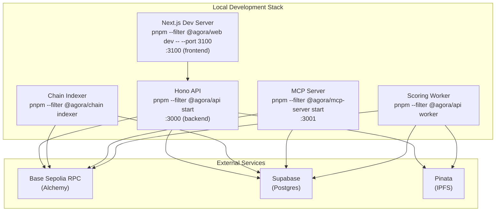
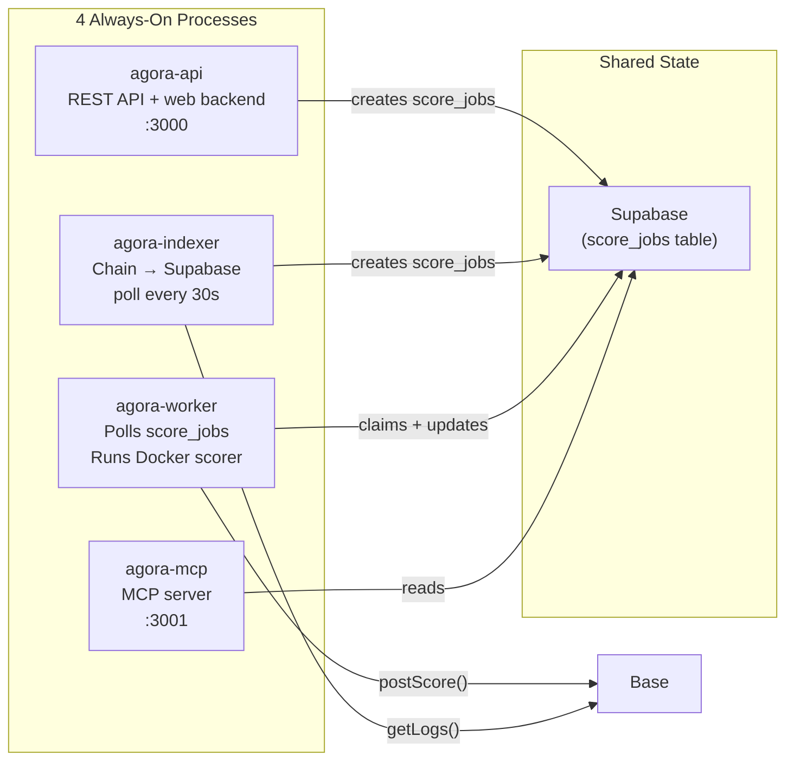
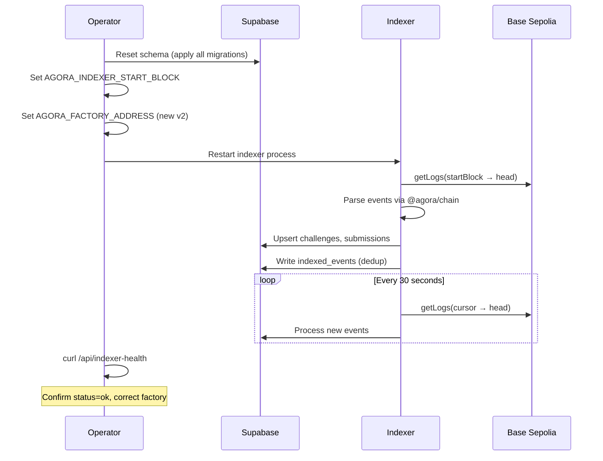
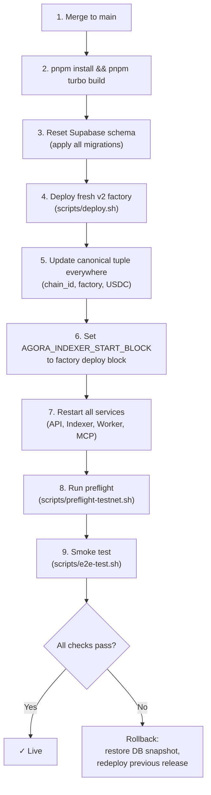

# Operations

## Purpose

How to set up, run, deploy, monitor, troubleshoot, and cut over Agora services.

## Audience

Operators and engineers responsible for running Agora in testnet or production environments.

## Read this after

- [Architecture](architecture.md) — system overview
- [Protocol](protocol.md) — contract lifecycle and settlement rules
- [Data and Indexing](data-and-indexing.md) — DB schema and indexer behavior

## Source of truth

This doc is authoritative for: service startup, deployment procedures, monitoring, incident response, and cutover checklists. It is NOT authoritative for: smart contract logic, sealed submission format internals, database schema, or frontend behavior. For the privacy model itself, see [Submission Privacy](submission-privacy.md).

## Summary

- Four processes: API, Indexer, Worker, MCP
- Pre-launch requires aligned (chain id, factory address, USDC address) tuple across all services
- Indexer polls every 30s; Worker polls score_jobs after challenges enter Scoring
- Worker stays alive in degraded mode, publishes readiness via `worker_runtime_state`, and only claims jobs while `ready=true`
- Health monitoring via /healthz, /api/indexer-health, /api/worker-health, agora doctor
- Cutover requires coordinated env updates, DB reset, factory deploy, and reindex

---

## Local Development



```bash
pnpm install
pnpm turbo build
pnpm turbo test
```

Run services:

```bash
pnpm --filter @agora/api start        # API on :3000
pnpm --filter @agora/api worker       # Worker
pnpm --filter @agora/mcp-server start # MCP on :3001
pnpm --filter @agora/chain indexer    # Chain indexer
```

Web frontend:

```bash
pnpm --filter @agora/web dev -- --port 3100
```

---

## Pre-Launch Checklist

1. Merge latest `main` and deploy from `main` only.
2. Set all required environment variables in your host platform.
3. For a clean contract generation: reset the testnet Supabase schema and apply all current Supabase migrations.
4. Deploy a fresh `v2` factory. `scripts/deploy.sh` requires explicit `AGORA_ORACLE_ADDRESS` and `AGORA_TREASURY_ADDRESS`.
5. Set `AGORA_INDEXER_START_BLOCK` to the factory deployment block before restarting the indexer.
6. Confirm the canonical `(chain id, factory address, USDC address)` tuple is identical in API, indexer, worker, CLI, and web env.
7. If sealed submissions are enabled, set the submission sealing env vars in API and worker.
8. Set `AGORA_CORS_ORIGINS` (comma-separated exact origins).
9. Set the same `AGORA_RUNTIME_VERSION` value on API and worker for each deploy. Use the git SHA when possible.
10. Keep `AGORA_REQUIRE_PINNED_PRESET_DIGESTS=true`. Official GHCR scorer packages should be public; if they are not public yet, set `AGORA_GHCR_TOKEN` anywhere digest resolution runs and make sure the worker host can still `docker pull` them.
11. Build and run preflight:

```bash
pnpm install
pnpm turbo build
./scripts/preflight-testnet.sh
```

Recommended explicit release checks:

```bash
pnpm schema:verify
pnpm scorers:verify
```

Notes:

- `pnpm scorers:verify` requires a running Docker daemon.
- It verifies the production invariant, not just digest resolution: official scorer images must be anonymously resolvable from GHCR and anonymously pullable with Docker.
- The shipped official preset catalog is intentionally narrow: `csv_comparison_v1`, `regression_v1`, and `docking_v1`. Placeholder presets should not be reintroduced unless a real published scorer artifact exists for them.

---

## Service Architecture



| Process | Entrypoint | Role |
|---------|-----------|------|
| `agora-api` | `apps/api/dist/index.js` | REST API + web backend |
| `agora-indexer` | `packages/chain/dist/indexer.js` | Chain event poller -> Supabase |
| `agora-worker` | `apps/api/dist/worker.js` | Polls score_jobs, runs Docker scorer, posts scores on-chain |
| `agora-mcp` | `apps/mcp-server/dist/index.js` | MCP server for AI agents |

Architecture boundary:

- Clients now pre-register `submission_intents` before the on-chain submit. API submit confirmation and the indexer both reconcile intents into `submissions` rows and only then create or revive `score_jobs`.
- Worker polls `score_jobs` but only claims jobs after the challenge enters `Scoring` at deadline.
- Scorer is the Docker container itself (e.g. `ghcr.io/agora-science/repro-scorer:v1`) — stateless, sandboxed, no network access.
- Official scorer images are public reproducibility artifacts. Keep the code and Dockerfile inspectable; keep hidden evaluation data out of the image.
- One active contract generation at a time. Runtime envs should never mix multiple factory generations.
- Worker and API coordinate through Supabase. `submission_intents` stages off-chain submission metadata, `score_jobs` drives scoring work, and `worker_runtime_state` carries worker heartbeat/readiness for split deployments.
- Official preset challenges should persist pinned image digests. The worker should only score from registry-backed official images, never from a host-local build that lacks a repo digest.

### Worker Docker Flow

The worker now treats scorer availability as a runtime readiness problem, not a crash condition.

1. At startup it writes a `worker_runtime_state` row with `runtime_version`, `ready=false`, and any current `last_error`.
2. It checks `docker info`, then preflights all official scorer images referenced by currently scoring official challenges.
3. If Docker or image preflight fails, the process stays up, keeps heartbeating, and skips job claims until readiness recovers.
4. Readiness is retried in the background every minute.
5. During scoring, the runner inspects the local Docker image first and only pulls when the image is missing.
6. Official images without a repo digest are rejected. A locally built image is not accepted as a substitute for a published official artifact.

---

## Submission Sealing

Sealed submission mode hides answer bytes from the public while a challenge is open.

For the exact envelope format, trust boundary, and end-to-end flow, see [Submission Privacy](submission-privacy.md).

Required env vars:

- API public config: `AGORA_SUBMISSION_SEAL_KEY_ID`, `AGORA_SUBMISSION_SEAL_PUBLIC_KEY_PEM`
- Worker private config: `AGORA_SUBMISSION_OPEN_PRIVATE_KEY_PEM` or `AGORA_SUBMISSION_OPEN_PRIVATE_KEYS_JSON`
- Shared deploy version: `AGORA_RUNTIME_VERSION` (set the same value on API and worker)
- Worker heartbeat tuning: `AGORA_WORKER_HEARTBEAT_MS`, `AGORA_WORKER_HEARTBEAT_STALE_MS`
- Optional stable worker runtime id: `AGORA_WORKER_RUNTIME_ID`
- Optional delayed retry tuning: `AGORA_WORKER_POST_TX_RETRY_MS`, `AGORA_WORKER_INFRA_RETRY_MS`

Key handling rules:

- The API advertises exactly one active public key via `GET /api/submissions/public-key`.
- The active `kid` must exist in the worker private key set.
- Services launched through `scripts/run-node-with-root-env.mjs` can load seal keys from disk via `AGORA_SUBMISSION_SEAL_PUBLIC_KEY_PEM_FILE`, `AGORA_SUBMISSION_OPEN_PRIVATE_KEY_PEM_FILE`, and `AGORA_SUBMISSION_OPEN_PRIVATE_KEYS_JSON_FILE`. There is no implicit repo-root keyfile fallback.
- `AGORA_SUBMISSION_OPEN_PRIVATE_KEYS_JSON` is the rotation path. Keep the active key plus any historical keys whose sealed submissions still need to be scored.
- `AGORA_SUBMISSION_OPEN_PRIVATE_KEY_PEM` is the simple single-key path. If both sources are set for the active `kid`, they must match.
- `GET /api/submissions/public-key` now fails closed unless a live worker heartbeat exists for the active `kid` and that worker has passed sealing self-check + Docker startup checks.
- Set `AGORA_WORKER_RUNTIME_ID` when you intentionally run multiple scoring workers on the same host. Otherwise the worker derives a stable host-based runtime id automatically.

Verification checklist:

```bash
curl -sS http://localhost:3000/healthz
curl -sS http://localhost:3000/api/worker-health
curl -sS http://localhost:3000/api/submissions/public-key
pnpm schema:verify
pnpm scorers:verify
```

Expected results:

- `/healthz` returns `{"ok":true,"service":"api","runtimeVersion":"..."}` for API liveness plus deployed version.
- `/api/worker-health` reports a fresh worker heartbeat, `workers.healthy > 0`, `workers.healthyWorkersForActiveRuntimeVersion > 0`, `workers.healthyWorkersNotOnActiveRuntimeVersion = 0`, and `sealing.workerReady=true` for the active `keyId`.
- `/api/submissions/public-key` returns `version:"sealed_submission_v2"` only when the active worker heartbeat for that `kid` is healthy.

Existing testnet DBs:

- Fresh environments should apply all migrations.
- Existing environments that still contain `result_format='sealed_v1'` must apply `002_align_sealed_submission_result_format.sql` before accepting new sealed submissions.
- Existing environments should also apply `004_add_score_job_backoff.sql` so delayed no-penalty worker retries and queue eligibility work correctly.
- Existing environments should also apply `005_add_submission_intents.sql` so pre-registered submission metadata can reconcile safely after on-chain submit confirmation.
- Existing environments should also apply `006_add_worker_runtime_version.sql` so worker/runtime alignment is visible in health checks.

Operational privacy boundary:

- Plaintext answer bytes should not be uploaded directly by clients.
- Public verification remains locked while the challenge is open.
- Once scoring begins, replay artifacts may be published for reproducibility, so sealed submissions are not permanent secrecy.

---

## Starting Services

### Manual

```bash
pnpm --filter @agora/api start
pnpm --filter @agora/chain indexer
pnpm --filter @agora/api worker
```

### PM2 (recommended)

```bash
pm2 start scripts/ops/ecosystem.config.cjs
pm2 save
pm2 status   # should show 4 processes: agora-api, agora-indexer, agora-worker, agora-mcp
```

---

## Smoke Test

```bash
./scripts/e2e-test.sh
```

Fast overrides for shorter sessions:

```bash
AGORA_E2E_DEADLINE_MINUTES=30 \
AGORA_E2E_DISPUTE_WINDOW_HOURS=0 \
./scripts/e2e-test.sh
```

Expected flow: post -> indexer pickup -> list -> get -> score-local -> submit -> worker scoring -> verify-public -> finalize -> claim.

Note: `agora finalize` and `agora claim` require the dispute window to elapse after deadline. Use `AGORA_E2E_DISPUTE_WINDOW_HOURS=0` for same-session Base Sepolia testing, or a local Anvil RPC with `evm_increaseTime` for full lifecycle testing.
The E2E script now expects the scorer image to already be published and pullable. It no longer builds a local official scorer fallback.

---

## Health Monitoring

Check every 15-30 minutes during first launch window:

1. API `/healthz` returns 200.
2. Indexer logs show new blocks processed.
3. `indexed_events` block number continues advancing.
4. `agora doctor` passes all required checks.
5. Worker health: `curl <API_URL>/api/worker-health` returns `"ok": true` and shows healthy workers on the active runtime version.
6. Indexer health: `curl <API_URL>/api/indexer-health` reports the intended factory address and no active alternate factories.

Health commands:

```bash
curl -sS http://localhost:3000/healthz
curl -sS http://localhost:3000/api/indexer-health
curl -sS http://localhost:3000/api/worker-health
agora doctor
```

Expected results:

- API health returns `{"ok":true,"runtimeVersion":"..."}`.
- Indexer health is `ok` or `warning`, not `critical`.
- `agora doctor` passes RPC/Supabase/factory checks.
- If sealing is enabled, `/api/submissions/public-key` returns `sealed_submission_v2` only while `/api/worker-health` reports a healthy worker for the same active `kid`.
- If active scoring challenges use official Agora scorer images and those GHCR images are not pullable, the worker should stay alive but report `ready=false`, a `latestError`, and zero healthy workers for the active runtime version.

---

## Scoring Safety Limits

Default scoring limits:

- Max submissions per challenge: `100`
- Max submissions per solver per challenge: `3`
- Max upload size: `50MB`

Behavior:

- Extra submissions are still recorded on-chain and in DB.
- Scoring jobs are marked skipped and not executed by the worker.

Per-challenge overrides can be set in the challenge spec:

- `max_submissions_total`
- `max_submissions_per_solver`

---

## Confirming Worker Scoring

1. Check `submission_intents`: each client submission should create an unmatched intent before the wallet transaction is sent, then the intent should gain `matched_submission_id` after the on-chain submission is indexed or the submit-confirmation API call succeeds.
2. Check `score_jobs` transitions: once the submission has both on-chain state and reconciled metadata, jobs should move from `queued` -> `running` -> `scored`. Infrastructure and tx-reconciliation retries may temporarily stay `queued` with a future `next_attempt_at`.
3. Check `GET /api/worker-health`: it should show `status != "warning"`, `workers.healthyWorkersForActiveRuntimeVersion > 0`, and no mismatched healthy workers before you expect automatic scoring.
4. After a submission, a `submission_intents` row appears immediately. A `score_jobs` row appears only after that intent is reconciled into a `submissions` row. The job should remain queued until the deadline passes and the challenge enters `Scoring`, then the worker should pick it up within ~15s (worker poll).
5. Successful scoring produces a proof bundle CID in `proof_bundles.cid`.
6. The frontend ActivityPanel "Scorer" row shows live queued/scored/failed counts.

---

## Indexer Operations

Reorg safety: `AGORA_INDEXER_CONFIRMATION_DEPTH` (default: `3`).

If the indexer falls behind:

1. Restart indexer.
2. Check RPC health and `/api/indexer-health`.
3. If state replay is needed, run reindex.

Reindex procedures:

```bash
# Preview (dry run)
agora reindex --from-block <block> --dry-run

# Apply cursor rewind
agora reindex --from-block <block>

# Deep replay (also purge dedupe markers from that block onward)
agora reindex --from-block <block> --purge-indexed-events
```

Notes:

- Reindex rewinds factory + challenge cursors for the active chain.
- Purging indexed events forces event handlers to run again from the specified block.



---

## Key Management

Rules:

- Never log private key env values.
- Rotate oracle keys on suspected compromise.
- Keep `AGORA_PRIVATE_KEY` and `AGORA_ORACLE_KEY` scoped to required services only.

Rotation sequence:

1. Pause worker scoring.
2. Decide whether this affects only future challenges or requires a clean factory cutover:
   - future challenges only: factory owner can call `setOracle()` and update worker env
   - active challenge oracle compromised: cut over to a fresh factory; existing challenge oracles are immutable
3. Update service env.
4. Resume worker after `agora doctor` + smoke validation.

---

## Incident Playbook

### API Down

1. Restart API process.
2. Verify `AGORA_*` env vars in host.
3. Verify Supabase connectivity.

### Indexer Stalled

1. Restart indexer process.
2. Verify RPC reachability.
3. Check last row in `indexed_events` and compare with chain head.
4. Check `GET /api/indexer-health` and alert if status is `critical`.
5. Rewind cursors with CLI (dry-run first):

```bash
agora reindex --from-block <block_number> --dry-run
agora reindex --from-block <block_number>
```

6. If a deep replay is required, include `--purge-indexed-events`.
7. Ensure `AGORA_INDEXER_START_BLOCK` is set before restarting indexer when bootstrapping a new factory.
8. If the factory address changed, align API/indexer/worker/web env first, restart all services, then reindex the fresh `v2` deployment from its deploy block.

### Worker Stalled

1. Check `GET /api/worker-health` — if `status: "warning"`, the oldest queued job has been waiting > 5 minutes.
2. Tail logs: `pm2 logs agora-worker --lines 100`.
3. Common causes:
   - Docker daemon not running or unreachable -> restart Docker, then `pm2 restart agora-worker`.
   - Official scorer image not pullable -> inspect `workers.latestError`, verify the image is public/pullable from the host, and rerun `./scripts/preflight-testnet.sh`.
   - DB schema drift or stale PostgREST cache -> run `pnpm schema:verify`. If it fails, apply the missing migration and reload the PostgREST schema cache before restarting services.
   - Runtime version mismatch -> compare `/healthz.runtimeVersion` with `/api/worker-health.runtime.apiVersion` and `workers.runtimeVersions`, then redeploy API + worker with the same `AGORA_RUNTIME_VERSION`.
   - RPC errors -> check `AGORA_RPC_URL` reachability.
   - All jobs stuck in `failed` or `running` after an infra incident -> recover them with `pnpm recover:score-jobs -- --challenge-id=<challenge-id>` after the worker is healthy again.
4. If the worker process itself crashed: `pm2 restart agora-worker`. PM2 uses exponential backoff (3s base).

### Oracle Key Issue

1. Stop scoring operations immediately.
2. Rotate oracle key and reconfigure env.
3. Resume scoring only after `agora doctor` and one dry-run check.

### IPFS Gateway Instability

1. Retry affected submissions/challenges.
2. Keep indexer running; retry logic will back off.
3. If failures persist, switch gateway and rerun scoring/verification.

### RPC Instability

1. Fail over RPC endpoint.
2. Restart indexer/worker.
3. Confirm lag recovers via `/api/indexer-health`.

### DB Restoration

1. Restore DB snapshot.
2. Re-apply migrations.
3. Rewind indexer (`agora reindex --from-block <known-good-block>`).
4. Monitor event replay and challenge/submission consistency.

---

## Rollback Criteria

Rollback if any of these occur:

- API health fails for more than 5 minutes.
- Indexer lag exceeds 200 blocks for more than 10 minutes.
- Incorrect challenge/submission writes observed in Supabase.
- Scoring or verification mismatches between on-chain and local outputs.

---

## Deployment and Cutover



### Contract Deployment

```bash
./scripts/deploy.sh             # Contracts to Base Sepolia
./scripts/preflight-testnet.sh  # Pre-launch validation
```

Clean v2 cutover:

1. Run one active factory generation at a time.
2. Reset Supabase, apply all migrations.
3. Deploy fresh `v2` factory.
4. Update canonical `(chain id, factory address, USDC address)` tuple everywhere.
5. Set `AGORA_INDEXER_START_BLOCK` and reindex from zero.

MCP route note:
- remote MCP traffic is served by the MCP server at `/mcp` on port `3001`
- it is not part of the Hono API route map under `/api/*`

### External Cutover Checklist

This section covers non-code work for deployment across hosted systems.

#### GitHub

- Confirm repo slug, settings, secrets use `AGORA_*` naming.
- Review branch protection rules, required status checks, environments, and deployment rules.
- Review GHCR visibility, package ownership, and README metadata.
- Review release names, milestones, and any pinned issue/PR templates.

#### Vercel

- Set production and preview env vars (`NEXT_PUBLIC_AGORA_*` and server-side `AGORA_*`).
- Update the production domain and any preview aliases.
- Validate that Open Graph metadata, title, and favicon render as Agora.
- Verify explorer links in the UI point to current deployments.

#### API Runtime

- Set the API environment to `AGORA_*` names only.
- `AGORA_CORS_ORIGINS` matches frontend origins.
- `AGORA_RUNTIME_VERSION` matches the deployed worker runtime version.
- SIWE origin and domain checks pass against production API and web domains.
- `agora_session` cookie is issued with correct `secure` behavior in production.
- Reverse proxy forwards `x-forwarded-host` and `x-forwarded-proto` correctly.

#### Chain Cutover

- Reset testnet DB, apply baseline migration.
- Deploy fresh `v2` factory.
- Update all runtime addresses together:
  - `AGORA_FACTORY_ADDRESS`, `AGORA_USDC_ADDRESS`, `AGORA_CHAIN_ID`, `AGORA_RPC_URL`
  - `AGORA_ORACLE_ADDRESS`, `AGORA_TREASURY_ADDRESS`
  - `NEXT_PUBLIC_AGORA_FACTORY_ADDRESS`, `NEXT_PUBLIC_AGORA_USDC_ADDRESS`, `NEXT_PUBLIC_AGORA_CHAIN_ID`, `NEXT_PUBLIC_AGORA_RPC_URL`
- Set indexer start block for the new deployment generation.
- Reindex from the fresh `v2` factory only.
- Never mix prior-generation factory addresses into active runtime envs.

#### Image Registry

- Publish scorer images under the Agora namespace (`ghcr.io/agora-science/*`).
- Use the `Publish Scorers` GitHub Actions workflow to build and publish official scorer images from `containers/`.
- The scorer publish workflow now verifies both digest resolution and unauthenticated `docker pull` after publishing. A release is not healthy until both pass.
- If the repo owner and GHCR namespace differ, provide `GHCR_PAT` (with `write:packages`) and, if needed, `GHCR_USERNAME` to the workflow so it can push into the org package namespace.
- Make official scorer packages public in GHCR so solvers and verifiers can inspect and pull them without credentials.
- If you cannot make the package public yet, provide `AGORA_GHCR_TOKEN` for any API/backfill environment that resolves official image digests, and configure Docker auth on the worker host separately. Public packages are still the preferred steady state.
- Publish stable release tags (for example `:v1`) and resolve them to pinned `@sha256:` digests before challenge persistence. Do not use `:latest`.
- Verify tags/digests referenced by presets are available.
- Do not bake hidden labels, hidden test sets, or other evaluation-only data into the image. Put that material in the evaluation bundle or mounted dataset CIDs instead.
- After the first publish, confirm package visibility in the GitHub Packages UI. The workflow pushes images, but package visibility is still an org-level/package-level setting.
- Keep legacy images frozen if historical replay requires them.

#### Worker Recovery Scripts

- `pnpm backfill:challenge-metadata -- --dry-run` previews pinned official scorer digest and `expected_columns` backfills for existing challenge rows. Run `pnpm turbo build` first, then rerun without `-- --dry-run` to apply.
- `pnpm recover:score-jobs -- --challenge-id=<challenge-id>` requeues stale `running` jobs and retries failed jobs after an infra outage.
- `pnpm schema:verify` checks that the live Supabase/PostgREST schema exposes all runtime-critical columns.
- `pnpm scorers:verify` checks that all official scorer images are anonymously resolvable from GHCR and anonymously pullable with Docker.

#### DNS and Domains

- Point the production web domain to the frontend deployment.
- Point the production API domain to the API deployment.
- Update CORS allowlists, reverse-proxy configs, and TLS cert coverage for final domains.

#### Operator Machines

- Replace local `.env` files with current `AGORA_*` naming.
- Update Claude/MCP client configs to Agora server and tool ids.
- Confirm CLI config directories and aliases use `agora`.
- Confirm cron jobs, shell aliases, launch agents, or systemd units do not reference retired names.

#### Final Verification

- `git remote -v` shows the Agora repo URL.
- Hosted web app title and metadata display Agora.
- API auth flow sets `agora_session`.
- MCP server registers as `agora-mcp`.
- CLI help text shows `agora`.
- Runtime envs contain only `AGORA_*` and `NEXT_PUBLIC_AGORA_*` keys for first-party settings.
- All externally referenced scorer images resolve under the Agora registry namespace.
