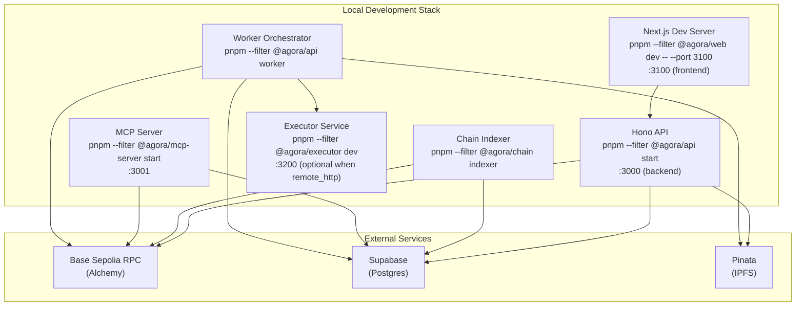
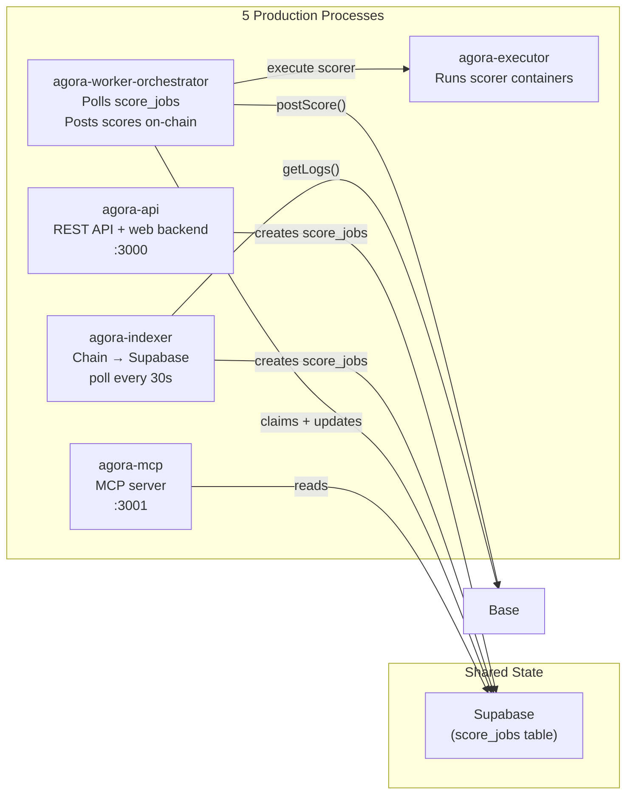
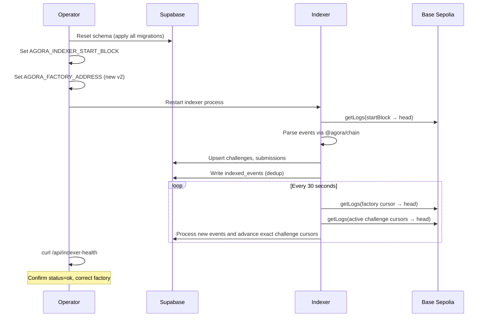

# Operations

## Purpose

How to run, monitor, and troubleshoot Agora services day-to-day. For deployment, cutover, and rollback procedures, see [Deployment](deployment.md).

## Audience

Operators and engineers responsible for running Agora in testnet or production environments.

## Read this after

- [Architecture](architecture.md) — system overview
- [Authoring Callbacks](authoring-callbacks.md) — external host callback verification and retry contract
- [Authoring Rollout](authoring-rollout.md) — authoring/draft/submission cutover specifics
- [Protocol](protocol.md) — contract lifecycle and settlement rules
- [Data and Indexing](data-and-indexing.md) — DB schema and indexer behavior
- [Deployment](deployment.md) — deploy, cutover, and rollback procedures

## Source of truth

This doc is authoritative for: service startup, monitoring, incident response, scoring limits, indexer operations, and operator-triggered callback recovery. It is NOT authoritative for: deployment procedures, cutover checklists (see [Deployment](deployment.md)), smart contract logic, sealed submission format internals, or database schema. For the privacy model itself, see [Submission Privacy](submission-privacy.md).

## Summary

- Five processes in production: API, Indexer, Worker Orchestrator, Executor, MCP
- Typical hosted split: web on Vercel, API + indexer + worker orchestrator on Railway, executor on a Docker-capable host or service
- The API is the canonical remote agent surface
- MCP HTTP is read-only by default; stdio remains the full local tool surface
- Browser auth/session traffic goes through the web origin's same-origin `/api` proxy; the browser should not call the backend API origin directly for SIWE/session flows
- Indexer polls factory logs every 30s and only continuously polls active challenges; Worker polls score_jobs after challenges enter Scoring
- Worker publishes readiness via `worker_runtime_state`, only claims jobs while `ready=true`, and uses a scorer execution backend (`local_docker` in dev, `remote_http` in production)
- Health monitoring via /healthz, /api/indexer-health, /api/worker-health, /api/authoring/health, agora doctor
- API, worker, executor, and indexer emit structured JSON logs. HTTP surfaces return `x-request-id`; include that header when tracing a failed request across logs or Sentry.

---

## Local Development



```bash
pnpm install
pnpm turbo build
pnpm turbo test
```

Run services:

```bash
pnpm --filter @agora/api start        # API on :3000
pnpm --filter @agora/api worker       # Worker orchestrator
pnpm --filter @agora/mcp-server start # MCP on :3001
pnpm --filter @agora/chain indexer    # Chain indexer
```

Optional remote executor for local parity with production:

```bash
AGORA_SCORER_EXECUTOR_BACKEND=remote_http \
AGORA_SCORER_EXECUTOR_URL=http://localhost:3200 \
pnpm --filter @agora/executor dev
```

Web frontend:

```bash
pnpm --filter @agora/web dev -- --port 3100
```

---

## Service Architecture



| Process | Entrypoint | Role |
|---------|-----------|------|
| `agora-api` | `apps/api/dist/index.js` | REST API + web backend |
| `agora-indexer` | `packages/chain/dist/indexer.js` | Chain event poller -> Supabase |
| `agora-worker` | `apps/api/dist/worker.js` | Orchestrates score jobs, persists proof data, posts scores on-chain |
| `agora-executor` | `apps/executor/dist/index.js` | Docker-only scorer execution service |
| `agora-mcp` | `apps/mcp-server/dist/index.js` | MCP server for AI agents |

Architecture boundary:

- Clients now pre-register `submission_intents` before the on-chain submit. API submit confirmation still provides the fast path, but the indexer can also recover a `submissions` row directly from the reserved intent when the on-chain `solver` + `result_hash` match, and then create or revive the corresponding `score_jobs`.
- Worker polls `score_jobs` but only claims jobs after the challenge enters `Scoring` at deadline, and only when the worker runtime matches the active scoring runtime version declared by the API.
- Scorer is the Docker container itself (for example `ghcr.io/andymolecule/gems-match-scorer:v1`) — stateless, sandboxed, no network access. The orchestrator stages inputs; the executor service runs the container.
- Official scorer images are public reproducibility artifacts. Keep the code and Dockerfile inspectable; keep hidden evaluation data out of the image.
- One active contract generation at a time. Runtime envs should never mix multiple factory generations.
- Worker and API coordinate through Supabase. `submission_intents` stages off-chain submission metadata, `score_jobs` drives scoring work, `worker_runtime_state` carries worker heartbeat/readiness, and `worker_runtime_control` remains the active scoring runtime fence while API and worker-orchestrator roll forward together on Railway.
- Official managed-runtime challenges should persist pinned image digests. The worker should only score from registry-backed official images, never from a host-local build that lacks a repo digest.
- Wallet/session consistency is enforced in the web app by a global wallet session bridge. If the connected wallet disconnects or changes to a different address, stale SIWE state is cleared instead of being reused accidentally.

### Worker / Executor Flow

The worker treats scorer availability as a runtime readiness problem, not a crash condition.

1. At startup it writes a `worker_runtime_state` row with `runtime_version`, `ready=false`, and any current `last_error`.
2. The API writes the active scoring runtime version into `worker_runtime_control` on startup.
3. Score-job claims are fenced against `worker_runtime_control`, so older workers can keep heartbeating but cannot keep claiming new jobs after a deploy.
4. It checks the configured scorer execution backend:
   - `local_docker`: verify local Docker health and preflight official images directly
   - `remote_http`: verify the executor service is reachable and ask it to preflight official images
5. If executor health or image preflight fails, the process stays up, keeps heartbeating, and skips job claims until readiness recovers.
6. Readiness is retried in the background every minute.
7. During scoring, the runner uses the configured executor backend. In production this should be the remote executor so Railway only runs orchestration code, not Docker itself.
8. Official images without a repo digest are rejected. A locally built image is not accepted as a substitute for a published official artifact.

---

## Submission Sealing

Sealed submission mode hides answer bytes from the public while a challenge is open.

For the exact envelope format, trust boundary, and end-to-end flow, see [Submission Privacy](submission-privacy.md).

Required env vars:

- API public config: `AGORA_SUBMISSION_SEAL_KEY_ID`, `AGORA_SUBMISSION_SEAL_PUBLIC_KEY_PEM`
- Worker private config: `AGORA_SUBMISSION_OPEN_PRIVATE_KEY_PEM` or `AGORA_SUBMISSION_OPEN_PRIVATE_KEYS_JSON`
- Shared deploy version: `AGORA_RUNTIME_VERSION` (optional override; otherwise the runtime resolves from platform commit metadata or local git SHA)
- Worker heartbeat tuning: `AGORA_WORKER_HEARTBEAT_MS`, `AGORA_WORKER_HEARTBEAT_STALE_MS`
- Optional stable worker runtime id: `AGORA_WORKER_RUNTIME_ID`
- Optional delayed retry tuning: `AGORA_WORKER_POST_TX_RETRY_MS`, `AGORA_WORKER_INFRA_RETRY_MS`

Key handling rules:

- The API advertises exactly one active public key via `GET /api/submissions/public-key`.
- The active `kid` must exist in the worker private key set.
- Services launched through `scripts/run-node-with-root-env.mjs` can load seal keys from disk via `AGORA_SUBMISSION_SEAL_PUBLIC_KEY_PEM_FILE`, `AGORA_SUBMISSION_OPEN_PRIVATE_KEY_PEM_FILE`, and `AGORA_SUBMISSION_OPEN_PRIVATE_KEYS_JSON_FILE`.
- `AGORA_SUBMISSION_OPEN_PRIVATE_KEYS_JSON` is the rotation path. Keep the active key plus any previous keys whose still-pending sealed submissions need to be scored.
- `AGORA_SUBMISSION_OPEN_PRIVATE_KEY_PEM` is the simple single-key path. If both sources are set for the active `kid`, they must match.
- `GET /api/submissions/public-key` returns the active public key whenever sealing is configured. Worker readiness is enforced at scoring time, not submission time.
- Set `AGORA_WORKER_RUNTIME_ID` when you intentionally run multiple scoring workers on the same host. Otherwise the worker derives a stable host-based runtime id automatically.

Verification checklist:

```bash
curl -sS http://localhost:3000/healthz
curl -sS http://localhost:3000/api/worker-health
curl -sS http://localhost:3000/api/authoring/health
curl -sS http://localhost:3000/api/submissions/public-key
pnpm schema:verify
pnpm scorers:verify
```

Expected results:

- `/healthz` returns `{"ok":true,"service":"api","runtimeVersion":"..."}` for API liveness plus deployed version.
- API responses include `x-request-id`; if you pass one in the request header, the API preserves it for end-to-end correlation.
- `/api/worker-health` reports a fresh worker heartbeat, `workers.healthy > 0`, `workers.healthyWorkersForActiveRuntimeVersion > 0`, and `sealing.workerReady=true` for the active `keyId`. `healthyWorkersNotOnActiveRuntimeVersion` is diagnostic only unless active healthy workers drop to zero.
- `/api/authoring/health` returns `status: ok|warning|critical` and exposes managed-authoring backlog metrics such as expired drafts and stale compiling drafts.
- `/api/submissions/public-key` returns `version:"sealed_submission_v2"` whenever sealing is configured successfully.

Existing testnet DBs:

- Fresh environments should apply all migrations.
- Existing environments that still contain `result_format='sealed_v1'` must apply `002_align_sealed_submission_result_format.sql` before accepting new sealed submissions.
- Existing environments should also apply `004_add_score_job_backoff.sql` so delayed no-penalty worker retries and queue eligibility work correctly.
- Existing environments should also apply `005_add_submission_intents.sql` so pre-registered submission metadata exists before the later strict intent-first migration window.
- Existing environments should also apply `006_add_worker_runtime_version.sql` so worker/runtime alignment is visible in health checks.
- Existing environments should also apply `011_rename_worker_runtime_executor_ready.sql` so worker readiness reflects the new orchestrator/executor naming in runtime checks.
- Existing environments rolling onto the latest authoring and strict-submission model should also follow [Authoring Rollout](authoring-rollout.md) and apply the `017` through `033` migration window in order.

Operational privacy boundary:

- Plaintext answer bytes should not be uploaded directly by clients.
- Public verification remains locked while the challenge is open.
- Once scoring begins, replay artifacts may be published for reproducibility, so sealed submissions are not permanent secrecy.

---

## Starting Services

### Manual

```bash
pnpm --filter @agora/api start
pnpm --filter @agora/chain indexer
pnpm --filter @agora/api worker
pnpm --filter @agora/executor start  # only when AGORA_SCORER_EXECUTOR_BACKEND=remote_http
```

### PM2 (legacy local ops only)

```bash
pm2 start scripts/ops/ecosystem.config.cjs
pm2 save
pm2 status   # should show 4 processes: agora-api, agora-indexer, agora-worker, agora-mcp (executor is separately managed)
```

### Split Hosted Production

Current production is intentionally split across hosts:

- Vercel: `agora-web`
- Railway: `@agora/api`, `agora-indexer`, `agora-worker-orchestrator`
- Docker-capable host or service: `agora-executor`

Vercel redeploys directly from GitHub `main` via its native integration. Railway API, indexer, and worker orchestrator should also redeploy natively from GitHub `main`. The executor should be treated as infrastructure: update it when the executor service itself changes, not on every app commit.

Vercel-specific proxy rule:

- Set server-side `AGORA_API_URL` to the backend API origin, not the web origin. The same-origin web `/api/*` proxy depends on this and will fail closed if it is pointed back at the web host.

### Railway Dashboard Settings

Railway API and indexer are intentionally dashboard-managed.

Recommended steady-state settings:

- `Source Repo`: `andymolecule/Agora`
- `Branch connected to production`: `main`
- Native Railway auto-deploy: enabled
- No dashboard watch-path filtering
- Build/start commands:
  - API build: `pnpm turbo build --filter=@agora/api`
  - API start: `pnpm --filter @agora/api start`
  - Indexer build: `pnpm turbo build --filter=@agora/chain`
  - Indexer start: `pnpm --filter @agora/chain indexer`
  - Worker orchestrator build: `pnpm turbo build --filter=@agora/api`
  - Worker orchestrator start: `pnpm --filter @agora/api worker`

Operational rule:

- Do not reintroduce repo-local `railway.toml` service configs for API or indexer unless Railway's native deploy path is intentionally being replaced.
- If native Railway auto-deploy stops advancing, first reset the dashboard integration by disconnecting and reconnecting:
  - `Source Repo`
  - `Branch connected to production`
  then redeploy latest once and verify the next push advances production.

### Remote Executor Service

Production scoring should run with:

- `AGORA_SCORER_EXECUTOR_BACKEND=remote_http`
- `AGORA_SCORER_EXECUTOR_URL=<executor base url>`
- `AGORA_SCORER_EXECUTOR_TOKEN=<shared bearer token>`

Expected executor host configuration:

- Docker daemon available locally
- `apps/executor` deployed and reachable by the Railway worker orchestrator
- `AGORA_EXECUTOR_AUTH_TOKEN` matches the orchestrator token
- `NODE_ENV=production` requires `AGORA_EXECUTOR_AUTH_TOKEN`; the executor will fail fast without it

Steady-state flow:

1. Railway deploys API, indexer, and worker orchestrator from `main`
2. The worker orchestrator writes its runtime heartbeat into `worker_runtime_state`
3. The orchestrator checks executor health and preflights official images
4. When a job is claimed, the orchestrator stages inputs and sends them to the executor
5. The executor runs the scorer container locally and returns `score.json`
6. The orchestrator persists proof data and posts scores on-chain

---

## Smoke Test

```bash
./scripts/e2e-test.sh
```

Fast overrides for shorter sessions:

```bash
AGORA_E2E_DEADLINE_MINUTES=30 \
AGORA_E2E_DISPUTE_WINDOW_HOURS=0 \
./scripts/e2e-test.sh
```

Expected flow: post -> indexer pickup -> list -> get -> score-local -> submit -> worker scoring -> verify-public -> finalize -> claim.

Note: `agora finalize` and `agora claim` require the dispute window to elapse after deadline. Use `AGORA_E2E_DISPUTE_WINDOW_HOURS=0` for same-session Base Sepolia testing, or a local Anvil RPC with `evm_increaseTime` for full lifecycle testing.
The E2E script now expects the scorer image to already be published and pullable. It no longer builds a local official scorer fallback.

---

## Health Monitoring

Check every 15-30 minutes during first launch window:

1. API `/healthz` returns 200.
2. Indexer logs show new blocks processed.
3. `indexed_events` block number continues advancing.
4. `agora doctor` passes all required checks.
5. Worker health: `curl <API_URL>/api/worker-health` returns `"ok": true` and shows healthy workers on the active runtime version. If `AGORA_SCORER_EXECUTOR_BACKEND=remote_http`, this also implies the executor passed the worker readiness checks.
6. Managed authoring health: `curl <API_URL>/api/authoring/health` stays `ok` during normal operation. `warning` or `critical` means expired drafts or stale compiling drafts need attention.
7. Web proxy health: `curl <WEB_URL>/api/healthz` and `curl <WEB_URL>/api/worker-health` succeed without the `AGORA_API_URL` proxy-misconfiguration error.
8. Indexer health: `curl <API_URL>/api/indexer-health` reports the intended factory address and no active alternate factories.

Health commands:

```bash
curl -sS http://localhost:3000/healthz
curl -sS http://localhost:3000/api/indexer-health
curl -sS http://localhost:3000/api/worker-health
curl -sS http://localhost:3000/api/authoring/health
agora doctor
```

Expected results:

- API health returns `{"ok":true,"runtimeVersion":"..."}`.
- Indexer health is `ok` or `warning`, not `critical`.
- Authoring draft health is `ok` during steady state. If it moves to `warning` or `critical`, inspect expired drafts and stale compiling drafts.
- `agora doctor` passes RPC/Supabase/factory checks.
- If sealing is enabled, `/api/submissions/public-key` returns `sealed_submission_v2` whenever the public sealing key is configured.
- If active scoring challenges use official Agora scorer images and those GHCR images are not pullable, the worker should stay alive but report `ready=false`, a `latestError`, and zero healthy workers for the active runtime version.
- When `AGORA_SCORER_EXECUTOR_BACKEND=remote_http`, `GET <executor-url>/healthz` should return `{"ok":true,"service":"executor","backend":"local_docker"}`.

---

## Scoring Safety Limits

Default scoring limits:

- Max submissions per challenge: `100`
- Max submissions per solver per challenge: `3`
- Max upload size: `50MB`

Behavior:

- Extra submissions are still recorded on-chain and in DB.
- Scoring jobs are marked skipped and not executed by the worker.

Per-challenge overrides can be set in the challenge spec:

- `max_submissions_total`
- `max_submissions_per_solver`

---

## Confirming Worker Scoring

1. Check `submission_intents`: each client submission should create an intent before the wallet transaction is sent, and the on-chain submission should attach to that existing intent. `submissions.submission_intent_id` should be present before the row can become scoreable.
2. Check `score_jobs` transitions: once the submission has both on-chain state and the linked registered metadata, jobs should move from `queued` -> `running` -> `scored`. Infrastructure retries may temporarily stay `queued` with a future `next_attempt_at`.
3. Check `GET /api/worker-health`: it should show `status != "warning"` and `workers.healthyWorkersForActiveRuntimeVersion > 0` before you expect automatic scoring. `healthyWorkersNotOnActiveRuntimeVersion` is still useful diagnostically, but it is no longer a hard readiness requirement when an active healthy worker already exists.
4. After a submission, a `submission_intents` row appears immediately. A `score_jobs` row appears only after the indexed `submissions` row exists with its linked `submission_intent_id`. The job should remain queued until the deadline passes and the challenge enters `Scoring`, then the worker should pick it up within ~15s (worker poll).
5. Successful scoring produces a proof bundle CID in `proof_bundles.cid`.
6. The frontend ActivityPanel "Scorer" row shows live queued/scored/failed counts.

---

## Indexer Operations

Reorg safety: `AGORA_INDEXER_CONFIRMATION_DEPTH` (default: `3`).

The indexer now separates:

- **Replay cursor** for reorg/retry safety
- **Factory high-water cursor** for health and lag reporting
- **Targeted repair** for challenge-local drift (`agora repair-challenge`)
- **Internal modules by concern** — `indexer.ts` drives polling, `factory-events.ts` handles factory-side creation projection, `challenge-events.ts` dispatches per-challenge logs, `submissions.ts` owns submission projection/recovery, `settlement.ts` owns payout/finalization repair, and `cursors.ts` owns challenge cursor bootstrap/persist

If the indexer falls behind:

1. Restart indexer.
2. Check RPC health and `/api/indexer-health`.
3. If one challenge projection drifted, run targeted repair.
4. If transport/state replay is needed, run reindex.

Reindex procedures:

```bash
# Preview (dry run)
agora reindex --from-block <block> --dry-run

# Apply cursor rewind
agora reindex --from-block <block>

# Deep replay (also purge dedupe markers from that block onward)
agora reindex --from-block <block> --purge-indexed-events

# Repair one projected challenge from chain state
agora repair-challenge --id <challenge_id>
```

Notes:

- Reindex rewinds factory + challenge cursors for the active chain.
- Purging indexed events forces event handlers to run again from the specified block.
- `repair-challenge` rebuilds one challenge projection at the current confirmed tip without rewinding the whole indexer.



---

## Key Management

Rules:

- Never log private key env values.
- Rotate oracle keys on suspected compromise.
- Keep `AGORA_PRIVATE_KEY` and `AGORA_ORACLE_KEY` scoped to required services only.

Rotation sequence:

1. Pause worker scoring.
2. Decide whether this affects only future challenges or requires a clean factory cutover:
   - future challenges only: factory owner can call `setOracle()` and update worker env
   - active challenge oracle compromised: cut over to a fresh factory; existing challenge oracles are immutable
3. Update service env.
4. Resume worker after `agora doctor` + smoke validation.

---

## Incident Playbook

### API Down

1. Restart API process.
2. Verify `AGORA_*` env vars in host.
3. Verify Supabase connectivity.

### Indexer Stalled

1. Restart indexer process.
2. Verify RPC reachability.
3. Check `GET /api/indexer-health`. It now reports lag from the factory high-water cursor, not the replay cursor.
4. If the issue is challenge-local drift, repair that challenge first:

```bash
agora repair-challenge --id <challenge_id>
```

5. Rewind cursors with CLI (dry-run first) only when transport replay is needed:

```bash
agora reindex --from-block <block_number> --dry-run
agora reindex --from-block <block_number>
```

6. If a deep replay is required, include `--purge-indexed-events`.
7. Ensure `AGORA_INDEXER_START_BLOCK` is set before restarting indexer when bootstrapping a new factory.
8. If the factory address changed, align API/indexer/worker/web env first, restart all services, then reindex the fresh `v2` deployment from its deploy block.

### Worker Stalled

1. Check `GET /api/worker-health` — if `status: "warning"`, the oldest queued job has been waiting > 5 minutes.
2. Tail worker logs from Railway and executor logs from the executor host/service.
3. Common causes:
   - Executor unavailable -> inspect the worker `latestError`, check `GET <executor-url>/healthz`, then verify network reachability and the shared bearer token.
   - Docker daemon not running or unreachable on the executor host -> restart Docker there, then retry readiness checks.
   - Official scorer image not pullable -> inspect `workers.latestError`, verify the image is public/pullable from the executor host, and rerun `./scripts/preflight-testnet.sh`.
   - DB schema drift or stale PostgREST cache -> run `pnpm schema:verify`. If it fails, apply the missing migration and reload the PostgREST schema cache before restarting services.
   - Runtime version mismatch -> compare `/healthz.runtimeVersion` with `/api/worker-health.runtime.apiVersion` and `workers.runtimeVersions`, then restart the Railway worker orchestrator so it redeploys on the active API revision.
   - RPC errors -> check `AGORA_RPC_URL` reachability.
   - All jobs stuck in `failed` or `running` after an infra incident -> recover them with `pnpm recover:score-jobs -- --challenge-id=<challenge-id>` after the worker is healthy again.
   - Authoring publishes stuck around sponsor-budget reservation state after an API/indexer interruption -> run `pnpm recover:authoring-publishes -- --stale-minutes=30` and inspect any `pending` rows before retrying publish.
   - Terminal validation/configuration rows lingering in `failed` -> inspect with `agora clean-failed-jobs` and skip only the rows that are truly unrecoverable.
4. If the worker orchestrator process itself crashed: redeploy or restart the Railway worker service. If the executor crashed, restart the executor service on its host and re-check `/healthz`.

### Managed Authoring Backlog

1. Check `GET /api/authoring/health`.
2. If `drafts.expired > 0`, confirm they are abandoned sessions. The current submit flow recreates or refreshes drafts on the next poster or agent submit, so there is no separate review sweep route anymore.
3. If `drafts.stale_compiling > 0`, inspect recent API logs for interrupted compile requests, then ask the poster or agent to resubmit through `POST /api/authoring/sessions` or `POST /api/integrations/beach/sessions`.
4. If drafts are stuck after sponsor-funded publish attempts, run `pnpm recover:authoring-publishes -- --stale-minutes=30` before retrying the publish flow.

### Authoring Callback Backlog

Use this when an external host such as Beach stops reflecting session state transitions even though authoring sessions are still changing in Agora.

1. Confirm the host callback contract first:
   - host endpoint is still reachable over public HTTPS
   - the registered callback URL on the draft is correct
   - the host is verifying `x-agora-signature`, `x-agora-timestamp`, and `x-agora-event-id` as documented in [Authoring Callbacks](authoring-callbacks.md)
2. Check API logs for:
   - `authoring.callback.delivery_failed`
   - `authoring.callback.enqueued`
   - `authoring.callback.enqueue_failed`
   - `authoring.callback.direct_provider_ignored`
3. If callbacks were enqueued during a host outage, run the durable sweep:

```bash
curl -X POST \
  -H "x-agora-operator-token: <token>" \
  "<API_URL>/api/authoring/callbacks/sweep?limit=25"
```

4. Expected response shape:

```json
{
  "data": {
    "due": 3,
    "claimed": 3,
    "delivered": 2,
    "rescheduled": 1,
    "exhausted": 0,
    "conflicted": 0
  }
}
```

5. Interpretation:
   - `delivered > 0`: host recovered and accepted retried callbacks
   - `rescheduled > 0`: host is still failing; the outbox kept the events for another retry
   - `exhausted > 0`: manual intervention is now required; inspect the host endpoint and refresh host state from `GET /api/integrations/beach/sessions/:id`
   - `conflicted > 0`: another sweep or operator already claimed some deliveries; rerun only if backlog remains
6. Recommended operator cadence:
   - normal: run every minute from an internal scheduler or cron
   - outage recovery: run manually after the host endpoint is restored
7. Minimal cron example:

```bash
* * * * * curl -fsS -X POST \
  -H "x-agora-operator-token: ${AGORA_AUTHORING_OPERATOR_TOKEN}" \
  "https://api.example.com/api/authoring/callbacks/sweep?limit=25" \
  >/dev/null
```

Use an internal network path or secret manager-backed environment where possible; do not hardcode the operator token in a checked-in crontab.
8. If the sweep route returns `401` or `503`, verify `AGORA_AUTHORING_OPERATOR_TOKEN` is configured consistently on the API and the caller.
9. If the host remains stale after successful callback delivery, force a host-side pull refresh from:
   - `GET /api/integrations/beach/sessions/:id` for canonical Beach session state

Operational rule:
- callbacks are push signals
- session endpoints are pull truth

Do not try to reconstruct canonical session state purely from callback history.

### Oracle Key Issue

1. Stop scoring operations immediately.
2. Rotate oracle key and reconfigure env.
3. Resume scoring only after `agora doctor` and one dry-run check.

### IPFS Gateway Instability

1. Retry affected submissions/challenges.
2. Keep indexer running; retry logic will back off.
3. If failures persist, switch gateway and rerun scoring/verification.

### RPC Instability

1. Fail over RPC endpoint.
2. Restart indexer/worker.
3. Confirm lag recovers via `/api/indexer-health`.

### DB Restoration

1. Restore DB snapshot.
2. Re-apply migrations.
3. Rewind indexer (`agora reindex --from-block <known-good-block>`).
4. Monitor event replay and challenge/submission consistency.

---

## Deployment, Cutover, and Rollback

For pre-launch checklists, contract deployment, rollback criteria, external cutover checklists, and worker recovery scripts, see [Deployment](deployment.md).
