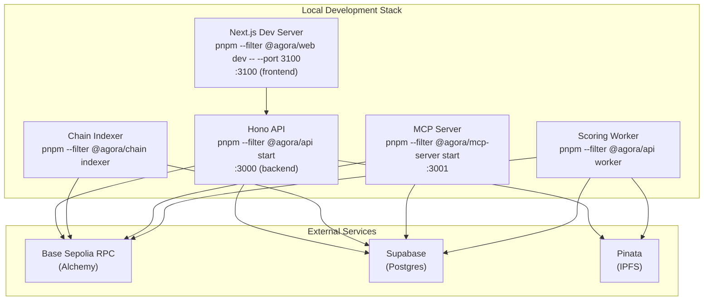
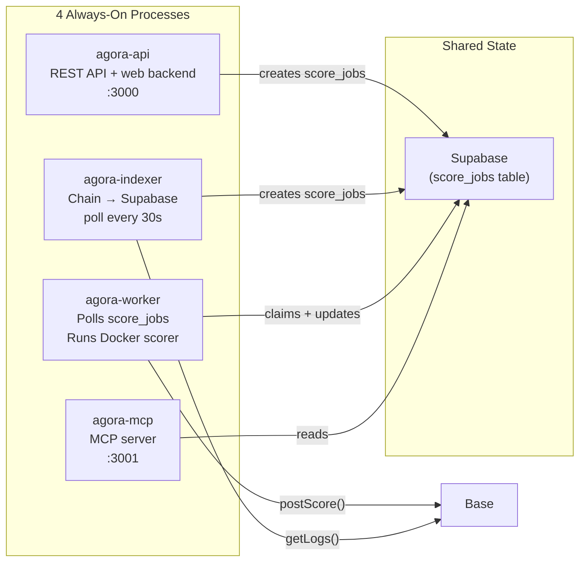
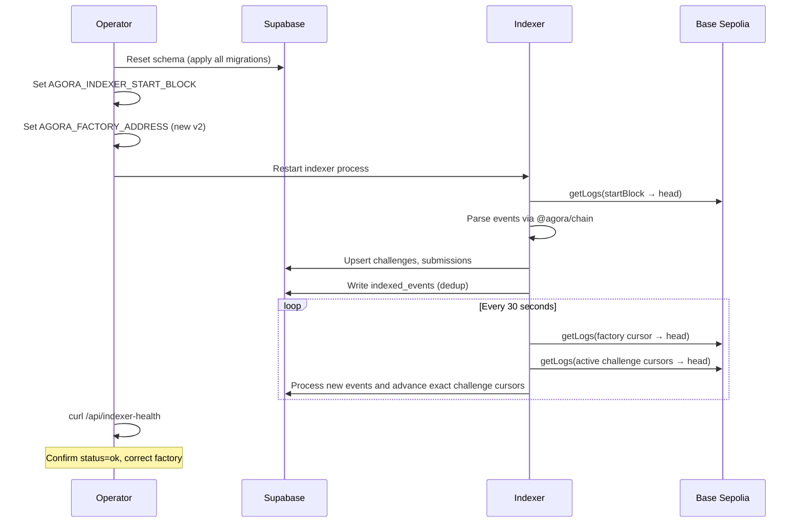

# Operations

## Purpose

How to run, monitor, and troubleshoot Agora services day-to-day. For deployment, cutover, and rollback procedures, see [Deployment](deployment.md).

## Audience

Operators and engineers responsible for running Agora in testnet or production environments.

## Read this after

- [Architecture](architecture.md) — system overview
- [Protocol](protocol.md) — contract lifecycle and settlement rules
- [Data and Indexing](data-and-indexing.md) — DB schema and indexer behavior
- [Deployment](deployment.md) — deploy, cutover, and rollback procedures

## Source of truth

This doc is authoritative for: service startup, monitoring, incident response, scoring limits, and indexer operations. It is NOT authoritative for: deployment procedures, cutover checklists (see [Deployment](deployment.md)), smart contract logic, sealed submission format internals, or database schema. For the privacy model itself, see [Submission Privacy](submission-privacy.md).

## Summary

- Four processes: API, Indexer, Worker, MCP
- Typical hosted split today: web on Vercel, API + indexer on Railway, worker on a self-hosted PM2 machine (for example, a DigitalOcean droplet)
- The API is the canonical remote agent surface
- MCP HTTP is read-only by default; stdio remains the full local tool surface
- Browser auth/session traffic goes through the web origin's same-origin `/api` proxy; the browser should not call the backend API origin directly for SIWE/session flows
- Indexer polls factory logs every 30s and only continuously polls active challenges; Worker polls score_jobs after challenges enter Scoring
- Worker stays alive in degraded mode, publishes readiness via `worker_runtime_state`, and only claims jobs while `ready=true`
- Health monitoring via /healthz, /api/indexer-health, /api/worker-health, agora doctor

---

## Local Development



```bash
pnpm install
pnpm turbo build
pnpm turbo test
```

Run services:

```bash
pnpm --filter @agora/api start        # API on :3000
pnpm --filter @agora/api worker       # Worker
pnpm --filter @agora/mcp-server start # MCP on :3001
pnpm --filter @agora/chain indexer    # Chain indexer
```

Web frontend:

```bash
pnpm --filter @agora/web dev -- --port 3100
```

---

## Service Architecture



| Process | Entrypoint | Role |
|---------|-----------|------|
| `agora-api` | `apps/api/dist/index.js` | REST API + web backend |
| `agora-indexer` | `packages/chain/dist/indexer.js` | Chain event poller -> Supabase |
| `agora-worker` | `apps/api/dist/worker.js` | Polls score_jobs, runs Docker scorer, posts scores on-chain |
| `agora-mcp` | `apps/mcp-server/dist/index.js` | MCP server for AI agents |

Architecture boundary:

- Clients now pre-register `submission_intents` before the on-chain submit. API submit confirmation and the indexer both reconcile intents into `submissions` rows and only then create or revive `score_jobs`.
- Worker polls `score_jobs` but only claims jobs after the challenge enters `Scoring` at deadline, and only when the worker runtime matches the active scoring runtime version declared by the API.
- Scorer is the Docker container itself (e.g. `ghcr.io/andymolecule/repro-scorer:v1`) — stateless, sandboxed, no network access.
- Official scorer images are public reproducibility artifacts. Keep the code and Dockerfile inspectable; keep hidden evaluation data out of the image.
- One active contract generation at a time. Runtime envs should never mix multiple factory generations.
- Worker and API coordinate through Supabase. `submission_intents` stages off-chain submission metadata, `score_jobs` drives scoring work, `worker_runtime_state` carries worker heartbeat/readiness, and `worker_runtime_control` declares the active scoring runtime version for claim fencing during split deploys.
- Official preset challenges should persist pinned image digests. The worker should only score from registry-backed official images, never from a host-local build that lacks a repo digest.
- Wallet/session consistency is enforced in the web app by a global wallet session bridge. If the connected wallet disconnects or changes to a different address, stale SIWE state is cleared instead of being reused accidentally.

### Worker Docker Flow

The worker now treats scorer availability as a runtime readiness problem, not a crash condition.

1. At startup it writes a `worker_runtime_state` row with `runtime_version`, `ready=false`, and any current `last_error`.
2. The API writes the active scoring runtime version into `worker_runtime_control` on startup.
3. Score-job claims are fenced against `worker_runtime_control`, so older workers can keep heartbeating but cannot keep claiming new jobs after a deploy.
2. It checks `docker info`, then preflights all official scorer images referenced by currently scoring official challenges.
3. If Docker or image preflight fails, the process stays up, keeps heartbeating, and skips job claims until readiness recovers.
4. Readiness is retried in the background every minute.
5. If the worker sees the active runtime version drift for three consecutive loop checks, it exits so PM2 and the DigitalOcean deploy workflows can replace it instead of leaving it degraded forever.
6. During scoring, the runner inspects the local Docker image first and only pulls when the image is missing.
7. Official images without a repo digest are rejected. A locally built image is not accepted as a substitute for a published official artifact.

---

## Submission Sealing

Sealed submission mode hides answer bytes from the public while a challenge is open.

For the exact envelope format, trust boundary, and end-to-end flow, see [Submission Privacy](submission-privacy.md).

Required env vars:

- API public config: `AGORA_SUBMISSION_SEAL_KEY_ID`, `AGORA_SUBMISSION_SEAL_PUBLIC_KEY_PEM`
- Worker private config: `AGORA_SUBMISSION_OPEN_PRIVATE_KEY_PEM` or `AGORA_SUBMISSION_OPEN_PRIVATE_KEYS_JSON`
- Shared deploy version: `AGORA_RUNTIME_VERSION` (optional override; otherwise the runtime resolves from platform commit metadata or local git SHA)
- Worker heartbeat tuning: `AGORA_WORKER_HEARTBEAT_MS`, `AGORA_WORKER_HEARTBEAT_STALE_MS`
- Optional stable worker runtime id: `AGORA_WORKER_RUNTIME_ID`
- Optional delayed retry tuning: `AGORA_WORKER_POST_TX_RETRY_MS`, `AGORA_WORKER_INFRA_RETRY_MS`

Key handling rules:

- The API advertises exactly one active public key via `GET /api/submissions/public-key`.
- The active `kid` must exist in the worker private key set.
- Services launched through `scripts/run-node-with-root-env.mjs` can load seal keys from disk via `AGORA_SUBMISSION_SEAL_PUBLIC_KEY_PEM_FILE`, `AGORA_SUBMISSION_OPEN_PRIVATE_KEY_PEM_FILE`, and `AGORA_SUBMISSION_OPEN_PRIVATE_KEYS_JSON_FILE`. The DigitalOcean worker start script still supports repo-root PEM fallbacks for backward compatibility.
- `AGORA_SUBMISSION_OPEN_PRIVATE_KEYS_JSON` is the rotation path. Keep the active key plus any previous keys whose still-pending sealed submissions need to be scored.
- `AGORA_SUBMISSION_OPEN_PRIVATE_KEY_PEM` is the simple single-key path. If both sources are set for the active `kid`, they must match.
- `GET /api/submissions/public-key` now fails closed unless a live worker heartbeat exists for the active `kid` and that worker has passed sealing self-check + Docker startup checks.
- Set `AGORA_WORKER_RUNTIME_ID` when you intentionally run multiple scoring workers on the same host. Otherwise the worker derives a stable host-based runtime id automatically.

Verification checklist:

```bash
curl -sS http://localhost:3000/healthz
curl -sS http://localhost:3000/api/worker-health
curl -sS http://localhost:3000/api/submissions/public-key
pnpm schema:verify
pnpm scorers:verify
```

Expected results:

- `/healthz` returns `{"ok":true,"service":"api","runtimeVersion":"..."}` for API liveness plus deployed version.
- `/api/worker-health` reports a fresh worker heartbeat, `workers.healthy > 0`, `workers.healthyWorkersForActiveRuntimeVersion > 0`, and `sealing.workerReady=true` for the active `keyId`. `healthyWorkersNotOnActiveRuntimeVersion` is diagnostic only unless active healthy workers drop to zero.
- `/api/submissions/public-key` returns `version:"sealed_submission_v2"` only when the active worker heartbeat for that `kid` is healthy.

Existing testnet DBs:

- Fresh environments should apply all migrations.
- Existing environments that still contain `result_format='sealed_v1'` must apply `002_align_sealed_submission_result_format.sql` before accepting new sealed submissions.
- Existing environments should also apply `004_add_score_job_backoff.sql` so delayed no-penalty worker retries and queue eligibility work correctly.
- Existing environments should also apply `005_add_submission_intents.sql` so pre-registered submission metadata can reconcile safely after on-chain submit confirmation.
- Existing environments should also apply `006_add_worker_runtime_version.sql` so worker/runtime alignment is visible in health checks.

Operational privacy boundary:

- Plaintext answer bytes should not be uploaded directly by clients.
- Public verification remains locked while the challenge is open.
- Once scoring begins, replay artifacts may be published for reproducibility, so sealed submissions are not permanent secrecy.

---

## Starting Services

### Manual

```bash
pnpm --filter @agora/api start
pnpm --filter @agora/chain indexer
pnpm --filter @agora/api worker
```

### PM2 (recommended)

```bash
pm2 start scripts/ops/ecosystem.config.cjs
pm2 save
pm2 status   # should show 4 processes: agora-api, agora-indexer, agora-worker, agora-mcp
```

### Split Hosted Production

Current production is intentionally split across hosts:

- Vercel: `agora-web`
- Railway: `@agora/api`, `agora-indexer`
- Self-hosted PM2 machine: `agora-worker`

Vercel redeploys directly from GitHub `main` via its native integration. Railway API and indexer should also redeploy natively from GitHub `main`. The self-hosted worker has its own deploy workflow because it does not live on a Git-integrated host.

### Railway Dashboard Settings

Railway API and indexer are intentionally dashboard-managed.

Recommended steady-state settings:

- `Source Repo`: `andymolecule/Agora`
- `Branch connected to production`: `main`
- Native Railway auto-deploy: enabled
- No dashboard watch-path filtering
- Build/start commands:
  - API build: `pnpm turbo build --filter=@agora/api`
  - API start: `pnpm --filter @agora/api start`
  - Indexer build: `pnpm turbo build --filter=@agora/chain`
  - Indexer start: `pnpm --filter @agora/chain indexer`

Operational rule:

- Do not reintroduce repo-local `railway.toml` service configs for API or indexer unless Railway's native deploy path is intentionally being replaced.
- If native Railway auto-deploy stops advancing, first reset the dashboard integration by disconnecting and reconnecting:
  - `Source Repo`
  - `Branch connected to production`
  then redeploy latest once and verify the next push advances production.

### DigitalOcean Worker Auto-Deploy

For the self-hosted worker, this repo ships a push-triggered deploy workflow, a scheduled auto-heal workflow, and a reusable droplet script:

- Workflow: [deploy-worker-digitalocean.yml](../.github/workflows/deploy-worker-digitalocean.yml)
- Workflow: [auto-heal-worker-digitalocean.yml](../.github/workflows/auto-heal-worker-digitalocean.yml)
- Droplet script: [deploy-worker.sh](../scripts/ops/deploy-worker.sh)

Expected GitHub configuration:

- Variable: `AGORA_API_HEALTH_URL`
- Secret: `DO_WORKER_HOST`
- Secret: `DO_WORKER_USER`
- Secret: `DO_WORKER_SSH_KEY`
- Variable: `DO_WORKER_PORT` (optional, defaults to `22`)
- Variable: `DO_WORKER_PATH` (optional, defaults to `/opt/agora`)
- Variable: `DO_WORKER_PM2_NAME` (optional, defaults to `agora-worker`)

Deploy flow:

1. Push to `main`
2. Railway API and indexer redeploy natively from GitHub `main`
3. GitHub Actions (DO worker workflow) waits for the API `/healthz` runtime version to match the latest API-surface commit for that push
4. GitHub Actions SSHes into the worker host
5. The droplet runs `scripts/ops/deploy-worker.sh`
6. The script checks out the live API runtime revision, installs deps, rebuilds `@agora/api`, and restarts the PM2 worker
7. The worker reports the new runtime SHA automatically through `/api/worker-health`

Auto-heal flow:

1. Every 10 minutes, GitHub Actions checks API `/healthz` and `/api/worker-health`
2. If the worker has zero healthy processes on the active runtime, or sealing is configured but `workerReady=false`, the workflow SSHes into the droplet
3. The droplet reruns `scripts/ops/deploy-worker.sh` pinned to the live API runtime revision
4. The workflow polls `/api/worker-health` until the worker is aligned again or fails visibly
5. If the unhealthy snapshot also showed stale running jobs, the workflow runs `pnpm recover:score-jobs -- --stale-minutes=20` on the droplet after the worker recovers

---

## Smoke Test

```bash
./scripts/e2e-test.sh
```

Fast overrides for shorter sessions:

```bash
AGORA_E2E_DEADLINE_MINUTES=30 \
AGORA_E2E_DISPUTE_WINDOW_HOURS=0 \
./scripts/e2e-test.sh
```

Expected flow: post -> indexer pickup -> list -> get -> score-local -> submit -> worker scoring -> verify-public -> finalize -> claim.

Note: `agora finalize` and `agora claim` require the dispute window to elapse after deadline. Use `AGORA_E2E_DISPUTE_WINDOW_HOURS=0` for same-session Base Sepolia testing, or a local Anvil RPC with `evm_increaseTime` for full lifecycle testing.
The E2E script now expects the scorer image to already be published and pullable. It no longer builds a local official scorer fallback.

---

## Health Monitoring

Check every 15-30 minutes during first launch window:

1. API `/healthz` returns 200.
2. Indexer logs show new blocks processed.
3. `indexed_events` block number continues advancing.
4. `agora doctor` passes all required checks.
5. Worker health: `curl <API_URL>/api/worker-health` returns `"ok": true` and shows healthy workers on the active runtime version. A mismatched healthy worker may still appear in health until it is stopped or becomes stale, but claim fencing prevents it from taking new jobs.
6. Indexer health: `curl <API_URL>/api/indexer-health` reports the intended factory address and no active alternate factories.

Health commands:

```bash
curl -sS http://localhost:3000/healthz
curl -sS http://localhost:3000/api/indexer-health
curl -sS http://localhost:3000/api/worker-health
agora doctor
```

Expected results:

- API health returns `{"ok":true,"runtimeVersion":"..."}`.
- Indexer health is `ok` or `warning`, not `critical`.
- `agora doctor` passes RPC/Supabase/factory checks.
- If sealing is enabled, `/api/submissions/public-key` returns `sealed_submission_v2` only while `/api/worker-health` reports a healthy worker for the same active `kid`.
- If active scoring challenges use official Agora scorer images and those GHCR images are not pullable, the worker should stay alive but report `ready=false`, a `latestError`, and zero healthy workers for the active runtime version.

---

## Scoring Safety Limits

Default scoring limits:

- Max submissions per challenge: `100`
- Max submissions per solver per challenge: `3`
- Max upload size: `50MB`

Behavior:

- Extra submissions are still recorded on-chain and in DB.
- Scoring jobs are marked skipped and not executed by the worker.

Per-challenge overrides can be set in the challenge spec:

- `max_submissions_total`
- `max_submissions_per_solver`

---

## Confirming Worker Scoring

1. Check `submission_intents`: each client submission should create an unmatched intent before the wallet transaction is sent, then the intent should gain `matched_submission_id` after the on-chain submission is indexed or the submit-confirmation API call succeeds.
2. Check `score_jobs` transitions: once the submission has both on-chain state and reconciled metadata, jobs should move from `queued` -> `running` -> `scored`. Infrastructure and tx-reconciliation retries may temporarily stay `queued` with a future `next_attempt_at`.
3. Check `GET /api/worker-health`: it should show `status != "warning"`, `workers.healthyWorkersForActiveRuntimeVersion > 0`, and no mismatched healthy workers before you expect automatic scoring.
4. After a submission, a `submission_intents` row appears immediately. A `score_jobs` row appears only after that intent is reconciled into a `submissions` row. The job should remain queued until the deadline passes and the challenge enters `Scoring`, then the worker should pick it up within ~15s (worker poll).
5. Successful scoring produces a proof bundle CID in `proof_bundles.cid`.
6. The frontend ActivityPanel "Scorer" row shows live queued/scored/failed counts.

---

## Indexer Operations

Reorg safety: `AGORA_INDEXER_CONFIRMATION_DEPTH` (default: `3`).

The indexer now separates:

- **Replay cursor** for reorg/retry safety
- **Factory high-water cursor** for health and lag reporting
- **Targeted repair** for challenge-local drift (`agora repair-challenge`)

If the indexer falls behind:

1. Restart indexer.
2. Check RPC health and `/api/indexer-health`.
3. If one challenge projection drifted, run targeted repair.
4. If transport/state replay is needed, run reindex.

Reindex procedures:

```bash
# Preview (dry run)
agora reindex --from-block <block> --dry-run

# Apply cursor rewind
agora reindex --from-block <block>

# Deep replay (also purge dedupe markers from that block onward)
agora reindex --from-block <block> --purge-indexed-events

# Repair one projected challenge from chain state
agora repair-challenge --id <challenge_id>
```

Notes:

- Reindex rewinds factory + challenge cursors for the active chain.
- Purging indexed events forces event handlers to run again from the specified block.
- `repair-challenge` rebuilds one challenge projection at the current confirmed tip without rewinding the whole indexer.



---

## Key Management

Rules:

- Never log private key env values.
- Rotate oracle keys on suspected compromise.
- Keep `AGORA_PRIVATE_KEY` and `AGORA_ORACLE_KEY` scoped to required services only.

Rotation sequence:

1. Pause worker scoring.
2. Decide whether this affects only future challenges or requires a clean factory cutover:
   - future challenges only: factory owner can call `setOracle()` and update worker env
   - active challenge oracle compromised: cut over to a fresh factory; existing challenge oracles are immutable
3. Update service env.
4. Resume worker after `agora doctor` + smoke validation.

---

## Incident Playbook

### API Down

1. Restart API process.
2. Verify `AGORA_*` env vars in host.
3. Verify Supabase connectivity.

### Indexer Stalled

1. Restart indexer process.
2. Verify RPC reachability.
3. Check `GET /api/indexer-health`. It now reports lag from the factory high-water cursor, not the replay cursor.
4. If the issue is challenge-local drift, repair that challenge first:

```bash
agora repair-challenge --id <challenge_id>
```

5. Rewind cursors with CLI (dry-run first) only when transport replay is needed:

```bash
agora reindex --from-block <block_number> --dry-run
agora reindex --from-block <block_number>
```

6. If a deep replay is required, include `--purge-indexed-events`.
7. Ensure `AGORA_INDEXER_START_BLOCK` is set before restarting indexer when bootstrapping a new factory.
8. If the factory address changed, align API/indexer/worker/web env first, restart all services, then reindex the fresh `v2` deployment from its deploy block.

### Worker Stalled

1. Check `GET /api/worker-health` — if `status: "warning"`, the oldest queued job has been waiting > 5 minutes.
2. Tail logs: `pm2 logs agora-worker --lines 100`.
3. Common causes:
   - Docker daemon not running or unreachable -> restart Docker, then `pm2 restart agora-worker`.
   - Official scorer image not pullable -> inspect `workers.latestError`, verify the image is public/pullable from the host, and rerun `./scripts/preflight-testnet.sh`.
   - DB schema drift or stale PostgREST cache -> run `pnpm schema:verify`. If it fails, apply the missing migration and reload the PostgREST schema cache before restarting services.
   - Runtime version mismatch -> compare `/healthz.runtimeVersion` with `/api/worker-health.runtime.apiVersion` and `workers.runtimeVersions`, then redeploy API + worker from the same git revision.
   - RPC errors -> check `AGORA_RPC_URL` reachability.
   - All jobs stuck in `failed` or `running` after an infra incident -> recover them with `pnpm recover:score-jobs -- --challenge-id=<challenge-id>` after the worker is healthy again.
   - Terminal validation/configuration rows lingering in `failed` -> inspect with `agora clean-failed-jobs` and skip only the rows that are truly unrecoverable.
4. If the worker process itself crashed: `pm2 restart agora-worker`. PM2 uses exponential backoff (3s base).

### Oracle Key Issue

1. Stop scoring operations immediately.
2. Rotate oracle key and reconfigure env.
3. Resume scoring only after `agora doctor` and one dry-run check.

### IPFS Gateway Instability

1. Retry affected submissions/challenges.
2. Keep indexer running; retry logic will back off.
3. If failures persist, switch gateway and rerun scoring/verification.

### RPC Instability

1. Fail over RPC endpoint.
2. Restart indexer/worker.
3. Confirm lag recovers via `/api/indexer-health`.

### DB Restoration

1. Restore DB snapshot.
2. Re-apply migrations.
3. Rewind indexer (`agora reindex --from-block <known-good-block>`).
4. Monitor event replay and challenge/submission consistency.

---

## Deployment, Cutover, and Rollback

For pre-launch checklists, contract deployment, rollback criteria, external cutover checklists, and worker recovery scripts, see [Deployment](deployment.md).
