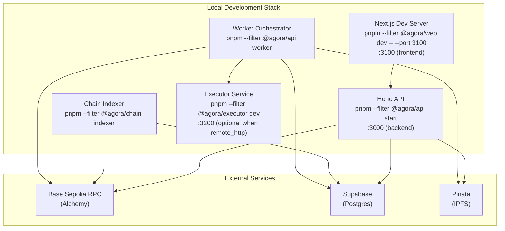
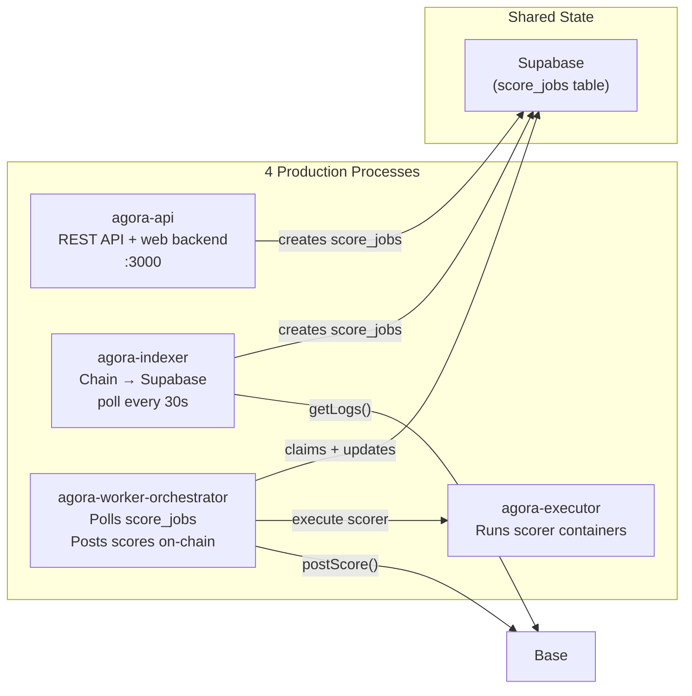

# Operations

## Purpose

How to run, monitor, and troubleshoot Agora services day-to-day. For deployment, cutover, and rollback procedures, see [Deployment](deployment.md).

## Audience

Operators and engineers responsible for running Agora in testnet or production environments.

## Read this after

- [Architecture](architecture.md) — system overview
- [specs/runtime-release-architecture.md](specs/runtime-release-architecture.md) — locked release, health, and ingress architecture
- [specs/authoring-session-api.md](specs/authoring-session-api.md) — locked session-first authoring contract
- [Protocol](protocol.md) — contract lifecycle and settlement rules
- [Data and Indexing](data-and-indexing.md) — DB schema and indexer behavior
- [Deployment](deployment.md) — deploy, cutover, and rollback procedures

## Source of truth

This doc is authoritative for: service startup, monitoring, incident response, scoring limits, indexer operations, and runtime recovery. It is NOT authoritative for: deployment procedures, cutover checklists (see [Deployment](deployment.md)), future-state runtime release architecture (see [specs/runtime-release-architecture.md](specs/runtime-release-architecture.md)), smart contract logic, sealed submission format internals, or database schema. For the privacy model itself, see [Submission Privacy](submission-privacy.md).

## Summary

- Four processes in production: API, Indexer, Worker Orchestrator, Executor
- Typical hosted split: web on Vercel, API + indexer + worker orchestrator on Railway, executor on a Docker-capable host or service
- The API is the canonical remote agent surface
- Browser auth/session traffic goes through the web origin's same-origin `/api` proxy; the browser should not call the backend API origin directly for SIWE/session flows
- Indexer polls factory logs every 30s and only continuously polls active challenges; Worker polls score_jobs after challenges enter Scoring
- Worker publishes readiness via `worker_runtime_state`, only claims jobs while `ready=true`, and uses a scorer execution backend (`local_docker` in dev, `remote_http` in production)
- Health monitoring via `/api/health`, `/api/indexer-health`, `/api/worker-health`, and `agora doctor`
- API, worker, executor, and indexer emit structured JSON logs. HTTP surfaces return `x-request-id`; include that header when tracing a failed request across logs or Sentry.

---

## Local Development



```bash
pnpm install
pnpm turbo build
pnpm turbo test
```

Run services:

```bash
pnpm --filter @agora/api start        # API on :3000
pnpm --filter @agora/api worker       # Worker orchestrator
pnpm --filter @agora/chain indexer    # Chain indexer
```

Optional remote executor for local parity with production:

```bash
AGORA_SCORER_EXECUTOR_BACKEND=remote_http \
AGORA_SCORER_EXECUTOR_URL=http://localhost:3200 \
pnpm --filter @agora/executor dev
```

Web frontend:

```bash
pnpm --filter @agora/web dev -- --port 3100
```

---

## Service Architecture



| Process | Entrypoint | Role |
|---------|-----------|------|
| `agora-api` | `apps/api/dist/index.js` | REST API + web backend |
| `agora-indexer` | `packages/chain/dist/indexer.js` | Chain event poller -> Supabase |
| `agora-worker` | `apps/api/dist/worker.js` | Orchestrates score jobs, persists proof data, posts scores on-chain |
| `agora-executor` | `apps/executor/dist/index.js` | Docker-only scorer execution service |

Architecture boundary:

- Clients now pre-register `submission_intents` before the on-chain submit. API submit confirmation still provides the fast path, but the indexer can also recover a `submissions` row directly from the reserved intent when the on-chain `solver` + `result_hash` match, and then create or revive the corresponding `score_jobs`.
- Worker polls `score_jobs` but only claims jobs after the persisted `startScoring()` transition has landed and been projected into `challenges.status = scoring`, and only when the worker runtime matches the active scoring runtime version declared by the API.
- Scorer is the Docker container itself (for example `ghcr.io/andymolecule/gems-match-scorer:v1`) — stateless, sandboxed, no network access. The orchestrator stages inputs; the executor service runs the container.
- Official scorer images are public reproducibility artifacts. Keep the code and Dockerfile inspectable; keep hidden evaluation data out of the image.
- One active contract generation at a time. Runtime envs should never mix multiple factory generations.
- Worker and API coordinate through Supabase. `submission_intents` stages off-chain submission metadata, `score_jobs` drives scoring work, `worker_runtime_state` carries worker heartbeat/readiness, and `worker_runtime_control` remains the active scoring runtime fence while API and worker-orchestrator roll forward together on Railway.
- Official scorer-template challenges should persist pinned image digests. The worker should only score from registry-backed official images, never from a host-local build that lacks a repo digest.
- Read-side challenge visibility and write-side scoring readiness intentionally differ after the deadline. Use contract `status()` for public visibility decisions and `scoringStartedAt > 0` for score posting, dispute timing, finalization timing, and score-job eligibility.
- Wallet/session consistency is enforced in the web app by a global wallet session bridge. If the connected wallet disconnects or changes to a different address, stale SIWE state is cleared instead of being reused accidentally.

### Worker / Executor Flow

The worker treats scorer availability as a runtime readiness problem, not a crash condition.

1. At startup it writes a `worker_runtime_state` row with `runtime_version`, `ready=false`, and any current `last_error`.
2. While the runtime schema is healthy, the API keeps the active scoring runtime version in sync inside `worker_runtime_control`.
3. Score-job claims are fenced against `worker_runtime_control`, so older workers can keep heartbeating but cannot keep claiming new jobs after a deploy.
4. It checks the configured scorer execution backend:
   - `local_docker`: verify local Docker health and preflight official images directly
   - `remote_http`: verify the executor service is reachable and ask it to preflight official images
5. If executor health or image preflight fails, the process stays up, keeps heartbeating, and skips job claims until readiness recovers.
6. Readiness is retried in the background every minute.
7. During scoring, the runner uses the configured executor backend. In production this should be the remote executor so Railway only runs orchestration code, not Docker itself.
8. Official images without a repo digest are rejected. A locally built image is not accepted as a substitute for a published official artifact.

---

## Submission Sealing

Sealed submission mode hides answer bytes from the public while a challenge is open.

For the exact envelope format, trust boundary, and end-to-end flow, see [Submission Privacy](submission-privacy.md).

Required env vars:

- API public config: `AGORA_SUBMISSION_SEAL_KEY_ID`, `AGORA_SUBMISSION_SEAL_PUBLIC_KEY_PEM`
- API worker-validation bridge: `AGORA_WORKER_INTERNAL_URL`, `AGORA_WORKER_INTERNAL_TOKEN`
- Worker private config: `AGORA_SUBMISSION_OPEN_PRIVATE_KEY_PEM` or `AGORA_SUBMISSION_OPEN_PRIVATE_KEYS_JSON`
- Worker internal validation server: `AGORA_WORKER_INTERNAL_PORT`, `AGORA_WORKER_INTERNAL_TOKEN`
- Shared deploy version: `AGORA_RUNTIME_VERSION` (optional override; otherwise the runtime resolves from build metadata, platform commit metadata when available, or a best-effort fallback such as `dev`)
- Worker heartbeat tuning: `AGORA_WORKER_HEARTBEAT_MS`, `AGORA_WORKER_HEARTBEAT_STALE_MS`
- Optional stable worker runtime id: `AGORA_WORKER_RUNTIME_ID`
- Optional delayed retry tuning: `AGORA_WORKER_POST_TX_RETRY_MS`, `AGORA_WORKER_INFRA_RETRY_MS`

Key handling rules:

- The API advertises exactly one active public key via `GET /api/submissions/public-key`.
- The active `kid` must exist in the worker private key set.
- `POST /api/submissions/intent` now uses the worker bridge to open the uploaded sealed CID before persisting the `submission_intent`.
- Services launched through `scripts/run-node-with-root-env.mjs` can load seal keys from disk via `AGORA_SUBMISSION_SEAL_PUBLIC_KEY_PEM_FILE`, `AGORA_SUBMISSION_OPEN_PRIVATE_KEY_PEM_FILE`, and `AGORA_SUBMISSION_OPEN_PRIVATE_KEYS_JSON_FILE`.
- `AGORA_SUBMISSION_OPEN_PRIVATE_KEYS_JSON` is the rotation path. Keep the active key plus any previous keys whose still-pending sealed submissions need to be scored.
- `AGORA_SUBMISSION_OPEN_PRIVATE_KEY_PEM` is the simple single-key path. If both sources are set for the active `kid`, they must match.
- `GET /api/submissions/public-key` returns the active public key only when the worker validation bridge is configured too. Sealed submission validity is now enforced at submission time as well as scoring time.
- A `200` from `POST /api/submissions/upload` does not prove a sealed submission is decryptable. Treat `POST /api/submissions/intent` as the decryptability gate.
- Set `AGORA_WORKER_RUNTIME_ID` when you intentionally run multiple scoring workers on the same host. Otherwise the worker derives a stable host-based runtime id automatically.

Verification checklist:

```bash
curl -sS http://localhost:3000/api/health
curl -sS http://localhost:3000/api/worker-health
curl -sS http://localhost:3000/api/submissions/public-key
curl -sS \
  -H "Authorization: Bearer $AGORA_WORKER_INTERNAL_TOKEN" \
  http://localhost:3400/internal/sealed-submissions/healthz
pnpm schema:verify
pnpm scorers:verify
```

Expected results:

- `/api/health` returns `{"ok":true,"service":"api","runtimeVersion":"..."}` for API liveness plus deployed version.
- API responses include `x-request-id`; if you pass one in the request header, the API preserves it for end-to-end correlation.
- `/api/worker-health` reports a fresh worker heartbeat, `workers.healthy > 0`, `workers.healthyWorkersForActiveRuntimeVersion > 0`, and `sealing.workerReady=true` for the active `keyId`. It also exposes `sealing.publicKeyFingerprint`, `sealing.derivedPublicKeyFingerprint`, and `sealing.selfCheckOk` so hosted verification can confirm the worker private key still matches the API public key. `healthyWorkersNotOnActiveRuntimeVersion` is diagnostic only unless active healthy workers drop to zero.
- `/api/worker-health` should not report `idle` when queued work exists. If `queued > 0` and `eligibleQueued = 0`, treat that as blocked scoring work and inspect the `startScoring()` boundary, queue backoff, and runtime alignment before assuming the worker is healthy.
- Authoring has no dedicated health endpoint. Validate it with a create/patch/publish canary and inspect API logs or session rows directly when investigating backlog or expiry issues.
- `/api/submissions/public-key` returns `version:"sealed_submission_v2"` plus `publicKeyFingerprint` whenever sealing and the worker validation bridge are configured successfully.
- `/internal/sealed-submissions/healthz` returns the worker `keyId`, `publicKeyFingerprint`, and `derivedPublicKeyFingerprint`; both fingerprints must match the API `publicKeyFingerprint`.

When `SEALED_SUBMISSION_INVALID` appears at intent time:

- First prove whether the platform is healthy by running `agora prepare-submission` or `agora submit` once through the official helper path.
- If the canonical path succeeds, treat the failing caller as a non-canonical sealer, not a key-drift incident.
- Check the raw uploaded envelope for canonical boundary violations before deeper crypto debugging. The most common one is a mixed-case `solverAddress` in the uploaded JSON.
- `validation_code=key_unwrap_failed` usually means the caller used the wrong RSA-OAEP contract, the wrong public key, or corrupted `wrappedKey` bytes.
- `validation_code=ciphertext_auth_failed` usually means the caller drifted from Agora's authenticated-data contract (`challengeId`, lowercase `solverAddress`, `fileName`, `mimeType`, or key order) or corrupted `iv` / `ciphertext` bytes.
- `validation_code=decrypt_failed` is now a legacy/fallback catch-all. Expect the more specific subcodes above when Agora can classify the failure path.
- Do not keep retrying with the same custom sealer after refetching `/api/submissions/public-key`; that only helps when the key actually rotated. Autonomous agents should switch to the official helper contract instead.
- Inspect `submission_events.payload.error.details.sealed_submission_validation`
  for the worker subcode and safe key context. That field mirrors the
  `error.details.sealed_submission_validation` object returned by the API.
- Inspect `error.details.submission_helper` when present; it carries the
  preferred helper command templates for autonomous agents.
- Point non-JS callers at [`docs/fixtures/sealed-submission-v2-conformance.json`](fixtures/sealed-submission-v2-conformance.json) before asking them to retry live submissions.

Existing testnet DBs:

- Fresh environments should reset the schema and apply [001_baseline.sql](/Users/changyuesin/Agora/packages/db/supabase/migrations/001_baseline.sql).
- Existing environments are expected to reset cleanly. This repo no longer carries a supported incremental Supabase upgrade chain.
- The supported path is: wipe the schema, apply [001_baseline.sql](/Users/changyuesin/Agora/packages/db/supabase/migrations/001_baseline.sql), reload the PostgREST schema cache, then restart services.

Operational privacy boundary:

- Plaintext answer bytes should not be uploaded directly by clients.
- Public verification remains locked while the challenge is open.
- Once scoring begins, replay artifacts may be published for reproducibility, so sealed submissions are not permanent secrecy.

---

## Starting Services

### Manual

```bash
pnpm --filter @agora/api start
pnpm --filter @agora/chain indexer
pnpm --filter @agora/api worker
pnpm --filter @agora/executor start  # only when AGORA_SCORER_EXECUTOR_BACKEND=remote_http
```

### Split Hosted Production

Current production is intentionally split across hosts:

- Vercel: `agora-web`
- Railway: `@agora/api`, `agora-indexer`, `agora-worker-orchestrator`
- Docker-capable host or service: `agora-executor`

Vercel redeploys directly from GitHub `main` via its native integration. Railway runtime services should roll forward through Railway's native deploy path from `main`, then the hosted verification flow from [Deployment](deployment.md) waits for the intended API release metadata, checks schema compatibility, verifies hosted health, and only then treats the runtime as aligned. The executor should be treated as infrastructure: update it when the executor service itself changes, not on every app commit.

Vercel-specific proxy rule:

- Set server-side `AGORA_API_URL` to the backend API origin, not the web origin. The same-origin web `/api/*` proxy depends on this and will fail closed if it is pointed back at the web host.

### Railway Dashboard Settings

Railway API and indexer are intentionally dashboard-managed.

Recommended steady-state settings:

- `Source Repo`: `andymolecule/Agora`
- `Branch connected to production`: `main`
- Native Railway auto-deploy: enabled
- If `Wait for CI` is enabled, point it only at the repo `CI` workflow
- API health check path: `/api/health`
- API health check timeout: `30` seconds
- Shared runtime release identity: set `AGORA_EXPECT_RELEASE_METADATA=true`
  after confirming the hosted release metadata path reports a non-placeholder
  `identitySource` such as `baked` or `provider_env`
- No dashboard watch-path filtering
- Build/start commands:
  - API build: `pnpm turbo build --filter=@agora/api`
  - API start: `pnpm --filter @agora/api start`
  - Indexer build: `pnpm turbo build --filter=@agora/chain`
  - Indexer start: `pnpm --filter @agora/chain indexer`
  - Worker orchestrator build: `pnpm turbo build --filter=@agora/api`
  - Worker orchestrator start: `pnpm --filter @agora/api worker`

Operational rule:

- Do not reintroduce repo-local `railway.toml` service configs for API or indexer unless Railway's native deploy path is intentionally being replaced.
- Do not add a second deploy control plane on top of Railway. Let Railway handle runtime rollout from `main`, then use the hosted verification flow from [Deployment](deployment.md) to detect schema drift and runtime readiness.
- Do not use `Verify Runtime` as a Railway pre-deploy gate. The right order is
  `CI` first, Railway deploy second, hosted verification third.

### Remote Executor Service

Production scoring should run with:

- `AGORA_SCORER_EXECUTOR_BACKEND=remote_http`
- `AGORA_SCORER_EXECUTOR_URL=<executor base url>`
- `AGORA_SCORER_EXECUTOR_TOKEN=<shared bearer token>`

Expected executor host configuration:

- Docker daemon available locally
- `apps/executor` deployed and reachable by the Railway worker orchestrator
- `AGORA_EXECUTOR_AUTH_TOKEN` matches the orchestrator token
- `NODE_ENV=production` requires `AGORA_EXECUTOR_AUTH_TOKEN`; the executor will fail fast without it

Steady-state flow:

1. Runtime-affecting pushes to `main` deploy through Railway's native runtime deploy path
2. `Verify Runtime` waits for `/api/health` to report the intended API release metadata, then checks hosted schema compatibility, `/api/worker-health`, and `/api/indexer-health` without mutating the environment
3. Operators use `pnpm reset-bomb:testnet` only when verification reports schema incompatibility or when they intentionally want a destructive rebuild
4. Funded hosted smoke is a separate manual lane: `pnpm smoke:hosted`
5. Deterministic local CLI parity stays local-only: `pnpm smoke:cli:local`
6. The worker orchestrator writes its runtime heartbeat into `worker_runtime_state`
7. The orchestrator checks executor health and preflights official images
8. When a job is claimed, the orchestrator stages inputs and sends them to the executor
9. The executor runs the scorer container locally and returns `score.json`
10. The orchestrator persists proof data and posts scores on-chain

Release prerequisites:

- Railway auto-deploy remains enabled for API, indexer, and worker orchestrator
- `/api/health` must be healthy and report a runtime version plus a canonical `identitySource` before the release gate passes
- `/api/worker-health` must report healthy workers on the active API runtime before the release gate passes
- `/api/indexer-health` must report the same runtime version and a canonical `identitySource` before the release gate passes
- `gitSha` on Railway is best-effort provenance, not a hard hosted release gate
- `AGORA_SUPABASE_ADMIN_DB_URL` is required only for destructive reset bomb
- Any PR or direct push that changes `packages/db/src/schema-compatibility.ts` or `packages/db/supabase/migrations/001_baseline.sql` must include `[runtime-schema-change]` in the PR title or commit message so CI fails loud until the destructive reset plan is acknowledged

---

## Smoke Test

```bash
pnpm smoke:hosted
```

Local deterministic smoke:

```bash
pnpm smoke:lifecycle:local
pnpm smoke:cli:local

# hosted smoke still accepts explicit overrides
AGORA_E2E_DEADLINE_MINUTES=30 \
AGORA_E2E_DISPUTE_WINDOW_HOURS=168 \
pnpm smoke:hosted
```

Hosted smoke flow: post -> indexer pickup -> list -> get -> public score-local blocked for private-evaluation -> submit -> worker scoring -> verify-public.
Local deterministic flow: create -> submit -> startScoring -> score -> dispute -> resolve -> claim.
Local CLI parity flow: post -> submit -> worker scoring -> verify-public -> finalize -> claim.
Both local commands now provision their own isolated local Supabase + Anvil
stack automatically before they start the lifecycle or CLI parity flow.

Note: `agora finalize` and `agora claim` require the dispute window to elapse from scoring start. Full lifecycle settlement testing belongs to the local deterministic lane, not hosted smoke.
The smoke lanes expect the scorer image to already be published and pullable. They do not build a local official scorer fallback.
For standard local verification, official scorer images are expected to be
multi-arch (`linux/amd64` and `linux/arm64`). A published amd64-only official
image is a release issue, not an expected Apple Silicon limitation.

---

## Health Monitoring

Check every 15-30 minutes during first launch window:

1. API `/api/health` returns 200.
2. Indexer logs show new blocks processed.
3. `indexed_events` block number continues advancing.
4. `agora doctor` passes all required checks.
5. Worker health: `curl <API_URL>/api/worker-health` returns `"ok": true` and shows healthy workers on the active runtime version. If `AGORA_SCORER_EXECUTOR_BACKEND=remote_http`, this also implies the executor passed the worker readiness checks.
6. Authoring canary: create/patch/publish flows succeed for the intended caller type. There is no separate `/api/authoring/health` endpoint.
7. Web proxy health: `curl <WEB_URL>/api/health` and `curl <WEB_URL>/api/worker-health` succeed without the `AGORA_API_URL` proxy-misconfiguration error.
8. Indexer health: `curl <API_URL>/api/indexer-health` reports the intended factory address and no active alternate factories.

Health commands:

```bash
curl -sS http://localhost:3000/api/health
curl -sS http://localhost:3000/api/indexer-health
curl -sS http://localhost:3000/api/worker-health
agora doctor
```

Expected results:

- API health returns `{"ok":true,"runtimeVersion":"..."}`.
- Indexer health is `ok` or `warning`, not `critical`.
- Authoring is validated through session canaries plus API logs, not through a separate health route.
- `agora doctor` passes RPC/Supabase/factory checks.
- If sealing is enabled, `/api/submissions/public-key` returns `sealed_submission_v2` whenever the public sealing key is configured.
- If active scoring challenges use official Agora scorer images and those GHCR images are not pullable, the worker should stay alive but report `ready=false`, a `latestError`, and zero healthy workers for the active runtime version.
- When `AGORA_SCORER_EXECUTOR_BACKEND=remote_http`, `GET <executor-url>/healthz` should return `{"ok":true,"service":"executor","backend":"local_docker"}`.

---

## Scoring Safety Limits

Default scoring limits:

- Max submissions per challenge: `100`
- Max submissions per solver per challenge: `3`
- Max upload size: `50MB`

Behavior:

- Extra submissions are still recorded on-chain and in DB.
- Scoring jobs are marked skipped and not executed by the worker.

Per-challenge overrides can be set in the challenge spec:

- `max_submissions_total`
- `max_submissions_per_solver`

---

## Confirming Worker Scoring

1. Check `submission_intents`: each client submission should create an intent before the wallet transaction is sent, and the on-chain submission should attach to that existing intent. `submissions.submission_intent_id` should be present before the row can become scoreable.
2. Check `score_jobs` transitions: once the submission has both on-chain state and the linked registered metadata, jobs should move from `queued` -> `running` -> `scored`. Infrastructure retries may temporarily stay `queued` with a future `next_attempt_at`.
3. Check `GET /api/worker-health`: it should show `status != "warning"` and `workers.healthyWorkersForActiveRuntimeVersion > 0` before you expect automatic scoring. `healthyWorkersNotOnActiveRuntimeVersion` is still useful diagnostically, but it is no longer a hard readiness requirement when an active healthy worker already exists.
4. After a submission, a `submission_intents` row appears immediately. A `score_jobs` row appears only after the indexed `submissions` row exists with its linked `submission_intent_id`. The job should remain queued until `startScoring()` has landed on-chain and that persisted transition has been projected into `challenges.status = scoring`, then the worker should pick it up within ~15s (worker poll).
5. If the on-chain submission arrived before the intent became visible, check `GET /api/indexer-health`: `unmatchedSubmissions.total` should briefly rise and then drain. Operators can inspect the backlog at `GET /api/internal/submissions/challenges/:id/unmatched`.
6. Successful scoring produces a proof bundle CID in `proof_bundles.cid`.
7. The frontend ActivityPanel "Scorer" row shows live queued/scored/failed counts.

---

## Indexer Operations

Reorg safety: `AGORA_INDEXER_CONFIRMATION_DEPTH` (default: `3`).

The indexer now separates:

- **Replay cursor** for reorg/retry safety
- **Factory high-water cursor** for health and lag reporting
- **Unmatched submission backlog** for on-chain submissions that arrived before their intent
- **Targeted repair** for challenge-local drift (`agora repair-challenge`)
- **Internal modules by concern** — `indexer.ts` drives polling, `factory-events.ts` handles factory-side creation projection, `challenge-events.ts` dispatches per-challenge logs, `submissions.ts` owns submission projection/recovery, `settlement.ts` owns payout/finalization repair, and `cursors.ts` owns challenge cursor bootstrap/persist

If the indexer falls behind:

1. Restart indexer.
2. Check RPC health and `/api/indexer-health`.
3. If `unmatchedSubmissions.stale > 0`, inspect `GET /api/internal/submissions/challenges/:id/unmatched` before reaching for repair.
4. If one challenge projection drifted outside the unmatched-submission backlog, run targeted repair.
5. If transport/state replay is needed, run reindex.

Reindex procedures:

```bash
# Preview (dry run)
agora reindex --from-block <block> --dry-run

# Apply cursor rewind
agora reindex --from-block <block>

# Deep replay (also purge dedupe markers from that block onward)
agora reindex --from-block <block> --purge-indexed-events

# Repair one projected challenge from chain state
agora repair-challenge --id <challenge_id>
```

Notes:

- Reindex rewinds factory + challenge cursors for the active chain.
- Purging indexed events forces event handlers to run again from the specified block.
- `repair-challenge` rebuilds one challenge projection at the current confirmed tip without rewinding the whole indexer. It is no longer the first-line recovery path for late submission intents; unmatched submission backlog should drain automatically.


---

## Key Management

Rules:

- Never log private key env values.
- Rotate oracle keys on suspected compromise.
- Keep `AGORA_PRIVATE_KEY` and `AGORA_ORACLE_KEY` scoped to required services only.

Rotation sequence:

1. Pause worker scoring.
2. Decide whether this affects only future challenges or requires a clean factory cutover:
   - future challenges only: factory owner can call `setOracle()` and update worker env
   - active challenge oracle compromised: cut over to a fresh factory; existing challenge oracles are immutable
3. Update service env.
4. Resume worker after `agora doctor` + smoke validation.

---

## Incident Playbook

### API Down

1. Restart API process.
2. Verify `AGORA_*` env vars in host.
3. Verify Supabase connectivity.

### Indexer Stalled

1. Restart indexer process.
2. Verify RPC reachability.
3. Check `GET /api/indexer-health`. It now reports lag from the factory high-water cursor, not the replay cursor, and includes unmatched submission backlog counts.
4. If `unmatchedSubmissions.stale > 0`, inspect the per-challenge backlog first:

```bash
curl -H "Authorization: Bearer $AGORA_AUTHORING_OPERATOR_TOKEN" \
  "$AGORA_API_URL/api/internal/submissions/challenges/<challenge_id>/unmatched"
```

5. If the issue is challenge-local drift outside that backlog, repair that challenge:

```bash
agora repair-challenge --id <challenge_id>
```

6. Rewind cursors with CLI (dry-run first) only when transport replay is needed:

```bash
agora reindex --from-block <block_number> --dry-run
agora reindex --from-block <block_number>
```

7. If a deep replay is required, include `--purge-indexed-events`.
8. Ensure `AGORA_INDEXER_START_BLOCK` is set before restarting indexer when bootstrapping a new factory.
9. If the factory address changed, align API/indexer/worker/web env first, restart all services, then reindex the fresh `v2` deployment from its deploy block.

### Worker Stalled

1. Check `GET /api/worker-health` — if `status: "warning"`, the oldest queued job has been waiting > 5 minutes.
2. Tail worker logs from Railway and executor logs from the executor host/service.
3. Common causes:
   - Executor unavailable -> inspect the worker `latestError`, check `GET <executor-url>/healthz`, then verify network reachability and the shared bearer token.
   - Docker daemon not running or unreachable on the executor host -> restart Docker there, then retry readiness checks.
   - Official scorer image not pullable -> inspect `workers.latestError`, verify the image is public/pullable from the executor host, and rerun `./scripts/preflight-testnet.sh`.
   - DB schema drift or stale PostgREST cache -> run `pnpm schema:verify`. If it fails, apply the missing migration and reload the PostgREST schema cache before restarting services.
   - Runtime version mismatch -> compare `/api/health.runtimeVersion` with `/api/worker-health.runtime.apiVersion` and `workers.runtimeVersions`, then restart the Railway worker orchestrator so it redeploys on the active API revision.
   - RPC errors -> check `AGORA_RPC_URL` reachability.
   - All jobs stuck in `failed` or `running` after an infra incident -> recover them with `pnpm recover:score-jobs -- --challenge-id=<challenge-id>` after the worker is healthy again.
   - Wallet-funded authoring publishes interrupted before the caller sent the chain transaction -> rerun `POST /api/authoring/sessions/:id/publish` with the same bound wallet and use the returned executable tx payloads.
   - Wallet-funded authoring publishes interrupted after the caller sent the chain transaction -> inspect the session row, confirm the `tx_hash`, and retry `POST /api/authoring/sessions/:id/confirm-publish` with the original `tx_hash` instead of replaying the authoring flow.
   - Terminal validation/configuration rows lingering in `failed` -> inspect with `agora clean-failed-jobs` and skip only the rows that are truly unrecoverable.
4. If the worker orchestrator process itself crashed: redeploy or restart the Railway worker service. If the executor crashed, restart the executor service on its host and re-check the executor `/healthz` endpoint.

### Managed Authoring Backlog

1. Check recent API logs and inspect affected rows in `authoring_sessions`.
2. If `sessions.expired > 0`, confirm they are abandoned private workspaces. Sessions do not refresh in place; the caller starts a new session if they need to continue after expiry.
3. If `sessions.stale_ready > 0` or `sessions.stale_awaiting_input > 0`, inspect recent API logs for interrupted authoring requests and confirm the caller is still polling `GET /api/authoring/sessions/:id`.
4. If a wallet-funded publish is stuck before the caller transaction was sent, rerun `POST /api/authoring/sessions/:id/publish` with the same wallet and continue from the returned tx payloads.
5. If a wallet-funded publish is stuck after the caller transaction succeeded, retry `POST /api/authoring/sessions/:id/confirm-publish` with the original `tx_hash` before asking the caller to rebuild the session.
6. There is no push-delivery recovery path in the current authoring model. Session clients use direct mutation responses plus authenticated polling.

### Oracle Key Issue

1. Stop scoring operations immediately.
2. Rotate oracle key and reconfigure env.
3. Resume scoring only after `agora doctor` and one dry-run check.

### IPFS Gateway Instability

1. Retry affected submissions/challenges.
2. Keep indexer running; retry logic will back off.
3. If failures persist, switch gateway and rerun scoring/verification.

### RPC Instability

1. Fail over RPC endpoint.
2. Restart indexer/worker.
3. Confirm lag recovers via `/api/indexer-health`.

### DB Restoration

1. Restore DB snapshot.
2. Re-apply migrations.
3. Rewind indexer (`agora reindex --from-block <known-good-block>`).
4. Monitor event replay and challenge/submission consistency.

---

## Deployment, Cutover, and Rollback

For pre-launch checklists, contract deployment, rollback criteria, external cutover checklists, and worker recovery scripts, see [Deployment](deployment.md).
