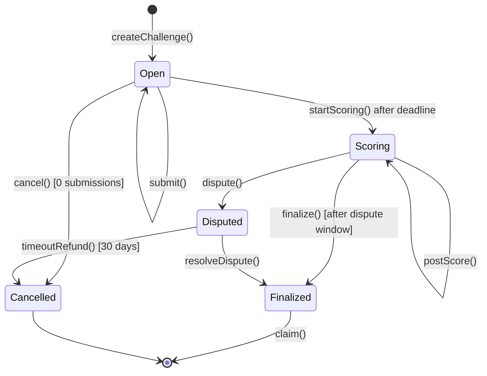
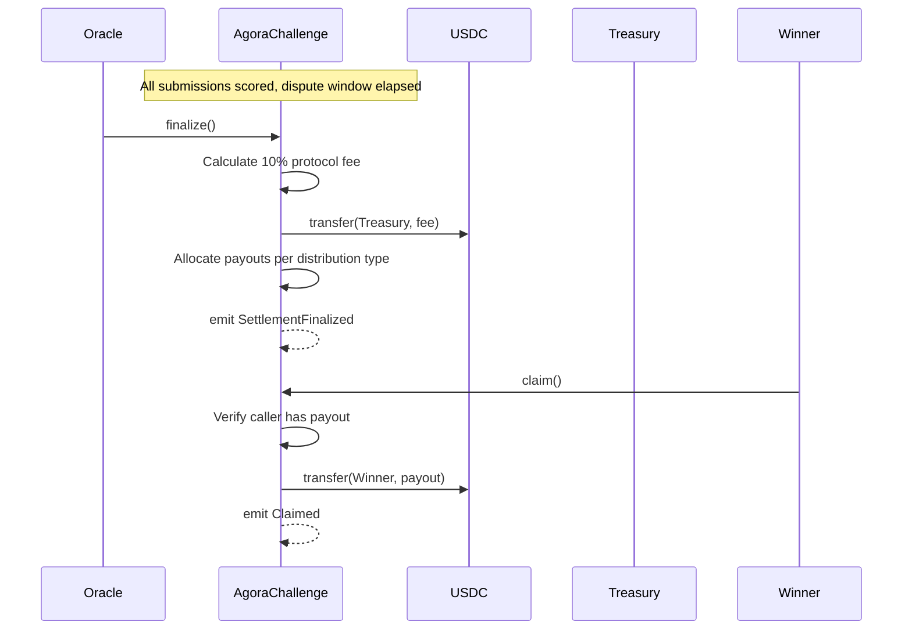

# Agora Protocol

## Purpose

What the on-chain protocol does: challenge lifecycle, settlement, scoring rules, and contract invariants.

## Audience

Engineers working on contracts, chain integration, or settlement logic. Operators running scoring and finalization.

## Read this after

- [Product Guide](product.md) — what Agora is and why
- [Architecture](architecture.md) — how the system fits together

## Source of truth

This doc is authoritative for: challenge lifecycle states, settlement rules, payout distribution, contract roles, event semantics, and the challenge YAML schema. It is **not** authoritative for: database schema, API routes, or frontend behavior.

## Summary

- AgoraFactory deploys per-bounty AgoraChallenge contracts with USDC escrow.
- Challenges follow a strict state machine: Open → Scoring → Finalized (or Disputed → Finalized, or Cancelled).
- 10% protocol fee (hardcoded, 1000 bps) flows to treasury on finalization.
- Scoring is deterministic Docker execution; proof bundles are pinned to IPFS with hashes stored on-chain.
- Dispute window is poster-configurable (0–2160 hours on testnet; 168–2160 hours (7–90 days) before mainnet).
- Anyone can independently verify scores by re-running the scorer container.
- Contract generation: one active v2 factory at a time; `contractVersion()` for diagnostics.

---

## Contract Roles

| Role | Who | What they can do | Trust level |
|------|-----|-----------------|-------------|
| **Poster** | Any wallet | Creates a challenge, deposits USDC, cancels (if 0 submissions before deadline), disputes scores | Trustless — USDC locked in smart contract escrow |
| **Solver** | Any wallet | Submits result hashes on-chain during the Open phase, claims payouts after finalization | Trustless — can only submit hashes |
| **Oracle** | Designated address (set at challenge creation) | Calls `startScoring()`, `postScore()`, `resolveDispute()` | Semi-trusted (single key in MVP); immutable per challenge |
| **Treasury** | Designated address (set on factory) | Receives 10% protocol fee on finalization | Controlled by factory owner; updates affect future challenges only |
| **Verifier** | Anyone | Re-runs the Docker scorer locally to check that posted scores are honest | Fully trustless — no on-chain role required |

### Actor Permission Matrix

| Action | Poster | Solver | Oracle | Anyone |
|--------|--------|--------|--------|--------|
| `createChallenge()` | Yes (via Factory) | — | — | — |
| `submit()` | — | Yes | — | — |
| `startScoring()` | — | — | — | Yes (after deadline) |
| `postScore()` | — | — | Yes | — |
| `finalize()` | — | — | — | Yes (after dispute window) |
| `dispute()` | — | — | — | Yes (during dispute window) |
| `resolveDispute()` | — | — | Yes | — |
| `cancel()` | Yes (if 0 subs) | — | — | — |
| `timeoutRefund()` | — | — | — | Yes (after 30 days) |
| `claim()` | — | Yes (winner) | — | — |

---

## Challenge Lifecycle State Machine



### Effective versus persisted status

- The contract `status()` view function is the read-side truth. After the deadline passes, it returns `Scoring` even if the persisted storage slot is still `Open`.
- Write-side transitions remain strict: `postScore()`, `dispute()`, and `finalize()` require a persisted `startScoring()` transaction first.
- Off-chain consumers (API, web, MCP) should use `status()` for visibility decisions. The DB projection may conservatively lag until the `StatusChanged(Open, Scoring)` event is indexed.

### Fairness boundary

- **Open:** Submissions are allowed. No public leaderboard, no public verification artifacts, and no score computation. Sealed submissions are hidden from the public and other solvers.
- **Scoring:** Submissions are closed. The worker may decrypt sealed submissions, compute scores, and publish per-challenge results.
- **Finalized:** Public global reputation surfaces (win rate, earned USDC) derive from finalized challenges only.

---

## USDC Flow

```mermaid
sequenceDiagram
    participant Poster
    participant USDC
    participant Factory as AgoraFactory
    participant Escrow as AgoraChallenge
    participant Treasury
    participant Winner

    Poster->>USDC: approve(Factory, amount)
    Poster->>Factory: createChallenge(...)
    Factory->>Escrow: deploy new contract
    Factory->>USDC: transferFrom(Poster, Escrow, amount)
    Note over Escrow: USDC locked in escrow

    Note over Escrow: Solvers submit, oracle scores...

    rect rgb(40, 40, 60)
        Note over Escrow: Finalization
        Escrow->>USDC: transfer(Treasury, 10% fee)
        Escrow->>Escrow: setPayout(winner, 90%)
    end

    Winner->>Escrow: claim()
    Escrow->>USDC: transfer(Winner, payout)
```



### Finalize and Claim Flow



---

## Distribution Types

| Type | Allocation | Description |
|------|-----------|-------------|
| **WinnerTakeAll** | 1st place: 100% | Single highest-scoring solver receives the entire reward (after fee). |
| **TopThree** | 1st: 60%, 2nd: 25%, 3rd: 15% | Top three scorers split the reward. If fewer than three qualifying submissions, remaining share rolls up to the top scorer(s). |
| **Proportional** | Score-weighted | All qualifying solvers (those meeting `minimum_score`, if set) share the reward proportional to their scores. |

All distributions apply after the 10% protocol fee is deducted.

---

## Emitted Events

| Event | Description |
|-------|-------------|
| `ChallengeCreated` | Factory deployed a new AgoraChallenge contract with USDC escrowed. |
| `FactoryOracleUpdated` | Factory owner rotated the oracle used for future challenges. |
| `FactoryTreasuryUpdated` | Factory owner rotated the treasury used for future challenges. |
| `Submitted` | A solver submitted a result hash to an open challenge. Includes `subId` and `solver` address. |
| `StatusChanged` | Challenge transitioned between lifecycle states (e.g., Open → Scoring). |
| `Scored` | Oracle posted a score and proof bundle hash for a submission. |
| `PayoutAllocated` | Payout amounts assigned to winners after finalization. |
| `SettlementFinalized` | Challenge fully settled — fee sent to treasury, payouts claimable. |
| `Disputed` | A dispute was raised during the dispute window. |
| `DisputeResolved` | Oracle resolved an active dispute, selecting the correct winner. |
| `Cancelled` | Challenge cancelled — USDC refunded to poster. |
| `Claimed` | A solver withdrew their payout from the escrow. |
| `ChallengeLinkedToLab` | Factory emits when `labTBA != address(0)` at challenge creation |

---

## Contract Versioning

- Agora runs **one active contract generation** at a time.
- `AgoraFactory` and `AgoraChallenge` expose `contractVersion()` for diagnostics, projection traceability, and future cutovers.
- `@agora/chain` is the only layer that understands raw ABI/event/status details for the active generation.
- API, worker, CLI, MCP, and web should consume canonical domain reads instead of duplicating raw contract decoding.
- Runtime environments should never mix multiple factory generations.

---

## Challenge YAML Schema

The authoritative schema for challenge specification files.

### Required fields

| Field | Type | Description |
|-------|------|-------------|
| `schema_version` | integer | Must be `2` for the active contract generation. |
| `id` | string | Unique challenge identifier (e.g., `ch-001`). |
| `title` | string | Human-readable challenge title. |
| `domain` | enum | One of: `longevity`, `drug_discovery`, `protein_design`, `omics`, `neuroscience`, `other`. |
| `type` | enum | One of: `reproducibility`, `prediction`, `docking`, `optimization`, `red_team`, `custom`. |
| `description` | string | Full challenge description. |
| `dataset` | object | Dataset configuration object. All sub-fields (`train`, `test`, `hidden_labels`) are optional. |
| `scoring.container` | string | Pinned Docker image reference (tag or digest). |
| `scoring.metric` | enum | One of: `rmse`, `mae`, `r2`, `pearson`, `spearman`, `custom`. |
| `reward.total` | decimal | USDC amount, up to 6 decimal places. |
| `reward.distribution` | enum | One of: `winner_take_all`, `top_3`, `proportional`. |
| `deadline` | string | RFC3339 UTC timestamp. |

### Optional fields

| Field | Type | Description |
|-------|------|-------------|
| `dataset.train` | string | Training data URL. Accepts `ipfs://` or `https://`. |
| `dataset.test` | string | Test data URL. Accepts `ipfs://` or `https://`. |
| `dataset.hidden_labels` | string | Hidden labels URL. Accepts `ipfs://` or `https://`. |
| `tags` | string[] | Freeform tags for discovery. |
| `minimum_score` | decimal | Minimum score threshold for payout eligibility. |
| `dispute_window_hours` | integer | Dispute window in hours (0–2160 on testnet; 168–2160 before mainnet). |
| `lab_tba` | address | Optional Molecule Protocol lab TBA address. |
| `max_submissions_total` | integer | Maximum submissions per challenge (1–10000). |
| `max_submissions_per_solver` | integer | Maximum submissions per solver per challenge (1–1000). |
| `preset_id` | string | Scorer preset ID (e.g. `csv_comparison_v1`, `regression_v1`). |
| `eval_spec` | object | Structured evaluation spec with `engine_id`, `engine_digest`, `evaluation_bundle`. |

### Example

```yaml
schema_version: 2
id: ch-001
title: "Reproduce Figure 3 from Gladyshev 2024 longevity clock"
domain: longevity
type: reproducibility
description: "..."
dataset:
  train: ipfs://Qm...
  test: ipfs://Qm...
scoring:
  container: ghcr.io/agora-science/repro-scorer:v1
  metric: custom
reward:
  total: 500 USDC
  distribution: winner_take_all
deadline: "2026-03-04T23:59:59Z"
```

---

## Safety Nets

- **Poster cancel:** Poster can cancel before the deadline if there are 0 submissions. Full USDC refund.
- **Dispute timeout:** If a dispute remains unresolved for 30 days, `timeoutRefund()` returns the full escrow to the poster.
- **Immutable oracle:** The oracle address is fixed at challenge creation. The poster cannot rotate the oracle mid-challenge to manipulate scoring.
- **Stuck escrow protection:** The 30-day `timeoutRefund()` ensures USDC can never be permanently locked in a disputed contract.
- **Reentrancy guard:** `ReentrancyGuard` is applied to all state-changing and transfer functions.
- **On-chain audit trail:** Proof bundle hashes are stored on-chain, enabling anyone to verify that scores match the deterministic scorer output.

---

## Scoring Model

- **Deterministic Docker execution:** Same container + same input = same score, every time.
- **Container constraints:**
  - `--network=none` — no network access, cannot exfiltrate data
  - `--read-only` — only `/output` is writable
  - `--cap-drop=ALL` — no Linux capabilities
  - Base runner fallback: 256 MB memory, 0.5 CPUs, 32 PIDs, 30-minute timeout
  - Official preset range today: 128 MB – 4 GB memory, 0.5 – 2 CPUs, 32 – 64 PIDs, 1 – 20 minute timeouts
  - `--user 65532:65532` — non-root execution
  - `--security-opt=no-new-privileges` — no privilege escalation
- **`score-local` is preview-only:** Free and unlimited. Does not affect on-chain state.
- **Official scoring:** Happens after the deadline through the worker/oracle flow. `agora oracle-score` is the manual operator fallback for the same official path.
- **Proof bundles:** Pinned to IPFS. Contain all inputs, outputs, and container metadata needed to reproduce the score.
- **Score precision:** Scores are stored on-chain as `uint256` in WAD format (1e18 precision).

---

## Invariants

1. **Escrow integrity:** USDC is locked at challenge creation and released only via `finalize()` + `claim()`, `cancel()`, or `timeoutRefund()`. No other code path can move escrowed funds.
2. **Oracle immutability:** The oracle address is set at challenge creation and cannot be changed for the lifetime of that challenge.
3. **Hardcoded fee:** The 10% protocol fee (1000 bps) is hardcoded in the contract. It is not configurable per challenge.
4. **Tamper-proof scoring:** Scores and proof bundle hashes stored on-chain are immutable once posted. Anyone can verify them by re-running the Docker scorer.
5. **USDC decimals:** USDC has 6 decimals. Always use `parseUnits(amount, 6)`, never `parseEther`.
6. **Single generation:** One active contract generation (v2) at a time. Runtime environments must not mix multiple factory generations.

---

## What Is Intentionally Out of Scope (MVP)

- Proprietary or gated data
- Full model-to-data (agent submits Docker that runs on hidden data)
- Multi-oracle quorum
- On-chain governance for protocol parameters

---

## Molecule Hook

Smart contracts accept an optional `labTBA` address, which defaults to `address(0)` for standalone operation. This provides a forward-compatible integration point with the Molecule Protocol without adding any MVP complexity.
