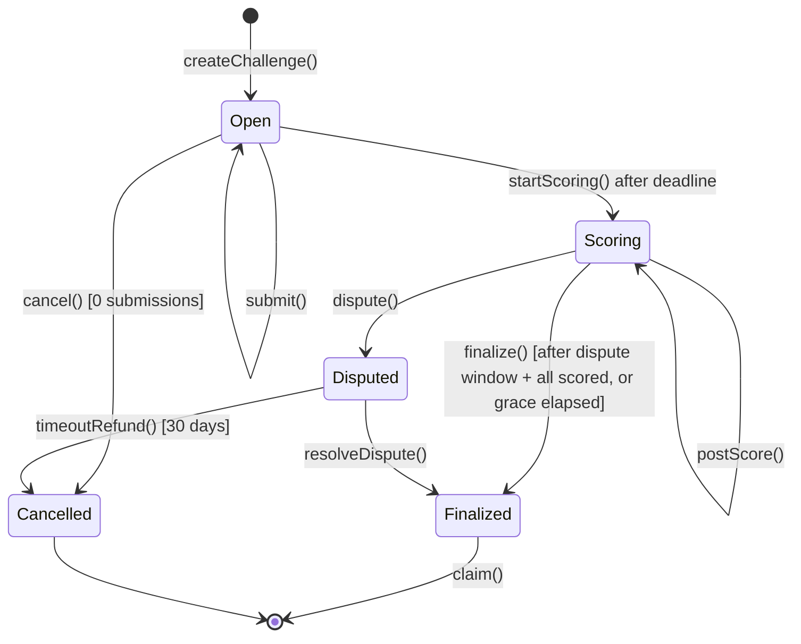
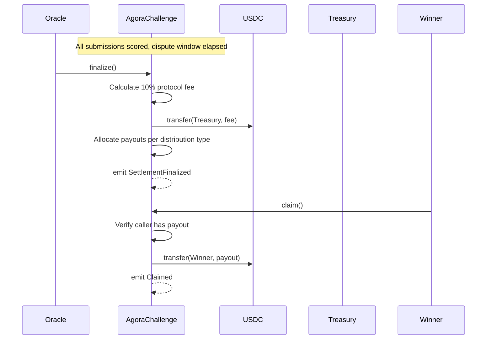

# Agora Protocol

## Purpose

What the on-chain protocol does: challenge lifecycle, settlement, scoring rules, and contract invariants.

## Audience

Engineers working on contracts, chain integration, or settlement logic. Operators running scoring and finalization.

## Read this after

- [Product Guide](product.md) — what Agora is and why
- [Architecture](architecture.md) — how the system fits together

## Source of truth

This doc is authoritative for: challenge lifecycle states, settlement rules, payout distribution, contract roles, event semantics, and the challenge YAML schema. It is **not** authoritative for: sealed submission format details, database schema, API routes, or frontend behavior. For the privacy and sealing model, see [Submission Privacy](submission-privacy.md).

## Summary

- AgoraFactory deploys per-bounty AgoraChallenge contracts with USDC escrow.
- Challenges follow a strict state machine: Open → Scoring → Finalized (or Disputed → Finalized, or Cancelled).
- 10% protocol fee (hardcoded, 1000 bps) flows to treasury on finalization.
- Scoring is deterministic Docker execution; proof bundles are pinned to IPFS with hashes stored on-chain.
- Dispute window is poster-configurable (0–2160 hours on testnet; 168–2160 hours (7–90 days) before mainnet).
- Anyone can independently verify scores by re-running the scorer container.
- Contract generation: one active v2 factory at a time; `contractVersion()` for diagnostics.

---

## Contract Roles

| Role | Who | What they can do | Trust level |
|------|-----|-----------------|-------------|
| **Poster** | Any wallet | Creates a challenge, deposits USDC, cancels (if 0 submissions before deadline), disputes scores | Trustless — USDC locked in smart contract escrow |
| **Solver** | Any wallet | Submits result hashes on-chain during the Open phase, claims payouts after finalization | Trustless — can only submit hashes |
| **Oracle** | Designated address (set at challenge creation) | Calls `startScoring()`, `postScore()`, `resolveDispute()` | Semi-trusted (single key in MVP); immutable per challenge |
| **Treasury** | Designated address (set on factory) | Receives 10% protocol fee on finalization | Controlled by factory owner; updates affect future challenges only |
| **Verifier** | Anyone | Re-runs the Docker scorer locally to check that posted scores are honest | Fully trustless — no on-chain role required |

### Actor Permission Matrix

| Action | Poster | Solver | Oracle | Anyone |
|--------|--------|--------|--------|--------|
| `createChallenge()` | Yes (via Factory) | — | — | — |
| `submit()` | — | Yes | — | — |
| `startScoring()` | — | — | — | Yes (after deadline) |
| `postScore()` | — | — | Yes | — |
| `finalize()` | — | — | — | Yes (after dispute window, once all submissions are scored or scoring grace elapses) |
| `dispute()` | — | — | — | Yes (during dispute window) |
| `resolveDispute()` | — | — | Yes | — |
| `cancel()` | Yes (if 0 subs) | — | — | — |
| `timeoutRefund()` | — | — | — | Yes (after 30 days) |
| `claim()` | — | Yes (winner) | — | — |

---

## Challenge Lifecycle State Machine



### Effective versus persisted status

- The contract `status()` view function is the read-side truth. After the deadline passes, it returns `Scoring` even if the persisted storage slot is still `Open`.
- Write-side transitions remain strict: `postScore()`, `dispute()`, and `finalize()` require a persisted `startScoring()` transaction first.
- Off-chain consumers (API, web, CLI) should use `status()` for visibility decisions. The DB projection may conservatively lag until the `StatusChanged(Open, Scoring)` event is indexed.

### Fairness boundary

- **Open:** Submissions are allowed. No public leaderboard, no public verification artifacts, and no score computation. Sealed submissions are hidden from the public and other solvers.
- **Scoring:** Submissions are closed. The worker may decrypt sealed submissions, compute scores, and publish per-challenge results.
- **Finalized:** Public global reputation surfaces (win rate, earned USDC) derive from finalized challenges only.

### Sealed submission rules

For the full sealing flow, trust boundary, and envelope details, see [Submission Privacy](submission-privacy.md).

- The canonical sealed submission format is `sealed_submission_v2`.
- The browser fetches the active submission sealing public key from `GET /api/submissions/public-key`, seals the answer locally, uploads only the sealed envelope to IPFS, and submits the CID hash on-chain.
- The worker resolves the matching private key by `kid` and decrypts only after the challenge enters `Scoring`.
- Public verification remains locked while the challenge is `Open`. Once scoring begins, proof bundles and replay artifacts may be published for reproducibility.
- Privacy guarantee: answer bytes are hidden from the public and other solvers while the challenge is open. Wallet address, transaction metadata, and any replay artifact published after scoring are not private.

---

## USDC Flow

```mermaid
sequenceDiagram
    participant Poster
    participant USDC
    participant Factory as AgoraFactory
    participant Escrow as AgoraChallenge
    participant Treasury
    participant Winner

    Poster->>USDC: approve(Factory, amount)
    Poster->>Factory: createChallenge(...)
    Factory->>Escrow: deploy new contract
    Factory->>USDC: transferFrom(Poster, Escrow, amount)
    Note over Escrow: USDC locked in escrow

    Note over Escrow: Solvers submit, oracle scores...

    rect rgb(40, 40, 60)
        Note over Escrow: Finalization
        Escrow->>USDC: transfer(Treasury, 10% fee)
        Escrow->>Escrow: setPayout(winner, 90%)
    end

    Winner->>Escrow: claim()
    Escrow->>USDC: transfer(Winner, payout)
```



### Finalize and Claim Flow



---

## Distribution Types

| Type | Allocation | Description |
|------|-----------|-------------|
| **WinnerTakeAll** | 1st place: 100% | Single highest-scoring solver receives the entire reward (after fee). |
| **TopThree** | 1st: 60%, 2nd: 25%, 3rd: 15% | Top three scorers split the reward. If fewer than three qualifying submissions, remaining share rolls up to the top scorer(s). |
| **Proportional** | Score-weighted | All qualifying solvers (those meeting `minimum_score`, if set) share the reward proportional to their scores. |

All distributions apply after the 10% protocol fee is deducted.

---

## Emitted Events

| Event | Description |
|-------|-------------|
| `ChallengeCreated` | Factory deployed a new AgoraChallenge contract with USDC escrowed. |
| `FactoryOracleUpdated` | Factory owner rotated the oracle used for future challenges. |
| `FactoryTreasuryUpdated` | Factory owner rotated the treasury used for future challenges. |
| `Submitted` | A solver submitted a result hash to an open challenge. Includes `subId` and `solver` address. |
| `StatusChanged` | Challenge transitioned between lifecycle states (e.g., Open → Scoring). |
| `Scored` | Oracle posted a score and proof bundle hash for a submission. |
| `PayoutAllocated` | Payout amounts assigned to winners after finalization. |
| `SettlementFinalized` | Challenge fully settled — fee sent to treasury, payouts claimable. |
| `Disputed` | A dispute was raised during the dispute window. |
| `DisputeResolved` | Oracle resolved an active dispute, selecting the correct winner. |
| `Cancelled` | Challenge cancelled — USDC refunded to poster. |
| `Claimed` | A solver withdrew their payout from the escrow. |
| `ChallengeLinkedToLab` | Factory emits when `labTBA != address(0)` at challenge creation |

---

## Contract Versioning

- Agora runs **one active contract generation** at a time.
- `AgoraFactory` and `AgoraChallenge` expose `contractVersion()` for diagnostics, projection traceability, and future cutovers.
- `@agora/chain` is the only layer that understands raw ABI/event/status details for the active generation.
- API, worker, CLI, and web should consume canonical domain reads instead of duplicating raw contract decoding.
- Runtime environments should never mix multiple factory generations.

---

## Challenge YAML Schema

The authoritative schema for challenge specification files.

### Required fields

| Field | Type | Description |
|-------|------|-------------|
| `schema_version` | integer | Must be `5` for the active public pinned-spec model. |
| `id` | string | Unique challenge identifier (e.g., `ch-001`). |
| `title` | string | Human-readable challenge title. |
| `domain` | enum | One of: `longevity`, `drug_discovery`, `protein_design`, `omics`, `neuroscience`, `other`. |
| `type` | enum | One of: `reproducibility`, `prediction`, `docking`, `optimization`, `red_team`, `custom`. |
| `description` | string | Full challenge description. |
| `execution` | object | Canonical public scoring contract. Public specs set `template`, `metric`, `comparator`, `scorer_image`, the hidden evaluation artifact binding by artifact id, the evaluation contract, and runtime policies exactly once. |
| `artifacts` | array | Normalized public artifact list. Each artifact includes `artifact_id`, `role`, and `visibility`. Public artifacts include `uri`; private artifacts do not. |
| `submission_contract` | object | Canonical machine-readable submission artifact contract. This is the only source of truth for what solvers must upload. |
| `reward.total` | decimal | USDC amount, up to 6 decimal places. |
| `reward.distribution` | enum | One of: `winner_take_all`, `top_3`, `proportional`. |
| `deadline` | string | RFC3339 UTC timestamp. |

### Optional fields

| Field | Type | Description |
|-------|------|-------------|
| `execution.template` | string | Official execution template ID (for example `official_table_metric_v1`). |
| `execution.metric` | string | Metric ID executed by the chosen official scorer template. |
| `execution.scorer_image` | string | Pinned scorer image digest used for deterministic execution. |
| `execution.evaluation_artifact_id` | string | Hidden evaluation artifact binding. Must point at one private artifact by `artifact_id`. |
| `execution.evaluation_contract` | object | Evaluation-table contract including required columns and id/value mappings. |
| `execution.policies` | object | Runtime scoring policies such as coverage and duplicate-id handling. |
| `artifacts[].artifact_id` | string | Stable artifact identifier. Public execution binds hidden evaluation data through this id, not through a URI. |
| `artifacts[].role` | string | Poster-defined artifact role label. Roles are descriptive metadata; the execution contract binds the hidden evaluation artifact explicitly. |
| `artifacts[].visibility` | enum | One of: `public`, `private`. |
| `artifacts[].uri` | string | Artifact URI for public artifacts only. Private artifacts in the public spec must omit `uri`. |
| `artifacts[].file_name` | string | Optional canonical file name when the source URI has no basename. |
| `artifacts[].mime_type` | string | Optional MIME type metadata. |
| `artifacts[].description` | string | Optional human-facing artifact description. |
| `tags` | string[] | Freeform tags for discovery. |
| `minimum_score` | decimal | Minimum score threshold for payout eligibility. |
| `dispute_window_hours` | integer | Dispute window in hours (0–2160 on testnet; 168–2160 before mainnet). |
| `lab_tba` | address | Optional Molecule Protocol lab TBA address. |
| `max_submissions_total` | integer | Maximum submissions per challenge (1–10000). |
| `max_submissions_per_solver` | integer | Maximum submissions per solver per challenge (1–1000). |

### Example

```yaml
schema_version: 5
id: ch-001
title: "Rank ligands for KRAS binding affinity"
domain: drug_discovery
type: docking
description: "Predict docking scores for the supplied ligand set against the target structure."
execution:
  version: v1
  template: official_table_metric_v1
  metric: spearman
  comparator: maximize
  scorer_image: ghcr.io/andymolecule/gems-tabular-scorer:v1@sha256:...
  evaluation_artifact_id: reference_scores
  evaluation_contract:
    kind: csv_table
    columns:
      required: [ligand_id, reference_score]
      id: ligand_id
      value: reference_score
      allow_extra: true
  policies:
    coverage_policy: reject
    duplicate_id_policy: reject
    invalid_value_policy: reject
artifacts:
  - artifact_id: target_structure
    role: target_structure
    visibility: public
    uri: ipfs://QmTarget
    file_name: kras_target.pdb
  - artifact_id: ligand_library
    role: ligand_library
    visibility: public
    uri: ipfs://QmLigands
    file_name: ligands.csv
  - artifact_id: reference_scores
    role: reference_scores
    visibility: private
    file_name: hidden_scores.csv
submission_contract:
  version: v1
  kind: csv_table
  file:
    extension: .csv
    mime: text/csv
    max_bytes: 26214400
  columns:
    required:
      - ligand_id
      - docking_score
    id: ligand_id
    value: docking_score
    allow_extra: true
reward:
  total: "500"
  distribution: winner_take_all
deadline: "2026-03-04T23:59:59Z"
```

### Public Spec Privacy Boundary

Public pinned challenge specs are solver-facing and safe to distribute through
public IPFS gateways.

Rules:

- dereferenceable URIs may appear only on `artifacts[].visibility = public`
- private artifact entries in the public spec keep metadata only and must not
  expose `uri`
- `execution.evaluation_artifact_id` binds the hidden evaluation artifact
  without revealing its location
- the real private evaluation artifact URI lives only in trusted runtime
  surfaces such as `execution_plan_json` and private authoring-session publish
  state
- private-evaluation challenges must publish through Agora's authoring-session
  flow so the trusted runtime plan exists before or at publish
- all newly published challenge specs use this sanitized `schema_version: 5`
  shape
- Agora does not keep an active public compatibility mode where new published
  specs expose `execution.evaluation_artifact_uri`

---

## Safety Nets

- **Poster cancel:** Poster can cancel before the deadline if there are 0 submissions. Full USDC refund.
- **Dispute timeout:** If a dispute remains unresolved for 30 days, `timeoutRefund()` returns the full escrow to the poster.
- **Immutable oracle:** The oracle address is fixed at challenge creation. The poster cannot rotate the oracle mid-challenge to manipulate scoring.
- **Stuck escrow protection:** The 30-day `timeoutRefund()` ensures USDC can never be permanently locked in a disputed contract.
- **Reentrancy guard:** `ReentrancyGuard` is applied to all state-changing and transfer functions.
- **On-chain audit trail:** Proof bundle hashes are stored on-chain, enabling anyone to verify that scores match the deterministic scorer output.

---

## Scoring Model

- **Deterministic Docker execution:** Same container + same input = same score, every time.
- **Public official scorers:** Agora official scorer code and images are public artifacts so solvers can inspect the exact scoring logic before they submit.
- **No hidden data in images:** Hidden labels, reference outputs, and other non-public evaluation material must live in the evaluation bundle or mounted dataset CIDs, not inside the scorer image.
- **Container constraints:**
  - `--network=none` — no network access, cannot exfiltrate data
  - `--read-only` — only `/output` is writable
  - `--cap-drop=ALL` — no Linux capabilities
  - Base runner fallback: 256 MB memory, 0.5 CPUs, 32 PIDs, 30-minute timeout
  - Official scorer-template range today: 512 MB – 4 GB memory, 1 – 2 CPUs, 64 PIDs, 5 – 20 minute timeouts
  - `--user 65532:65532` — non-root execution
  - `--security-opt=no-new-privileges` — no privilege escalation
- **`score-local` is preview-only:** Free and unlimited. Does not affect on-chain state.
- **Official scoring:** Happens after the deadline through the worker/oracle flow. `agora oracle-score` is the manual operator fallback for the same official path.
- **Proof bundles:** Pinned to IPFS. Contain all inputs, outputs, and container metadata needed to reproduce the score.
- **Score precision:** Scores are stored on-chain as `uint256` in WAD format (1e18 precision).

---

## Invariants

1. **Escrow integrity:** USDC is locked at challenge creation and released only via `finalize()` + `claim()`, `cancel()`, or `timeoutRefund()`. No other code path can move escrowed funds.
2. **Oracle immutability:** The oracle address is set at challenge creation and cannot be changed for the lifetime of that challenge.
3. **Hardcoded fee:** The 10% protocol fee (1000 bps) is hardcoded in the contract. It is not configurable per challenge.
4. **Tamper-proof scoring:** Scores and proof bundle hashes stored on-chain are immutable once posted. Anyone can verify them by re-running the Docker scorer.
5. **USDC decimals:** USDC has 6 decimals. Always use `parseUnits(amount, 6)`, never `parseEther`.
6. **Single generation:** One active contract generation (v2) at a time. Runtime environments must not mix multiple factory generations.

---

## What Is Intentionally Out of Scope (MVP)

- Proprietary or gated data
- Full model-to-data (agent submits Docker that runs on hidden data)
- Multi-oracle quorum
- On-chain governance for protocol parameters

---

## Molecule Hook

Smart contracts accept an optional `labTBA` address, which defaults to `address(0)` for standalone operation. This provides a forward-compatible integration point with the Molecule Protocol without adding any MVP complexity.
