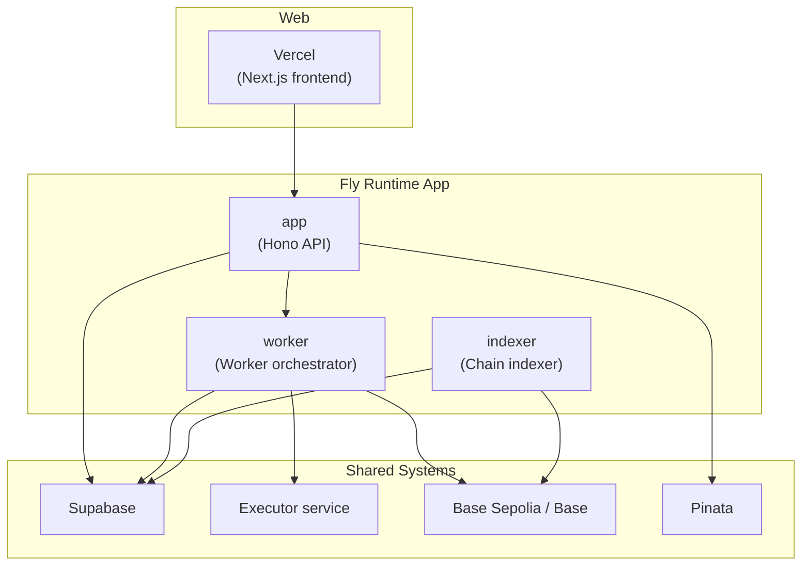

# Runtime Release Architecture

> Status: LOCKED
> Scope: hosted runtime ownership, release identity, health contracts, and destructive reset boundaries

Read after:

- [Architecture](../architecture.md)
- [Deployment](../deployment.md)
- [Operations](../operations.md)

---

## Purpose

This document locks the hosted runtime model so API, worker, and indexer keep
one clear source of deploy ownership and one clear set of health contracts.

---

## Canonical Hosted Model

- Fly is the hosted runtime platform for API, worker orchestrator, and indexer.
- The runtime runs as one Fly app, one image, and three process groups:
  `app`, `worker`, `indexer`.
- Vercel remains the hosted web platform.
- The executor remains separate infrastructure on a Docker-capable host or
  service.

Deploy ownership:

1. `CI` validates code.
2. `Deploy Fly Runtime` stages secrets and deploys the runtime image to Fly.
3. `Verify Runtime` checks the live hosted surfaces after deploy.
4. `Hosted Smoke` stays optional and funded.

GitHub Actions may build, deploy to Fly, verify, and smoke. Shared production
should not depend on ad hoc local laptop deploys.

---

## Design Goals

1. Hosted runtime ownership is obvious.
2. API, worker, and indexer share one release identity.
3. Liveness and readiness stay separate.
4. Failed or unready API candidates must not take over worker runtime control.
5. Schema rebuilds remain explicit and destructive.
6. Official scorer images remain immutable OCI artifacts.
7. Hosted verification stays readable and provider-specific only where needed.

---

## Non-Goals

- reintroducing a second runtime control plane
- deploying API, worker, and indexer from separate hosted providers
- making destructive schema reset automatic
- weakening the worker runtime fence

---

## Locked Invariants

### Runtime Identity

Hosted runtime surfaces must expose:

- `releaseId`
- `runtimeVersion`
- `gitSha`
- `identitySource`

Rules:

- `releaseId` and `runtimeVersion` should align in the normal hosted case.
- `gitSha` should be the full commit SHA when available.
- `identitySource` must explain whether identity came from `baked`,
  `override`, `provider_env`, `legacy_file`, `repo_git`, or `unknown`.
- Shared hosted environments should reject ambiguous identity by setting
  `AGORA_EXPECT_RELEASE_METADATA=true`.

### Health Contract

- `/healthz` is the platform liveness route.
- `/api/health` is the canonical hosted readiness route.
- `/api/worker-health` and `/api/indexer-health` remain the hosted detail
  routes.
- Deploy routing should depend on `/healthz`.
- Hosted verification should depend on `/api/health`,
  `/api/worker-health`, and `/api/indexer-health`.

### Worker Fence

- The API may write `worker_runtime_control` only while runtime readiness is
  healthy and the public API release matches the running runtime.
- Workers publish heartbeat and readiness in `worker_runtime_state`.
- Workers may keep heartbeating when inactive, but they must not claim new jobs
  unless their runtime version matches `worker_runtime_control`.

### Bootstrap Boundary

- `pnpm verify:runtime` is read-only.
- `pnpm reset-bomb:testnet` is destructive and explicit.
- Destructive rebuild requires `AGORA_SUPABASE_ADMIN_DB_URL`.
- Long-running runtime services must not require
  `AGORA_SUPABASE_ADMIN_DB_URL`.
- The supported hosted schema lane is still: wipe schema, apply
  [001_baseline.sql](/Users/changyuesin/Agora/packages/db/supabase/migrations/001_baseline.sql),
  reload PostgREST cache, restart services.

### Artifact Discipline

- Official scorers stay digest-pinned OCI artifacts.
- Hidden evaluation data must not ship inside scorer images.
- Runtime-service deploy simplicity does not relax scorer reproducibility.

---

## Hosted Topology

---

## Release Pipeline

1. `CI`
   - build
   - test
   - code-level verification
2. `Deploy Fly Runtime`
   - stage Fly secrets
   - stamp release identity from the commit SHA
   - deploy one image to the Fly runtime app
3. `Verify Runtime`
   - wait for the expected API release
   - verify schema compatibility
   - verify API, worker, and indexer health plus release alignment
4. `Hosted Smoke`
   - optional funded end-to-end lane

Rules:

- `Verify Runtime` is post-deploy, not a pre-deploy branch gate.
- Local operator machines are emergency tools, not the canonical shared deploy
  source.
- The hosted runtime should never depend on a second external release plane.

---

## Provider Boundaries

Fly-specific responsibilities:

- machine/process rollout
- staged secret application
- `/healthz` routing
- private service-to-service networking

Repo responsibilities:

- runtime identity stamping
- readiness contracts
- worker runtime fence
- schema verification
- funded smoke

---

## Operational Rules

- Keep Fly config in-repo with [fly.toml](/Users/changyuesin/Agora/fly.toml).
- Keep deploy automation in
  [deploy-fly-runtime.yml](/Users/changyuesin/Agora/.github/workflows/deploy-fly-runtime.yml).
- Keep hosted API URL and worker internal URL derived from the Fly app name.
- Do not hand-edit long-lived runtime identity secrets on the platform.
- Do not split API, worker, and indexer across different hosted deploy owners.

---

## Failure Model

If a release fails:

1. `/healthz` failing means the platform should not route traffic.
2. `/api/health` failing means the runtime is alive but not ready.
3. `/api/worker-health` failing means scoring is degraded.
4. `/api/indexer-health` failing means chain projection is degraded.

If hosted verification reports schema incompatibility and a destructive rebuild
is acceptable, run `pnpm reset-bomb:testnet`. Otherwise revert or fix the
runtime and redeploy.
