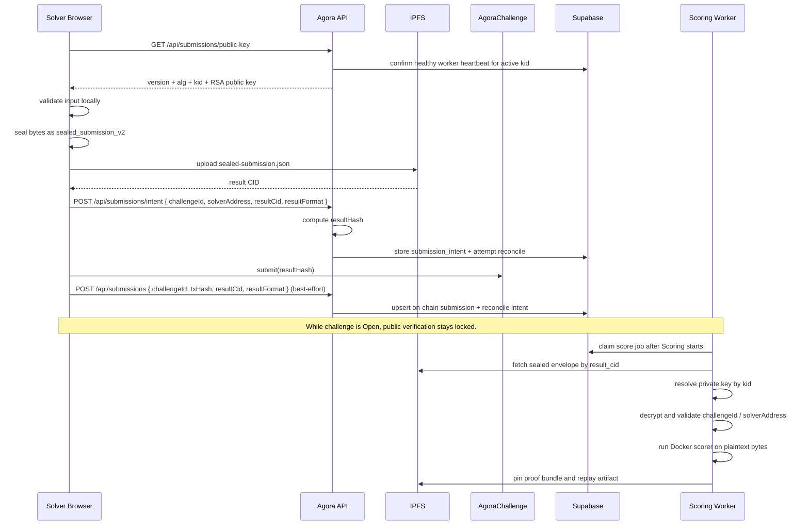

# Submission Privacy and Sealing

## Purpose

How Agora hides solver answer bytes while a challenge is open, how sealed submissions are represented, what is and is not private, and how operators should manage sealing keys.

## Audience

Engineers working on submission flow, scoring, API, or verification. Operators enabling or rotating submission sealing.

## Read this after

- [Architecture](architecture.md) — system topology
- [Protocol](protocol.md) — lifecycle rules
- [Data and Indexing](data-and-indexing.md) — storage model

## Source of truth

This doc is authoritative for: sealed submission format, privacy boundary, trust assumptions, key management model, and the end-to-end submission sealing flow. It is not authoritative for: contract settlement logic, general database schema outside submission privacy fields, or frontend layout decisions.

## Summary

- The canonical sealed submission format is `sealed_submission_v2`.
- The browser fetches Agora's active submission sealing public key only when the API sees a live worker heartbeat for that same active `kid`, then seals locally and uploads only the sealed envelope to IPFS.
- The on-chain contract stores only `keccak256(result CID)`, not the plaintext answer.
- The worker resolves the matching private key by `kid`, decrypts after the challenge enters `Scoring`, and runs the Docker scorer.
- Public verification stays locked while the challenge is `Open`.
- Once scoring begins, replay artifacts may be published for reproducibility. This is anti-copy privacy during the open phase, not permanent secrecy.

---

## Implementation Map

Key code paths:

- Web submit flow and UX gating: `apps/web/src/components/SubmitSolution.tsx`
- Web API types for sealing capability: `apps/web/src/lib/api.ts`
- API route serving the active sealing public key: `apps/api/src/routes/submissions.ts`
- Canonical sealing and unsealing primitives: `packages/common/src/submission-sealing.ts`
- Sealed envelope schema: `packages/common/src/schemas/submission.ts`
- Submission result format constants: `packages/common/src/types/submission.ts`
- Sealing key config and `kid` resolution: `packages/common/src/config.ts`
- Worker startup self-check for sealing: `apps/api/src/worker/index.ts`
- Worker scoring flow and replay publication: `apps/api/src/worker/scoring.ts`
- Scorer-side sealed envelope resolution and decrypt: `packages/scorer/src/sealed-submission.ts`
- Worker heartbeat/readiness queries: `packages/db/src/queries/worker-runtime.ts`
- Database result-format + worker runtime migrations: `packages/db/supabase/migrations/001_baseline.sql`, `packages/db/supabase/migrations/002_align_sealed_submission_result_format.sql`, `packages/db/supabase/migrations/003_add_worker_runtime_state.sql`, `packages/db/supabase/migrations/004_add_score_job_backoff.sql`

---

## Privacy Goal

Agora's submission privacy goal is narrow and explicit:

- Hide answer bytes from the public and other solvers while the challenge is open.
- Allow Agora-operated scoring to decrypt automatically after the challenge enters scoring.
- Preserve reproducibility after scoring begins.

This model is designed to prevent copy/paste leakage during the live competition window. It is not designed to make submissions permanently secret from Agora, from the solver, or from the public after replay artifacts are intentionally published.

## Non-Goals

The current model does not try to provide:

- Metadata opacity for wallet address or transaction activity.
- Permanent confidentiality after scoring begins.
- Operator-blind decryption. The worker still decrypts on Agora infrastructure.
- Hidden filenames or MIME types once someone already has the sealed envelope CID.

---

## End-to-End Flow



---

## What Gets Stored Where

### On chain

- Solver wallet address as the transaction sender.
- `result_hash = keccak256(result CID)`.
- Posted score and proof hash after scoring.

The contract does not store the plaintext answer and does not store the IPFS CID directly.

### In Supabase

- `submission_intents` stores pre-registered `(challenge_id, solver_address, result_hash) -> (result_cid, result_format)` mappings before the on-chain submit is sent.
- `submissions.result_cid` points to the IPFS object used for scoring.
- `submissions.result_format` is either `plain_v0` or `sealed_submission_v2`.
- For sealed submissions, `result_cid` points to the sealed envelope, not the replay artifact.
- `worker_runtime_state` tracks live scoring-worker heartbeats, Docker readiness, and sealing self-check state for the active `kid`.
- `AGORA_WORKER_RUNTIME_ID` can override the worker heartbeat row id when multiple scoring workers share one host.

### In IPFS

- During the open phase, the stored object is `sealed-submission.json`.
- After scoring begins, the worker may additionally publish a replay artifact containing the plaintext scorer input for public verification.

---

## Sealed Envelope Format

The canonical envelope version is `sealed_submission_v2`.

Fields:

- `version`: `sealed_submission_v2`
- `alg`: `aes-256-gcm+rsa-oaep-256`
- `kid`: identifier of the active Agora sealing keypair
- `challengeId`: challenge UUID
- `solverAddress`: normalized lowercase wallet address
- `fileName`: original staged file name
- `mimeType`: original staged MIME type
- `iv`: AES-GCM nonce
- `wrappedKey`: AES data key encrypted with Agora's RSA public key
- `ciphertext`: encrypted answer bytes

### Cryptographic construction

- The browser generates a fresh random AES-256-GCM key per submission.
- The answer bytes are encrypted with that AES key.
- The AES key is then wrapped with the active Agora RSA public key using RSA-OAEP with SHA-256.
- The envelope is serialized as JSON and uploaded to IPFS.

### Authenticated data

The following visible fields are included in AES-GCM additional authenticated data:

- `version`
- `alg`
- `kid`
- `challengeId`
- `solverAddress`
- `fileName`
- `mimeType`

That means these fields are not secret, but they cannot be modified without causing decryption failure.

### Encrypted data

Only the answer payload bytes are encrypted.

---

## What Is Private Versus Visible

### Hidden from the public while the challenge is open

- Plaintext answer bytes.
- Any replay artifact that would let others rerun the scorer on the plaintext answer.

### Visible or inferable

- The solver wallet address and transaction hash on-chain.
- The existence of a submission.
- The `result_hash` on-chain.
- The active submission sealing key id exposed by the API.

### Visible if someone already has the sealed envelope CID

- `challengeId`
- `solverAddress`
- `fileName`
- `mimeType`
- `version`
- `alg`
- `kid`

This is why the system should be described as public-hidden answer privacy during the open phase, not full opaque storage.

---

## Browser Submission Flow

1. The challenge page checks `GET /api/submissions/public-key`.
2. The API returns that public key only if it has public sealing config and at least one healthy worker heartbeat for the same active `kid`.
3. If sealing is unavailable, the UI blocks submission instead of pretending privacy exists.
4. The browser validates the selected file or text answer locally.
5. The browser imports the API-provided RSA public key.
6. The browser seals the submission locally as `sealed_submission_v2`.
7. The browser uploads only `sealed-submission.json` to IPFS.
8. The browser pre-registers a `submission_intent` and receives the canonical `resultHash`.
9. The browser submits that `resultHash` on-chain.
10. The browser makes a best-effort submit-confirmation call to the API.
11. If that best-effort call fails, the stored `submission_intent` still lets the API/indexer reconcile the on-chain submission later.

Important consequence:

- If sealing is enabled, the browser never intentionally uploads plaintext answer bytes as the official submission payload.

---

## Worker Decryption and Scoring Flow

1. The worker claims score jobs only after the challenge enters `Scoring`.
2. On startup, the worker writes a heartbeat row into `worker_runtime_state` only after sealing self-check and Docker checks pass.
3. The worker refreshes that heartbeat periodically while it stays alive.
4. The worker fetches the sealed envelope from IPFS using `submissions.result_cid`.
5. The worker parses the envelope and reads its `kid`.
6. The worker resolves the matching private key from its configured key set.
7. The worker decrypts the wrapped AES key and then decrypts the answer bytes.
8. The worker validates:
   - `envelope.challengeId === submission.challenge_id`
   - `envelope.solverAddress === submission.solver_address`
9. The worker stages the plaintext bytes into the scoring workspace and runs the Docker scorer.
10. If scoring succeeds, the worker pins the proof bundle and may pin a replay artifact for public verification.

If the worker cannot resolve the `kid`, or if the envelope metadata was tampered with, decryption fails and the submission is rejected as invalid.

---

## Public Verification Boundary

Public verification is intentionally gated by challenge status:

- While `Open`: no public verification route exposes the replay artifact.
- Once `Scoring` begins: proof bundles and replay artifacts may become public so anyone can rerun the scorer.

This is the key tradeoff:

- Anti-copy fairness while the challenge is live.
- Reproducibility and public auditability after scoring begins.

If the product ever needs secrecy all the way through final settlement, this model is not sufficient and would need a different design.

---

## Key Management Model

The API and worker split responsibilities:

- API serves exactly one active public key:
  - `AGORA_SUBMISSION_SEAL_KEY_ID`
  - `AGORA_SUBMISSION_SEAL_PUBLIC_KEY_PEM`
- Worker holds the matching private key:
  - `AGORA_SUBMISSION_OPEN_PRIVATE_KEY_PEM`
  - or `AGORA_SUBMISSION_OPEN_PRIVATE_KEYS_JSON`

### `kid` rotation

- New submissions always use the active API `kid`.
- The worker may keep a small private key map keyed by `kid`.
- The active `kid` must exist in the worker key set, or the worker fails startup.
- Historical keys may remain in `AGORA_SUBMISSION_OPEN_PRIVATE_KEYS_JSON` so older sealed submissions can still be scored.

This keeps rotation simple:

- one active public key for new submissions
- one worker key set containing the active private key and any temporary historical keys

---

## Trust Boundary

Current trust assumptions:

- The browser is trusted to seal locally before upload.
- Agora infrastructure is trusted to hold the worker private key.
- The worker is trusted to decrypt only for scoring and verification publication.
- The scorer container is deterministic, but not confidential.

This means the current model protects against solver-to-solver copying during the open phase, but not against a malicious Agora operator with access to worker infrastructure.

---

## Operational Checks

To confirm sealing is working:

```bash
curl -sS http://localhost:3000/healthz
curl -sS http://localhost:3000/api/worker-health
curl -sS http://localhost:3000/api/submissions/public-key
```

Expected signals:

- `/api/submissions/public-key` returns `version:"sealed_submission_v2"` and the active `kid` only while the worker heartbeat for that `kid` is healthy.
- `/healthz` reports API liveness plus `runtimeVersion`. It does not imply a scoring worker is ready.
- `/api/worker-health` reports `workers.healthy > 0`, `workers.healthyWorkersForActiveRuntimeVersion > 0`, `workers.healthyWorkersNotOnActiveRuntimeVersion = 0`, `sealing.workerReady=true`, and the same active `keyId`.

If the public key endpoint returns `503`, the web UI should block private submissions rather than falling back to a fake privacy claim.

---

## Related Docs

- [Architecture](architecture.md) — topology and high-level flow
- [Protocol](protocol.md) — lifecycle rules around when privacy holds
- [Data and Indexing](data-and-indexing.md) — where sealed envelopes and replay artifacts are stored
- [Operations](operations.md) — env vars, startup checks, and key rotation handling
