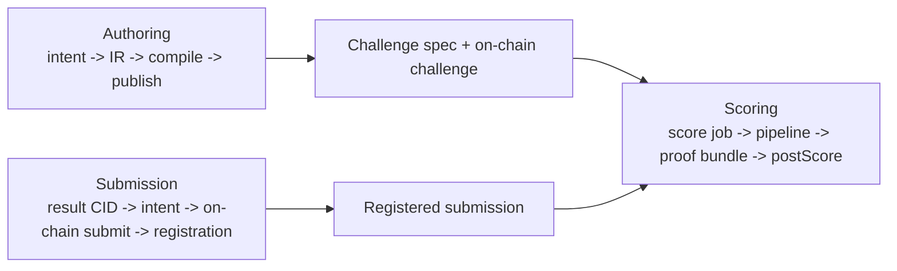
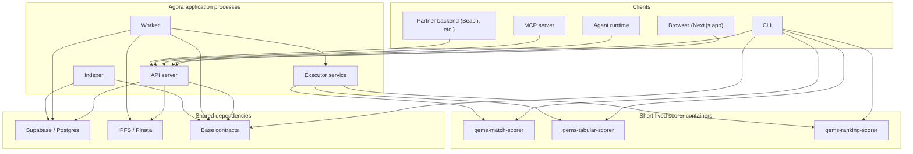
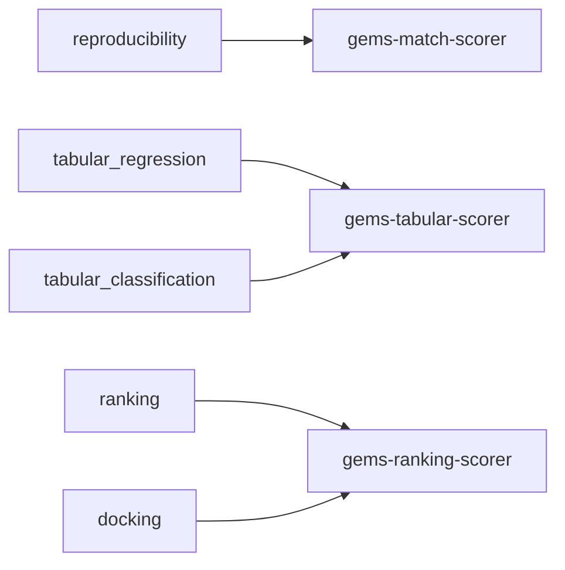
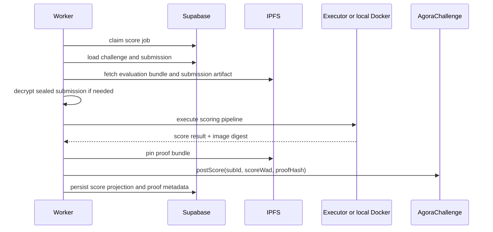
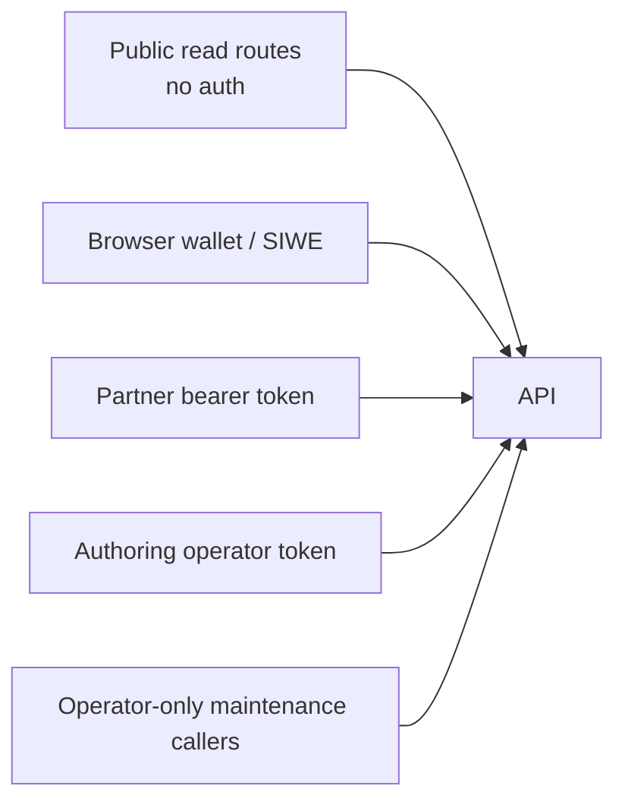
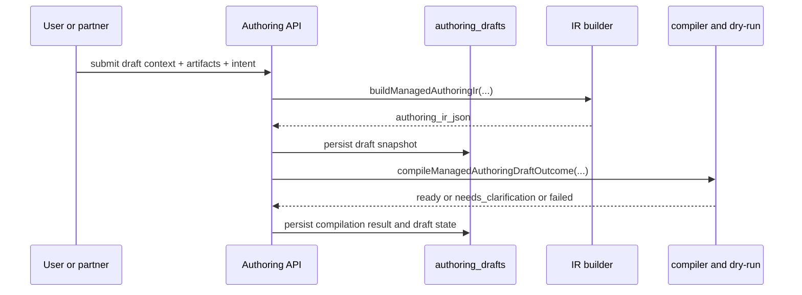
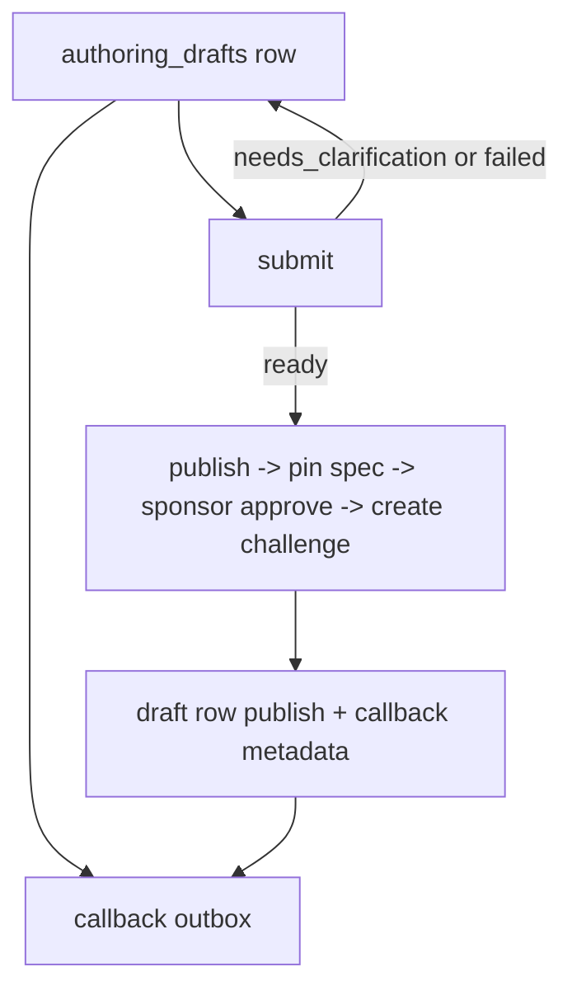
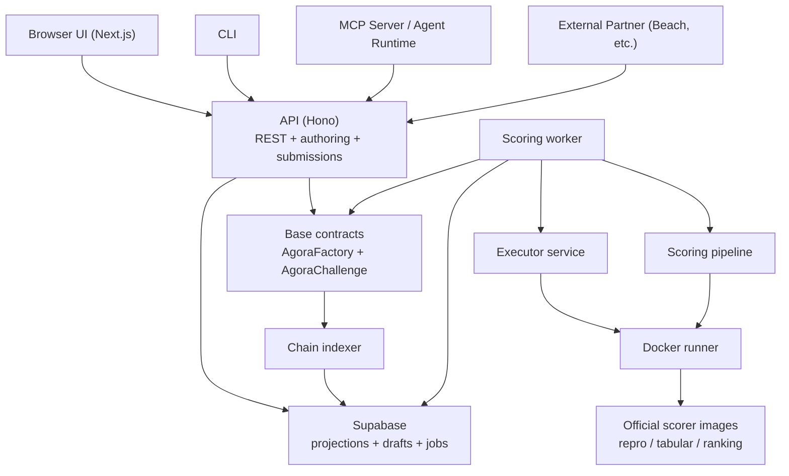
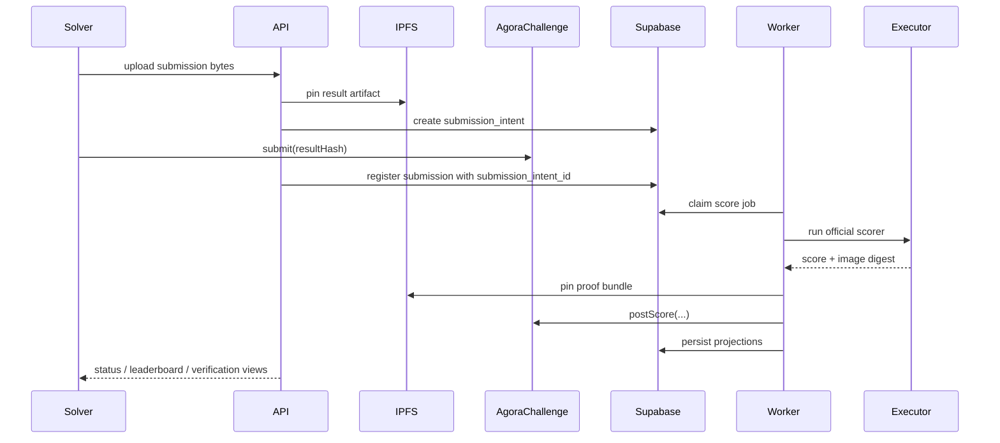

# Agora System Anatomy — Bottom-Up

## Purpose

A reverse-engineered, bottom-up walkthrough of Agora as it exists in the current codebase: what each layer does, what data it handles, where determinism is enforced, and how the system climbs from Docker scorers up to the browser, CLI, MCP server, and partner integrations.

This document is a systems map, not the normative spec. Source-of-truth rules still live in the code and the narrower docs:

- `docs/architecture.md`
- `docs/protocol.md`
- `docs/data-and-indexing.md`
- `docs/submission-privacy.md`

## Audience

Engineers, operators, auditors, and integration partners who need to understand how Agora actually works end to end.

## Reading Map

This document is easiest to follow if you keep four questions in mind:

1. What is the canonical artifact at this layer?
2. What process is allowed to mutate it?
3. What process only projects or reads it?
4. Where does determinism get enforced?

If you only want the shortest orientation path, read these sections first:

- Layer 7: database truth boundaries
- Layer 8: API route map
- Layer 9: authoring pipeline
- Full Stack Trace

## Core Artifacts and IDs

Before the layers, it helps to anchor the nouns that recur everywhere:

| Thing | Meaning | Typical identifier |
|-------|---------|--------------------|
| Authoring draft | Pre-publish challenge authoring state | `authoring_drafts.id` |
| Authoring source link | Stable external source identity for idempotent partner imports | `(provider, external_id)` |
| Challenge spec | Canonical posted challenge contract document | `spec_cid` |
| Evaluation bundle | Hidden or reference scorer input | `evaluationBundleCid` |
| Submission intent | Reserved `(challenge, solver, resultHash, resultCid)` registration | `submission_intents.id` |
| Submission artifact | The solver-uploaded result payload on IPFS | `result_cid` |
| On-chain submission | Challenge contract submission slot | `on_chain_sub_id` |
| Score job | Worker task to evaluate one submission | `score_jobs.id` |
| Proof bundle | Reproducibility artifact for a scored run | `proof_bundles.cid` |
| Published draft metadata | Draft-to-challenge publish outcome stored on the draft row | `authoring_drafts.published_challenge_id` |

## Three Primary Flows

Almost everything in Agora is one of these three flows:



## Deployment and Container Topology

The easiest mental model is to separate Agora into:

- long-running application processes
- data and chain dependencies
- short-lived scorer containers



The important separation is:

- API, worker, and indexer are stateful application processes
- scorer images are disposable compute containers
- the executor is just the HTTP bridge to the Docker host

One nuance:

- the CLI usually talks to the API and chain like any other client
- for `score-local` and some operator recovery flows, the CLI can also invoke scorer containers locally

## Artifact Ladder: How Bytes Become On-Chain State

One useful way to understand Agora is to follow the object that moves upward through the stack:

```text
authoring intent / source transcript
  -> authoring IR
  -> compiled challenge spec
  -> pinned spec CID
  -> on-chain challenge
  -> submission intent
  -> solver result CID
  -> on-chain submission slot
  -> score job
  -> scorer workspace
  -> score.json
  -> proof bundle CID
  -> on-chain score / payout state
  -> indexed API payload
  -> browser / CLI / agent response
```

Almost every module in the repo exists to either:

- produce one of those artifacts
- validate one of those artifacts
- project one of those artifacts into a more convenient read model

---

## Layer 0: The Docker Scorers (Ground Truth Execution)

This is the lowest layer where challenge evaluation actually happens. Everything above it exists to stage files, pick the right official image, and publish the result.

### What it is

Agora does not have one scorer image anymore. It has a small official scorer image set:

| Image | Code | Used by |
|-------|------|---------|
| `ghcr.io/andymolecule/gems-match-scorer:v1` | `containers/gems-match-scorer/score.py` | `reproducibility` |
| `ghcr.io/andymolecule/gems-tabular-scorer:v1` | `containers/gems-tabular-scorer/score.py` | `tabular_regression`, `tabular_classification` |
| `ghcr.io/andymolecule/gems-ranking-scorer:v1` | `containers/gems-ranking-scorer/score.py` | `ranking`, `docking` |

The important architectural rule is not “one scorer.” It is “one small official scorer image set with pinned digests and deterministic runtime contracts.”

One nuance:

- the repo and release workflow also publish `ghcr.io/andymolecule/gems-generated-scorer:v1`
- on current `main`, that image is present as a generic runner/building block, but it is not a first-class managed runtime family selected by the active runtime-family resolver
- so the live execution rail today still routes through the three images listed above

### Runtime-family to image mapping



### What it receives

All official scorers receive a staged input directory:

```text
/input/
  agora-runtime.json
  <evaluation bundle>   # name depends on mount config
  <submission artifact> # name depends on mount config
```

Common mount patterns today:

```text
tabular managed:
  ground_truth.csv
  submission.csv

exact-match JSON:
  ground_truth.json
  submission.json

exact-match opaque:
  ground_truth.bin
  submission.bin
```

The runtime config tells the image:

- which metric to use
- how the files are mounted
- the submission contract
- any evaluation contract
- scorer policies such as coverage / duplicate-id handling

### What it does

The three official scorer images cover different deterministic workloads:

```text
gems-match-scorer
  ├── csv_table exact/tolerant row matching
  ├── json_file deep equality
  ├── json_record rubric validation
  └── opaque_file byte-for-byte matching

gems-tabular-scorer
  ├── r2
  ├── rmse
  ├── mae
  ├── pearson
  ├── spearman
  ├── accuracy
  └── f1

gems-ranking-scorer
  ├── spearman ranking
  └── ndcg ranking
```

The bottom-line rule is:

- managed prediction / ranking / docking use dedicated metric scorers
- explicit custom scorer workflows can still reuse these official images when the publishable spec points at them directly

### What it outputs

Every scorer writes `/output/score.json` with the same envelope:

```json
{
  "ok": true,
  "score": 0.857,
  "details": {
    "selected_metric": "validation_score"
  }
}
```

Or, for deterministic rejection:

```json
{
  "ok": false,
  "score": 0.0,
  "error": "Submission missing required columns: id,prediction",
  "details": {
    "missing_columns": ["prediction"]
  }
}
```

### Security constraints

The TypeScript runner applies a locked-down Docker invocation:

```text
--network=none
--read-only
--cap-drop=ALL
--user 65532:65532
--memory <runtime-family limit>
--cpus <runtime-family limit>
--pids-limit <runtime-family limit>
```

Production also requires the image to resolve to a registry digest. Local, digest-less custom images are rejected on the official path.

### What challenges each mode handles

| Runtime / Archetype | Execution path | Real-world examples |
|---------------------|----------------|---------------------|
| `reproducibility` | exact/tolerant CSV compare | reproduce a published table, replicate an analysis output |
| `exact_artifact_match` | CSV / JSON / binary equality | exact config match, exact JSON reference, PDF/binary reproduction |
| `structured_record_score` | JSON rubric validation | structured report validation, protocol checklist compliance |
| `tabular_regression` | metric scorer | numeric prediction against hidden labels |
| `tabular_classification` | metric scorer | label prediction against hidden labels |
| `ranking` | ranking scorer | ranked candidate ordering against hidden relevance |
| `docking` | ranking scorer | ligand ranking against hidden reference scores |

---

## Layer 1: The Scorer Runtime (TypeScript ↔ Docker Bridge)

**File:** `packages/scorer-runtime/src/runner.ts`

### What it does

This is the bridge from TypeScript to the local Docker daemon. It:

- checks Docker readiness
- pulls / inspects official scorer images
- enforces digest-backed image integrity
- assembles Docker flags
- runs the container
- parses `/output/score.json`

### Data flow

```text
RunScorerInput
{
  image,
  inputDir,
  env,
  timeoutMs,
  limits,
  strictPull
}
        │
        ▼
  prepareScorerImage()
    ├── inspect local image
    ├── require registry digest
    └── docker pull if needed
        │
        ▼
  docker run
    --network=none
    --read-only
    --cap-drop=ALL
    -v <workspace/input>:/input:ro
    -v <workspace/output>:/output
        │
        ▼
RunnerScoreResult
{
  ok,
  score,
  error?,
  details,
  log,
  outputPath,
  containerImageDigest
}
```

### Key responsibility

This layer enforces “official scorer image with verifiable registry provenance” before compute starts. It is the last gate before arbitrary container execution would become possible.

---

## Layer 2: The Scoring Pipeline (Orchestration)

**File:** `packages/scorer/src/pipeline.ts`

### What it does

The scoring pipeline turns challenge metadata plus IPFS artifacts into a staged scoring workspace. It:

- creates a temp workspace
- downloads evaluation bundles and submissions from IPFS, or stages local bytes
- builds `agora-runtime.json`
- validates the submission against the submission contract before container execution
- calls the Docker runner

### Data flow

```text
ExecuteScoringPipelineInput
{
  image,
  runtimeFamily?,
  evaluationBundle?,
  submission,
  mount?,
  submissionContract?,
  evaluationContract?,
  metric?,
  policies?,
  env?
}
        │
        ▼
Phase 1: fetch_inputs
  ├── create workspace
  ├── stage evaluation bundle
  ├── stage submission
  ├── resolve runtime defaults from runtime family
  └── write agora-runtime.json
        │
        ▼
submission contract validation
  ├── valid   → continue
  └── invalid → deterministic scorer-style rejection without running Docker
        │
        ▼
Phase 2: run_scorer
  └── executeScorer()
        │
        ▼
ScoringPipelineResult
{
  result,
  workspaceRoot,
  inputPaths,
  cleanup()
}
```

### Key responsibility

This layer is where spec-derived scoring config is resolved. It prefers cached DB config on the challenge row and falls back to the IPFS spec CID only when needed.

It keeps managed Gems challenges and explicit custom scorer challenges on one execution rail: once the image, mount plan, contracts, and policies are resolved, the pipeline does not care whether the spec came from guided authoring or a custom workflow.

---

## Layer 3: The Executor Service (Docker Host)

**File:** `apps/executor/src/app.ts`

### What it does

The executor is an HTTP wrapper around the scorer runtime. It exists so the main API/worker deployment can run without Docker while a separate machine performs the actual container execution.

### Why it exists

The architecture requirement is:

- API / worker / indexer may live on hosts without Docker
- scorer execution needs a Docker-capable host

That can be deployed in different ways, but the logical split is always the same:

```text
API / Worker / Indexer
        │  HTTP
        ▼
Executor Service
        │
        ▼
Docker daemon
        │
        ▼
Official scorer image
```

### Routes

| Route | Purpose |
|-------|---------|
| `GET /healthz` | executor liveness + Docker readiness |
| `POST /preflight` | pull official images ahead of time |
| `POST /execute` | accept staged files + run metadata, execute scorer, return score payload |

The `/execute` route receives multipart form data: one JSON request part plus staged files.

---

## Layer 4: The Worker Orchestrator (Job Loop)

**Files:** `apps/api/src/worker/jobs.ts`, `apps/api/src/worker/scoring.ts`

### What it does

The worker is the default automated oracle path. It polls `score_jobs`, claims work, resolves the challenge’s evaluation plan, runs the scorer, pins the proof bundle, and posts the score on-chain.

Important nuance: the worker is the main automated holder of the oracle key, but it is not the only code path that can use it. The manual CLI command `agora oracle-score` reuses the same scoring logic for recovery and operator workflows.

### The scoring loop

```text
Every poll interval:
  │
  ├── claim queued score_jobs
  │
  ├── load challenge + submission from DB
  │
  ├── reconcile previously-posted score tx if needed
  │
  ├── ensure challenge is effectively scoreable
  │     ├── read lifecycle from chain
  │     ├── requeue if still open
  │     └── skip if cancelled / finalized / otherwise not scoreable
  │
  ├── enforce submission limits
  │
  ├── resolve challenge evaluation plan
  │     ├── runtime family
  │     ├── scorer image
  │     ├── evaluation bundle CID
  │     ├── mount config
  │     └── custom runner family override if needed
  │
  ├── resolve submission source
  │     ├── plain_v0 → use CID directly
  │     └── sealed_submission_v2 → decrypt using the configured opening key
  │
  ├── execute scoring pipeline
  │
  ├── build proof bundle
  │     { inputHash, outputHash, containerImageDigest, replaySubmissionCid, challengeSpecCid }
  │
  ├── pin proof bundle to IPFS
  │
  ├── postScore() on-chain
  │
  └── persist DB projections
        ├── submission score
        ├── proof bundle metadata
        └── job completion / retry state
```

### Key responsibility

This is the bridge between deterministic off-chain compute and trustless on-chain settlement. It is also where public-hidden sealed submissions become plaintext scorer input once the challenge enters scoring.

### Worker interaction sequence



### What the worker actually coordinates

The worker is not "the scorer." It is the conductor for five different systems:

| Component | Why the worker needs it |
|-----------|-------------------------|
| DB | claim jobs, load challenge/submission projections, persist results |
| IPFS | fetch evaluation inputs, fetch submissions, pin proof bundles |
| chain | read effective lifecycle, post scores, reconcile tx state |
| executor / Docker | perform deterministic compute |
| config | load opening keys, scorer endpoints, retry and timing policy |

---

## Layer 5: The Smart Contracts (On-Chain Settlement)

**Files:** `packages/contracts/src/AgoraFactory.sol`, `packages/contracts/src/AgoraChallenge.sol`

### What they do

The contracts enforce escrow, submission hashes, oracle-posted scores, dispute windows, and payout claims.

### Contract architecture

```text
AgoraFactory
  │
  ├── createChallenge(...)
  │     ├── deploy AgoraChallenge
  │     └── move poster USDC into challenge escrow
  │
  └── governance-owned references
        oracle
        treasury

AgoraChallenge
  │
  ├── submit(resultHash)
  ├── startScoring()
  ├── postScore(subId, scoreWad, proofHash)      # oracle only
  ├── finalize()
  ├── dispute(reason)
  ├── resolveDispute(winnerSubId)                # oracle only
  ├── timeoutRefund()
  └── claim()
```

### State machine

The important nuance is that `status()` is a read-side truth function, not just a raw storage read. Once the deadline passes, `status()` reports `Scoring` even if the persisted `_status` is still `Open`.

```text
Open
  ├── cancel() with zero submissions ───────────────▶ Cancelled
  ├── deadline passes ───────────────────────────────▶ status() reads as Scoring
  └── startScoring() persists Scoring ──────────────▶ Scoring

Scoring
  ├── finalize() with valid winners ────────────────▶ Finalized
  ├── finalize() with no qualifying winners ────────▶ Cancelled + poster refund
  └── dispute() ────────────────────────────────────▶ Disputed

Disputed
  ├── resolveDispute() ─────────────────────────────▶ Finalized
  └── timeoutRefund() after 30 days ────────────────▶ Cancelled
```

### Distribution types

| Type | Split |
|------|-------|
| `WinnerTakeAll` | 100% to first place |
| `TopThree` | 60 / 25 / 15, with unclaimed shares consolidating onto the top scorer when there are fewer than three winners |
| `Proportional` | score-weighted over qualifying submissions |

Other important on-chain rules:

- minimum score gating exists on the challenge contract
- submission limits are enforced on-chain
- the protocol fee is 10%

---

## Layer 6: The Chain Indexer (On-Chain → Database)

**Files:** `packages/chain/src/indexer.ts`, `packages/chain/src/indexer/challenge-events.ts`, `packages/chain/src/indexer/factory-events.ts`, `packages/chain/src/indexer/settlement.ts`, `packages/chain/src/indexer/submissions.ts`, `packages/chain/src/indexer/cursors.ts`

### What it does

The indexer polls Base, parses factory and challenge events, and projects them into Supabase. It is projection logic, not truth logic.

Internally it is now split by concern:

- `indexer.ts` owns the poll loop and top-level cursor coordination
- `factory-events.ts` owns `ChallengeCreated` projection
- `challenge-events.ts` owns per-challenge event dispatch, idempotency, and retry handling
- `submissions.ts` owns submission projection and reserved-intent recovery
- `settlement.ts` owns status, finalization, payouts, claims, and targeted reconcile
- `cursors.ts` owns challenge cursor bootstrap and persistence

### Event → Projection mapping

```text
On-chain event / read               │ DB effect
────────────────────────────────────┼──────────────────────────────────────
ChallengeCreated                    │ UPSERT challenge + fetch/validate spec CID
Submitted                           │ UPSERT submission only if a registered intent exists
StatusChanged                       │ UPDATE challenge status projection
Scored                              │ UPDATE submission score / proof hash projection
PayoutAllocated                     │ UPSERT challenge_payouts
SettlementFinalized                 │ set finalized winner / settlement projection
Claimed                             │ mark challenge_payouts claimed
Cancelled                           │ mark challenge cancelled
Disputed / DisputeResolved          │ reflected via challenge status + settlement repair
```

The indexer also has settlement-repair logic: it can rebuild canonical payout state from the challenge contract logs if projections drift.

### Key invariant

Strict intent-first submission flow is now part of the architecture. An on-chain submission without a matching registered `submission_intent` is not allowed to become scoreable later by fuzzy reconciliation.

The indexer can observe it and log it, but it does not convert it into a normal scoreable submission row.

---

## Layer 7: The Database (Supabase Projections + Draft State)

### Key tables

```text
Authoring side
──────────────
authoring_drafts
  canonical draft state
  intent_json
  authoring_ir_json
  uploaded_artifacts_json
  compilation_json
  source_callback_url
  published_spec_cid
  published_challenge_id

authoring_source_links
  provider + external_id -> draft_id

authoring_callback_deliveries
  durable callback outbox / retry queue

Execution side
──────────────
challenges
  on-chain challenge projection + cached spec/scoring config

submission_intents
  pre-registered result hash / CID reservation

submissions
  on-chain submission projection
  strict FK to submission_intents

score_jobs
  queued / running / failed / skipped worker jobs

proof_bundles
  reproducibility metadata + pinned proof CID

challenge_payouts
  payout allocations and claim state
```

### Canonical rows and focused side tables

One important implementation detail for new engineers:

- `authoring_drafts` is the canonical draft aggregate
- only the truly multi-row concerns stay separate

Today that means:

```text
authoring_drafts
  + authoring_source_links
  + authoring_callback_deliveries
  + authoring_sponsor_budget_reservations
```

Callback registration and publish outcome now live directly on `authoring_drafts`, so the API draft payload is much closer to the real write model than it was during the split-table phase.

### Source of truth rules

| Data | Truth source | DB role |
|------|--------------|---------|
| lifecycle visibility | on-chain `status()` semantics | projection + cache |
| challenge payout entitlements | on-chain events and reads | projection |
| challenge spec | IPFS spec CID | cache + query convenience |
| scorer image / evaluation plan | challenge spec + runtime family / evaluator contract | cache + query convenience |
| draft state | `authoring_drafts` | canonical |
| external source identity | `authoring_source_links` | canonical |
| publish outcome | `authoring_drafts.published_*` | canonical |
| callback target registration | `authoring_drafts.source_callback_*` | canonical |
| callback retry queue | `authoring_callback_deliveries` | canonical |
| submission registration | strict `submission_intents -> submissions` link | canonical |
| proof bundle replay metadata | IPFS proof bundle + `proof_bundles` row | pinned artifact + projection |

---

## Layer 8: The API (Hono REST Server)

**File:** `apps/api/src/app.ts` + `routes/*`

### What it does

The API is the main remote boundary for:

- the browser frontend
- CLI and agent-runtime clients
- the MCP server tool layer
- external partners like Beach
- internal maintenance and operations flows

### Authentication surfaces

Different API slices use different trust models:

| Surface | Primary auth model |
|---------|--------------------|
| public challenge reads | none |
| direct browser authoring / portfolio | SIWE session or wallet-bound caller data |
| partner authoring | bearer token per provider |
| internal callback/maintenance ops | operator token |
| executor service | bearer token shared with orchestrator |

### API trust boundaries at a glance



This matters because "API" is not one trust zone. The server hosts:

- public read surfaces
- browser-authenticated write flows
- partner-authenticated authoring
- operator-only maintenance endpoints

### Route map (key routes)

```text
Discovery / challenge reads:
  GET  /api/challenges
  GET  /api/challenges/:id
  GET  /api/challenges/:id/solver-status
  GET  /api/challenges/:id/leaderboard
  GET  /api/challenges/:id/claimable
  GET  /api/challenges/by-address/:address
  GET  /api/challenges/by-address/:address/solver-status
  GET  /api/challenges/by-address/:address/leaderboard
  POST /api/challenges/:id/validate-submission
  POST /api/challenges/by-address/:address/validate-submission

Challenge registration:
  POST /api/challenges

Submission flow:
  GET  /api/submissions/public-key
  POST /api/submissions/upload
  POST /api/submissions/cleanup
  POST /api/submissions/intent
  POST /api/submissions
  GET  /api/submissions/:id/status
  GET  /api/submissions/:id/wait
  GET  /api/submissions/:id/events
  GET  /api/submissions/:id/public
  GET  /api/submissions/by-onchain/:challengeAddress/:subId/status
  GET  /api/submissions/by-onchain/:challengeAddress/:subId/public

Direct authoring:
  GET  /api/authoring/health
  POST /api/authoring/drafts/submit
  POST /api/authoring/drafts/:id/publish

External authoring / partner integration:
  POST /api/authoring/external/drafts/submit
  GET  /api/authoring/external/drafts/:id
  GET  /api/authoring/external/drafts/:id/card
  POST /api/authoring/external/drafts/:id/publish
  POST /api/authoring/external/drafts/:id/webhook
  POST /api/authoring/callbacks/sweep
  POST /api/integrations/beach/drafts/submit

Other active surfaces:
  GET  /api/me/portfolio
  GET  /api/analytics
  GET  /api/indexer-health
  GET  /api/worker-health
  GET  /.well-known/openapi.json
  GET  /.well-known/x402
```

### Fairness boundary

The API uses lifecycle-aware visibility helpers and effective challenge status semantics for public reads:

- `Open`: no public verification, no public leaderboard
- `Scoring`: public verification and leaderboard can open
- `Finalized`: payouts and reputation surfaces become stable

Sealed submission privacy is an anti-copy boundary while the challenge is open, not permanent secrecy from Agora-operated scoring infrastructure.

---

## Layer 9: The Authoring Pipeline (Draft → Challenge Spec)

### One workflow, two wrappers

```text
Direct managed submit
  /api/authoring/drafts/submit

External partner submit
  /api/authoring/external/drafts/submit
  /api/integrations/beach/drafts/submit

Both wrappers converge into the same flow:
  intent_json
  + uploaded_artifacts_json
  + source/origin context
        │
        ▼
  buildManagedAuthoringIr(...)
        │
        ▼
  compileManagedAuthoringDraftOutcome(...)
        │
        ▼
  persisted draft state:
    draft
      -> compiling
      -> ready | needs_clarification | failed
      -> published
```

### Submit sequence



### Publish branch



Important distinction:

- `routing.mode` is still the IR’s interpretation of what kind of evaluator path the draft may need
- `outcome.state` is the submit/compile result
- `authoring_drafts.state` is the persisted workflow state in the database
- for Beach/OpenClaw, the partner route is now the primary publish path; it does not need to bounce back out to a browser wallet because Agora can use its internal sponsor signer for the MVP agent-native flow
- the browser-based direct authoring path still exists, but it is now the exception path for human intervention rather than the core external integration model

### How routing works (3 layers)

1. **Input and artifact inference**

- inspect uploaded artifact schema hints
- infer likely artifact roles
- interpret intent fields and source transcript
- decide whether the draft already looks objective / deterministic

2. **Managed proposal generation**

- reads poster intent plus artifact metadata
- proposes one supported Gems runtime family and metric
- returns reason codes, warnings, and any missing-input questions needed before compile can succeed

3. **Scoreability and compile gating**

- supported Gems proposal + successful dry-run → `ready`
- missing intent fields or ambiguous artifact roles → `needs_clarification`
- unsupported evaluator shape → `failed` with an explicit custom-scorer next step
- unresolved ambiguity → `needs_clarification`

So the architecture already distinguishes between:

- typed deterministic evaluator contracts
- executable official evaluator templates
- expert/custom evaluator requirements

---

## Layer 10: The External Partner Callback System

**Files:** `apps/api/src/lib/authoring-drafts.ts`, `packages/db/src/queries/authoring-drafts.ts`, `packages/db/src/queries/authoring-callback-deliveries.ts`

### What it does

Agora can notify external partners when an authoring draft changes state. This is a signed push channel layered on top of the partner draft API.

### Delivery flow

```text
Draft state changes
      │
      ▼
Resolve callback target
  authoring_drafts.source_callback_url
      │
      ▼
Build event payload
  { event, draft_id, provider, state, card }
      │
      ▼
Sign with HMAC
  x-agora-event
  x-agora-event-id
  x-agora-timestamp
  x-agora-signature
      │
      ▼
Try HTTPS delivery
      │
  ┌───┴────┐
  ▼        ▼
success   failure
  │         │
  │         ▼
  │   write authoring_callback_deliveries
  │   next_attempt_at / attempts / status
  │         │
  │         ▼
  │   POST /api/authoring/callbacks/sweep
  │         │
  └─────────┴──▶ eventual delivery or exhaustion
```

### Events delivered

| Event | When |
|-------|------|
| `draft_updated` | partner added messages or artifacts |
| `draft_compiled` | compile succeeded |
| `draft_compile_failed` | compile failed |
| `draft_published` | publish completed |
| `challenge_created` | sponsor-backed publish created an on-chain challenge |
| `challenge_finalized` | indexer observed final settlement and enqueued a host callback |

The durable outbox is important here: callback delivery is not coupled to the request/response lifetime of the originating draft mutation.

---

## Layer 11: The Frontend (Next.js) and Top-Level Clients

### Challenge Discovery (Home)

The current home surface is no longer a simple card wall. It is a branded landing page plus sortable market view:

```text
Hero section
  ├── "Accelerate Science Bounties"
  ├── KPI strip
  └── CTA into /post

Challenge browse section
  ├── table / grid views
  ├── sorting
  ├── countdowns
  └── domain / status badges

Data source:
  listChallenges() -> GET /api/challenges
```

### Challenge Detail

Challenge detail remains status-aware:

```text
/challenges/[id]
  ├── title / reward / deadline / distribution / status
  ├── public artifacts
  ├── solver-status / claimable state
  ├── leaderboard visibility gated by challenge status
  └── verification visibility gated by challenge status
```

The page combines:

- `GET /api/challenges/:id`
- `GET /api/challenges/:id/leaderboard`
- `GET /api/challenges/:id/claimable`

and only exposes verification/public replay surfaces once the challenge is no longer open.

### Posting Flow (Guided Interview)

The posting UI is a guided authoring shell over the same submit backend:

```text
/post
  ├── local guided reducer / prompt state
  ├── submit draft
  ├── show compilation + confirmation contract
  ├── wallet approval / pin-spec / challenge creation
  └── optional return-to handoff for hosted partner flows
```

### Parallel top-layer clients

The browser is not the only top-of-stack consumer anymore.

```text
Browser UI
  └── Next.js app

CLI
  └── agora post / submit / score-local / oracle-score / verify / claim

Agent runtime
  └── typed API client around the REST API

MCP server
  └── exposes Agora tools to agent hosts
```

These are parallel clients over the same lower layers, not separate systems.

### Which top-layer client to reach for

```text
Need a human-facing challenge marketplace?
  -> Browser UI

Need a deterministic scripted workflow or ops recovery?
  -> CLI

Need a typed programmatic integration in TypeScript?
  -> agent-runtime

Need tool exposure inside another agent host?
  -> MCP server
```

### Client role matrix

| Client | Best for | Talks to |
|--------|----------|----------|
| Browser | challenge discovery, authoring, wallet UX | API |
| CLI | operator flows, local scoring, manual recovery, power-user posting | API, chain, local scorer |
| Agent runtime | typed programmatic automation in TS | API |
| MCP server | tool exposure to external agent hosts | API and local helper tooling |

---

## Full Stack Trace: End to End



## One Submission, End to End

Sometimes the simplest way to understand the whole system is to follow a single submission:



That single path touches almost every layer described above:

- API boundary
- submission registration model
- IPFS artifact storage
- worker scoring orchestration
- executor and Docker scorer
- on-chain settlement
- indexed read models

---

## Audit Observations

### What's solid

1. **Determinism is enforced at multiple boundaries.** Official scorer images are small and typed, image provenance is enforced through digest-backed pulls, runtime config is explicit, and proof bundles capture replay-critical hashes.

2. **Submission registration is now strict.** A scoreable submission must have a registered `submission_intent` and a strict FK-backed link into `submissions`. The old reconcile-later model is gone from the live architecture.

3. **The draft aggregate is cleaner than before.** The earlier split proved which concerns were truly 1:many and which were just 1:1 metadata. The current shape keeps `authoring_source_links`, `authoring_callback_deliveries`, and sponsor reservations as real side tables, while collapsing callback registration and publish outcome back onto `authoring_drafts`.

4. **The assisted authoring flow is smaller.** Managed and partner-assisted posting now converge on `submit -> publish` without a separate review queue or a separate compile endpoint.

5. **Public fairness boundaries are explicit.** Open challenges keep leaderboard and verification surfaces closed, and the code treats effective on-chain lifecycle semantics as the visibility boundary.

### What to watch

1. **Operator-blind privacy is still not a goal.** Sealed submissions protect against public copying while a challenge is open, but Agora-operated worker or manual oracle flows still decrypt on Agora-controlled infrastructure once scoring starts.

2. **`challenge_type` still exists as a compatibility/display concept.** Runtime identity has shifted toward `runtime_family` plus evaluator contract/archetype, but some compatibility fields still remain in the data model and UI surface.

3. **The authoring subsystem is cleaner but still cognitively dense.** The routes are thinner than before, but the authoring IR, compilation, dry-run, partner intake, and callback paths still span multiple focused modules.

4. **Proof pinning and on-chain posting are recoverable, not transactional.** The system has retry and reconciliation logic, but proof publication and score posting are still a multi-step workflow rather than a single atomic commit.

5. **The explicit custom scorer workflow is still a separate path.** The assisted authoring flow only targets supported Gems runtimes. Anything broader should fail clearly and move to the custom scorer workflow instead of silently widening the managed surface.

---

## Design Thinking: When Does Deterministic Scoring Work?

Agora is strongest when the poster can state an objective payout condition as an explicit, typed rule. The current assisted authoring flow supports supported Gems runtimes only, while broader deterministic evaluators still belong to the explicit custom scorer workflow.

### The fundamental question

Can the poster express the winner condition as a deterministic contract that the platform can execute without human judgment?

If yes, Agora can usually support it through:

- a managed runtime family
- or an explicit custom scorer workflow when the managed path is too narrow

If no, the challenge is not yet a fit for the current deterministic settlement model.

### Category 1: "I have the answer — can you reproduce it?"

**The poster already has the reference artifact.**

| Example | Evaluation artifact | Current path |
|---------|---------------------|--------------|
| reproduce a published data table | hidden CSV reference | managed `reproducibility` |
| match an exact JSON output | hidden JSON reference | explicit custom scorer workflow |
| reproduce a binary document or generated file | hidden binary/PDF | explicit custom scorer workflow |

Why it works:

- the scorer compares the solver artifact directly against a hidden reference
- the payout condition is explicit and deterministic

### Category 2: "I have hidden labels — can you predict them?"

**The poster has held-out truth data and wants the best predictive method.**

| Example | Evaluation artifact | Current path |
|---------|---------------------|--------------|
| numeric predictions against hidden labels | hidden CSV labels | managed `tabular_regression` |
| class labels against hidden truth | hidden CSV labels | managed `tabular_classification` |
| ranked candidates against hidden relevance | hidden ranking CSV | managed `ranking` or `docking` |
| deterministic table scoring with a custom rule | hidden CSV + custom evaluator | explicit custom scorer workflow |

Why it works:

- the metric is explicit
- the scorer compares solver output against hidden evaluation data
- ranking of solvers is deterministic

### Category 3: "I have a rubric — does the submission satisfy it?"

**The poster does not have one exact answer, but does have a deterministic validation contract.**

| Example | Evaluation artifact | Current path |
|---------|---------------------|--------------|
| incident report with required sections | hidden rubric JSON | explicit custom scorer workflow |
| structured protocol compliance | hidden rubric JSON | explicit custom scorer workflow |
| bundle/code package requiring deterministic checks | hidden harness or rubric | explicit custom scorer workflow |

Why it works:

- the rubric can be represented as a deterministic validation contract
- the scorer does not need a human to decide correctness

### Category 4: "I don't have the answer — I need someone to find it"

**The poster has a search problem or computation problem, not a reference artifact or bounded rubric.**

| Example | Why it is hard | Current support |
|---------|----------------|-----------------|
| discover a new molecule | needs simulation or search evaluation | explicit custom scorer workflow |
| run hidden model inference over submitted code | needs arbitrary execution against hidden environment | explicit custom scorer workflow |
| evaluate a code bundle with a bespoke hidden test harness | needs a custom judge runtime | explicit custom scorer workflow |

This is the frontier. The assisted Gems path is intentionally constrained so the platform does not drift into arbitrary code execution by default.

### Summary: What the scorer can and cannot evaluate

```text
Poster has...                     Current architecture path
───────────────────────────────   ───────────────────────────────────────────
Exact reference artifact          Managed reproducibility or explicit custom scorer workflow
Hidden labels / hidden scores     Managed metric scorer
Deterministic rubric              Explicit custom scorer workflow
Custom deterministic judge        Explicit custom scorer workflow
Open-ended search problem         Not a first-class assisted Gems path
```

### Design implication

The current architecture is no longer “ML-only,” but it is still explicitly deterministic-first.

The real question is not:

- “Is this an ML challenge?”

It is:

- “Can the payout rule be typed and executed deterministically without human judgment?”

That is the right mental model for Agora as of the current codebase.
